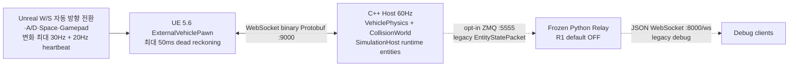
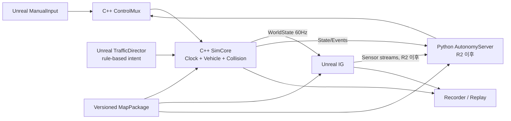
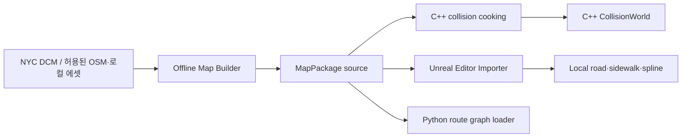
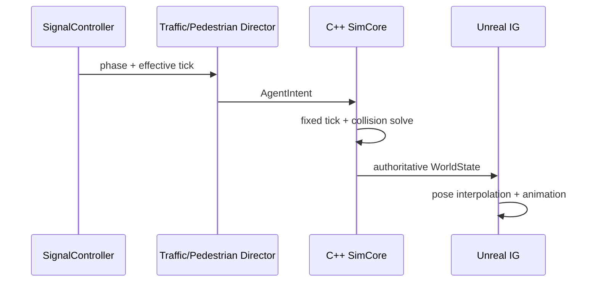

# 시스템 아키텍처

## 1. 문서 정보

| 항목 | 값 |
|---|---|
| 버전 | 2.1 |
| 작성일 | 2026-08-19 |
| 최종 수정 | 2026-08-27 |
| 대상 | R1 수동운전 및 R2/R3 자율주행 확장 기반 |
| 관련 문서 | [일정표](./01_schedule.md), [기능표](./02_feature_matrix.md) |

## 2. 설계 목표

1. C++ SimCore가 차량과 충돌의 최종 물리 상태를 정확하고 일관되게 계산한다.
2. Unreal은 C++ 결과를 고품질로 표현하고 입력·센서·교통 표현을 담당한다.
3. Python은 향후 FSD 판단만 담당하며 수동운전의 필수 데이터 경로에서 제외한다.
4. 지도·차선·충돌 데이터를 한 번 생성하여 C++·Unreal·Python이 함께 사용한다.
5. 수동 입력과 자율주행 명령이 동일한 제어 인터페이스를 사용한다.
6. Wall/Broad에 종속된 코드는 데이터 패키지로 격리하여 다른 지역과 트랙에 재사용한다.
7. 로컬 수동운전은 60Hz 상태 전달의 jitter와 표시 지연을 측정하고 제한된 예측으로 보완한다.

## 3. 현재 구조와 목표 구조

### 3.1 현재 저장소 기준 구조



현재 구현과 남은 경계는 다음과 같다.

- C++ `VehiclePhysics`는 네 바퀴의 독립 tire contact와 1D spring/damper 반력으로 tire load,
  차체 heave·pitch·roll을 계산한다. 경사면 tangent 힘과 ENU XY/yaw도 C++가 소유하며,
  `MapPackageGroundQuery`는 ENU triangle을 adaptive grid로 조회한다.
- `CollisionWorld`는 8m deterministic broad phase와 정적 OBB-prism, NPC kinematic OBB, 보행자 vertical capsule의 접촉·projection·상대속도 impulse를 계산한다.
- Proto는 루트 `protocol/vehicle.proto`로 통합됐고 R1의 C++·Unreal이 같은 schema-v2 필드 계약을 사용한다. Python 생성물은 같은 원본에서 만들지만 relay 자체는 동결된 선택 기능이다.
- C++ host는 절대 deadline 60Hz clock, command source/session/sequence/queue-age 검사, 250ms soft SafeStop·1초 hard session retire와 E-stop latch를 적용한다.
- 개발용 background launcher는 stdout/stderr를 `runtime_logs/`로 redirect하고 tick overrun 요약을 최대 1Hz로 제한해, 단일 `io_context` thread가 소비되지 않는 console pipe에 막히지 않게 한다.
- WebSocket 세션은 HTTP 101 accept 완료 전 state frame을 쓰지 않으며, 전송 중 state queue는 latest-wins로 제한한다.
- Unreal client는 입력 변화를 deadzone 처리 후 최신값 우선으로 합쳐 최대 30Hz로 보낸다. W/S는 fresh Ego body state가 정지를 확인한 경우에만 Drive/Reverse를 바꾸며, multi-entity `WorldState`의 Ego pose·body velocity·4개 wheel state와 NPC·보행자 transient 표시 actor를 갱신한다.
- C++와 Unreal은 strict `manifest.cfg`의 실제 collision checksum을 각각 검증한다. Unreal은 첫 `WorldState` checksum 일치 후에만 `SimulationReset`과 일반 control을 전송하고, host는 reset 전 일반 control을 거부한다.
- `SimulationHost`는 opt-in `--demo-entities`의 NPC·보행자 authoritative state를 소유하고 tick 진행·새 PIE reset·multi-entity 발행을 수행한다. 최종 LaneGraph, 신호와 Traffic/Pedestrian AI는 후속이다.
- `Hello` 기반 build/capability 협상과 packet gap HUD는 아직 후속이다. 실제 package의 `static_colliders.csv`는 현재 collider 0개이며, Unreal PIE 벽·동적 entity 충돌은 수동 검증 전이다.
- 기본 CMake 구성은 ZeroMQ를 빌드하거나 5555 포트를 열지 않는다. opt-in observer만 버전 없는 구 `EntityStatePacket`을 발행하며 R1 완료 경로에 포함하지 않는다.

### 3.2 목표 구조



수동운전에서 Python 프로세스는 실행하지 않아도 된다. 자율주행 모드에서는 Python이 `ControlCommand`를 생성하지만 최종 물리 상태는 계속 C++가 결정한다.

## 4. 컴포넌트 책임

### 4.1 C++ SimCore

아래 표는 R1 이후까지 유지할 목표 논리 경계다. 현재 코드는 `SimulationHost`가
`SimulationClock`, `ControlLease`, `VehiclePhysics`를 조정하고, `WsServer`와
opt-in `ZmqPublisher`를 callback으로 주입한다. `CollisionWorld`, strict MapPackage loader와
최소 runtime entity lifecycle은 구현됐지만 별도 `EntityWorld`, 최종 LaneGraph traffic
runtime과 `Recorder`는 후속이다.

| 모듈 | 책임 | 소유 데이터 |
|---|---|---|
| `SimulationClock` | 고정 tick, substep, pause/reset, overrun 계측 | sim time, tick index |
| `ControlMux` | 수동/자율 명령 선택, timeout, E-stop | 현재 control lease와 command |
| `VehicleDynamics` | 자체 강체·조향·구동계·타이어·서스펜션 계산 | 차체·휠·타이어·구동계 상태 |
| `CollisionWorld` | 정적·동적 충돌 검출과 해결 | collision shapes, contact state |
| `EntityWorld` | Ego, NPC 차량, 보행자 proxy 생명주기 | authoritative entity state |
| `MapLoader` | MapPackage 검증과 물리용 데이터 로드 | map checksum, cooked collision |
| `TransportServer` | 명령 수신, 상태·이벤트 발행, handshake | connection/session state |
| `Recorder` | 명령·상태·이벤트와 설정 체크섬 기록·재생 | replay stream |
| `Diagnostics` | tick, latency, collision, queue 로그 | metrics와 structured log |

C++는 렌더링, 영상 센서 생성, 자율주행 의사결정을 담당하지 않는다.

### 4.2 Unreal

현재 구현은 `SimCoreClientComponent`, `SimCoreProtocol`, `ExternalVehiclePawn`,
`SimCoreCoordinateFrames`, `SimCorePresentation`, `GroundCollisionExporter`,
`ASimCoreStaticCollider`와 runtime entity transient 표시다. 아래 표의 나머지 항목은
향후 분리·구현할 목표 모듈이다.

| 모듈 | 책임 | 금지되는 책임 |
|---|---|---|
| `SimCoreClient` | handshake, command 전송, WorldState 수신·버퍼링 | 최종 차량 pose 결정 |
| `ManualInputComponent` | 키보드/게임패드 입력 정규화 | 물리 계산 |
| `ExternalVehiclePawn` | pose 보간, wheel·steering 시각화 | Ego에 Chaos 힘을 적용해 C++ 상태 수정 |
| `GeoTransformAdapter` | ENU↔Cesium/Unreal 좌표 변환 | 자체 위·경도 적분 |
| `MapPackageImporter` | LaneGraph와 로컬 에셋 생성·검증 | 독립된 별도 차선 데이터 유지 |
| `TrafficDirector` | NPC 차선·속도·신호 intent 생성 | 충돌 후 최종 pose 해결 |
| `SignalController` | 차량·보행 신호 상태 | C++ 차량 물리 |
| `PedestrianDirector` | 단순 경로와 보행 intent, 애니메이션 | 대규모 군중 해석 |
| `SensorRig` | 카메라 등 센서 생성과 timestamp/frame metadata | AI 판단 |
| `ReplayPresenter` | 기록 상태 재생과 촬영 카메라 운용 | 기록된 물리 결과 재계산 |

### 4.3 Python AutonomyServer

R1에서는 필수가 아니며 R2부터 다음을 담당한다.

- 시작점·목적지와 LaneGraph 기반 route planning
- localization과 sensor preprocessing
- behavior planning과 trajectory generation
- steering, throttle, brake 명령 생성
- 자율주행 평가 지표와 실험 관리
- R3의 학습·추론 모델 실행

Python은 차량 동역학과 월드 충돌을 계산하지 않는다. 자율주행 중에도 C++ SimCore가 물리 권한을 유지한다.

## 5. 권한 모델

### 5.1 단일 물리 권한

| 상태 | 권한 소유자 | 다른 컴포넌트의 사용 방식 |
|---|---|---|
| Ego pose/velocity/wheel | C++ | Unreal과 Python은 읽기 전용 |
| NPC 물리 pose | C++ | Unreal AI가 intent를 보내고 결과를 표시 |
| 보행자 collision pose | C++ | Unreal이 경로 intent·animation을 제공하고 결과를 표시 |
| 신호 상태 | Unreal `SignalController` | tick이 붙은 상태를 C++와 Python에 공유 |
| LaneGraph·통행 제한 | MapPackage | 세 프로세스가 같은 버전 읽기 |
| 정적 collision source | MapPackage | C++가 authoritative collision로 cooking |
| 센서 영상 | Unreal | Python이 timestamp와 frame ID로 소비 |
| 운전 명령 | 선택된 controller | C++ `ControlMux`만 적용 여부 결정 |

### 5.2 제어 우선순위

```text
EmergencyStop > Active control lease(Manual 또는 Autonomous) > SafeStop
```

- Manual과 Autonomous가 동시에 차량을 제어하지 않는다.
- 모드 전환은 명시적인 요청·승인 handshake를 거친다.
- 유효 command가 250ms 동안 없으면 기본적으로 throttle을 해제하고 안전 제동한다.
- controller는 연결마다 고유 `session_id`를 만들며 sequence는 해당 session 안에서 단조 증가한다.
- active session에서도 client 생성 시각과 server 수신 간격으로 추정한 큐 체류 시간이 100ms를 넘는 명령은 적용하지 않는다.
- timeout 시 기존 session을 폐기하고 WebSocket을 닫는다. Unreal은 0.5초 뒤 새 session ID로 재연결하므로 이전 소켓의 큐 데이터가 새 lease로 넘어오지 않는다.
- reset, spawn, map 변경은 일반 ControlCommand와 분리한다.

## 6. 좌표·단위·시간 규약

### 6.1 좌표계

공통 공개 좌표는 ROS REP-103과 호환되는 right-handed 규약을 사용한다. Unreal과 현재 solver의 좌표는 각 runtime 내부 구현이며 경계 adapter 밖으로 노출하지 않는다.

| frame | 좌표계 | 사용처 |
|---|---|---|
| WGS84 | longitude/latitude/ellipsoidal height | Cesium 위치, GNSS 출력, 지도 import |
| `map_enu` | right-handed, X=East, Y=North, Z=Up | C++ 위치·속도·충돌, MapPackage |
| `base_link` | right-handed, X=forward, Y=left, Z=up(FLU) | 공통 body 상태, 휠·센서 장착, Python |
| `unreal_actor` | left-handed, X=forward, Y=right, Z=up(FRU) | Unreal 표시 전용 |
| `<sensor>_optical` | right-handed, X=right, Y=down, Z=forward | 향후 카메라 센서 출력 |

| 물리량 | canonical 양의 방향 |
|---|---|
| body yaw rate | 좌회전 |
| road-wheel steering angle·normalized steering command | 좌조향 |
| wheel slip angle·lateral force | wheel-local left |
| navigation heading | North=0°, 시계 방향; body 회전 vector와 별도 scalar |

- `MapOrigin`은 WGS84 원점과 `map_enu` frame을 정의한다.
- scalar `yaw_rate`는 true FLU angular velocity의 body-Z 성분이다. 수평 평면 운동에서는
  `heading_rate_clockwise = -yaw_rate_left_positive`지만, compound 자세에서는
  `angular_velocity_body`에서 navigation Euler yaw rate를 복원한 뒤 heading과 비교한다.
- Unreal body polar vector는 `(x, y, z)m → (100x, -100y, 100z)cm`로 변환한다. 자세와 angular velocity는 handedness를 고려한 basis 변환을 사용한다.
- `angular_velocity_body`는 Euler derivative 세 개가 아니라 true right-handed FLU angular
  velocity vector다. 수평 자세에서는 nose-up pitch가 `omega_y < 0`이고 left-up roll이
  `omega_x > 0`이다. compound pitch·roll·yaw에서는 C++가 Euler rate coupling까지 포함해
  FLU vector로 변환하고, Unreal이 현재 pitch·roll과 vector 성분으로 Euler rate를 역복원한 뒤
  제한 외삽한다. FLU positive roll과 Unreal `FRotator.Roll`은 같은 방향이므로 roll을 다시
  반전하지 않는다. 기존 roll 이중 반전은 차체가 지지면 반대로 기울어 보이게 했다.
- C++ `BodyFrameAdapter`가 공개 FLU와 solver 내부 right-positive steering·lateral·yaw의
  부호 경계를 전담한다. `SimCoreCoordinateFrames`는 평면 ENU 위치, FLU 속도,
  schema-v2 yaw·steering의 Unreal 표시 경계를 모은다.
- 완전한 `GeoTransformAdapter`, Cesium·quaternion 변환과 Unreal automation 시험은
  ADR-011 후속 작업이다. 이번 roll·pitch 계약 수정 후 Windows UE 5.6 Editor target build는
  통과했으며 Cesium·quaternion 왕복·실제 PIE 좌표 시각 검증은 남아 있다.
- 위치는 meter, 속도는 m/s, 가속도는 m/s², 질량은 kg, 시간은 second를 사용한다.
- 물리 내부 각도와 각속도는 radian 기반으로 통일하고 기존 표시용 pose 필드만 degree를 사용한다.
- 위·경도는 물리 적분에 사용하지 않고 ENU 상태에서 필요할 때 변환한다.

schema v2의 공개 `linear_velocity_body`, `angular_velocity_body`, scalar `yaw_rate`,
`steering_angle`, `ControlCommand.steering`과 wheel lateral 값은 모두 FLU/Y-left 계약을
사용한다. 항법 heading만 North=0·시계 방향 양수다. 수평 자세에서는 body-Z yaw와 부호가
반대이고, compound 자세에서는 복원한 navigation Euler yaw와 부호가 반대다.
남은 자세·센서·Windows 검증은 [ADR-011의 COORD-004~008](./decisions/ADR-011-canonical-coordinate-frames.md#현재-구현과-남은-이행-작업)에서 추적한다.

### 6.2 시간 모델

- 기본 physics tick: 고정 60Hz
- 자체 물리 모델의 수치 안정성에 필요하면 한 tick 안에서 설정 가능한 substep 사용
- 기본 WorldState 발행: 60Hz
- Unreal render tick: physics와 독립
- 모든 명령·상태·센서에 `tick_index` 또는 `simulation_time_ns` 포함
- wall-clock Unix timestamp는 로그 상관관계에만 사용하고 물리 적분에 사용하지 않음
- pause와 replay 시 sim time을 임의로 wall time에 맞추지 않음

## 7. 공통 MapPackage

### 7.1 목적

Cesium의 시각 타일, Unreal spline, C++ 충돌맵을 각각 손으로 관리하면 반드시 어긋난다. 하나의 지도 원본을 전처리하여 모든 런타임 산출물을 생성한다.



NYC Digital City Map의 street centerline은 도로명과 폭을 가진 공식 지도 기반 데이터로 사용할 수 있다. 실제 lane 수, 방향, 회전 연결, 신호, 통행 제한은 별도 속성과 수동 override가 필요하다. Cesium for Unreal은 GeoJSON/SHP를 직접 lane spline으로 변환하지 않으므로 offline builder와 Unreal importer를 둔다.

### 7.2 현재 R1 runtime 패키지와 장기 소스 패키지

```text
map_packages/wall_broad_v1/
  manifest.cfg
  ground_surface.csv
  static_colliders.csv
  README.md
```

현재 runtime은 strict `manifest.cfg`에 package ID, `map_enu` 좌표계,
`collision_files`와 실제 payload checksum을 기록한다. C++와 Unreal은 선언된 collision
파일의 이름과 raw bytes로 checksum을 다시 계산하며, unknown·duplicate·missing key,
unsafe filename, 파일 누락·변조를 시작 전에 거부한다. `ground_surface.csv`는 ENU
triangle, `static_colliders.csv`는 정적 OBB-prism의 공통 충돌 source다.

아래 `manifest.json` 구조는 LaneGraph·신호·출처와 여러 cooked artifact까지 포함할 장기
MapPackage 목표 포맷이며 현재 runtime parser가 읽는 형식이 아니다.

```text
map_packages/<long_term_package>/
  manifest.json
  georeference.json
  lane_graph.json
  road_semantics.json
  collision_mesh.glb
  signals.json
  pedestrian_paths.json
  spawn_points.json
  overrides.json
  attribution.md
```

장기 `manifest.json`에는 다음을 기록한다.

- package ID와 semantic version
- 작성 도구와 schema version
- WGS84 원점과 축 규약
- 각 파일의 SHA-256
- 원본 데이터의 이름·버전·취득일·라이선스
- Unreal용 및 C++용 cooked artifact가 참조한 source checksum

### 7.3 LaneGraph

LaneGraph는 다음 정보를 가진 방향 그래프다.

- lane node와 directed edge
- center polyline과 폭
- 제한 속도와 진행 방향
- 차량·보행 통행 가능 여부
- predecessor/successor와 좌·우 인접 lane
- 교차로 진입·진출 연결
- 정지선, 횡단보도, 신호 그룹
- 수동 보정 provenance

초기 생성은 도로 중심선을 기반으로 하되 lane offset을 자동 생성한다. 개발자는 모든 spline을 직접 깔지 않고 Wall/Broad 핵심 교차로와 통행 제한만 보정한다. 동일 LaneGraph를 Unreal NPC, Python A*, C++ 도로 경계 검증에 사용한다.

### 7.4 충돌 일치 절차

1. Unreal `GroundCollisionExporter`에서 `Ground Actor`를 지정한 뒤 `Fit Sampling Bounds To
   Ground Actor`로 actor 전체 component bounds와 기본 100cm padding을 sampling box에
   반영한다. 그다음 WorldStatic 지면을 ENU triangle으로 샘플링하고,
   `ASimCoreStaticCollider` marker를 정적 OBB-prism row로 변환한다.
2. exporter는 `ground_surface.csv`와 `static_colliders.csv`를 staging·교체한 뒤
   `manifest.cfg`를 마지막에 commit하여 부분 package가 유효하게 보이지 않게 한다.
3. C++는 manifest와 collision payload의 실제 checksum을 검증한 뒤 adaptive ground grid와
   8m static broad-phase index를 구성한다.
4. Unreal도 같은 manifest와 payload checksum을 검증하고, 서버의 첫 `WorldState`
   `map_package_checksum`이 일치한 뒤 `SimulationReset`과 control을 허용한다.
5. checksum이 다르거나 reset lifecycle이 열리지 않으면 host는 일반 control을 거부한다.
6. Ego의 실제 ground·정적·동적 contact solving은 C++만 수행한다.

현재 Landscape runtime package는 ground triangle을 로드하지만 exported static collider가
0개다. 또한 tracked CSV 범위는 아직 `east=-15~15m`, `north=-7~30m`다. 새 fit 버튼은
source에 구현됐지만 버튼 적용과 재-bake 전에는 package 범위가 넓어지지 않는다. 이번
차체·좌표 변경의 UE 5.6 build와 tracked package background runtime smoke는 통과했지만,
fit 적용 재-bake와 실제 PIE 주행은 재검증 전이다.

Cesium 스트리밍 타일의 collision은 타일 LOD와 로딩 상태가 변할 수 있으므로 authoritative 주행 충돌로 사용하지 않는다.

## 8. Cesium과 로컬 환경의 경계

### 8.1 Cesium이 담당하는 부분

- Georeference와 WGS84 변환
- 지도 원점 배치
- 목표 장비 성능을 통과할 경우 제한된 중·원경 배경
- 지리 데이터 정렬을 위한 Editor 기준

### 8.2 로컬 Unreal 환경이 담당하는 부분

- 차량이 실제로 닿는 도로 표면
- 보도, 커브, 정지선, 횡단보도
- 핵심 촬영 구간의 재질과 소품
- 고정 충돌 source와 시각적으로 맞는 주행면
- 주요 랜드마크의 촬영 품질

Cartographic Polygon의 invert/exclude 기능으로 목표 구역 바깥의 완전한 타일을 제외할 수 있지만, 경계에 걸친 타일은 로딩될 수 있고 시각 클리핑이 물리 충돌을 자동으로 자르지는 않는다. 따라서 이는 배경 최적화 수단이지 물리 데이터 생성 수단이 아니다.

Google Photorealistic 3D Tiles는 현재 목표 PC에서 측정된 성능 문제와 데이터 추출·저장 제약 때문에 R1에서 제외한다. 사용자 소유 데이터나 합법적으로 내려받을 수 있는 지리 데이터를 crop하여 로컬 에셋 또는 자체 3D Tiles로 만드는 방식은 허용한다.

## 9. 차량 물리 구조

### 9.1 자체 물리 경계

```cpp
class IVehicleDynamics {
public:
    virtual ~IVehicleDynamics() = default;
    virtual void initialize(const VehicleConfig&, const VehicleSpawn&) = 0;
    virtual void apply_control(const ControlCommand&) = 0;
    virtual void step(double fixed_dt, const CollisionWorld&) = 0;
    virtual VehicleState snapshot() const = 0;
};
```

실제 인터페이스는 구현 중 조정할 수 있지만, SimCore의 transport·recording·entity 코드는 구체적인 차량 수식과 내부 상태 타입을 직접 노출하지 않는다. 이후 비교 검증이나 요구 변경으로 외부 SDK를 시험하더라도 이 경계 밖의 코드를 바꾸지 않는 것이 목적이다.

### 9.2 구현 결정과 현재 단계

D1에 외부 차량 SDK를 런타임으로 채택하지 않고 현재 C++ 서버에 차량 물리를 직접 구현하기로 결정했다. Chrono::Vehicle 10.0.0의 차량 1대·4대, 정적 벽 충돌, 반복성 결과는 비교 기준으로 보존하며 제품 의존성에는 포함하지 않는다. 상세 근거는 [ADR-006](./decisions/ADR-006-custom-vehicle-physics.md)에 기록한다.

현재 2단계 모델과 MapPackage 지면 접촉 기반은 다음을 계산한다.

- 질량과 구동력·제동력으로 종방향 가속도 계산
- 공기저항과 구름저항
- Drive, Neutral, Reverse와 단일 기어비 RPM 근사
- `GroundQuery`를 통한 4개 바퀴의 하향 hit point·normal·no-hit 상태
- `FlatGroundQuery` 또는 MapPackage `ground_surface.csv` ENU triangle의 가장 가까운 vertical hit와 adaptive ground grid candidate 조회
- 바퀴별 1D spring/damper stroke·normal reaction. 네 독립 반력이 각 tire load와 차체
  z/heave, mount arm을 통한 pitch·roll moment를 결정한다.
- wheel inertia와 longitudinal slip 기반 종력, slip angle 기반 횡력, friction circle 제한.
  저속 복합 입력에서는 사용 가능한 마찰 한도에서 횡력을 먼저 보존하고 남은 범위에
  종력을 배분해 출발·저속 선회 중 옆미끄럼을 억제한다.
- 구동력은 유한 rise/fall rate로 적용하고 slip 8~12% traction control을 거친다. 구동축
  한쪽이라도 접지를 잃으면 해당 차축 토크를 차단하며, 공중 휠은 수동 감쇠로 정지한다.
- 가감속·선회에 따른 종·횡 tire force, 후륜 구동과 4륜 제동. 각 massless wheel hub의
  planar 속도를 world로 만든 뒤 wheel별 contact-normal local tangent forward/right에
  투영해 slip을 계산한다. tire force도 같은 평면에 둔 뒤 common solver basis로 투영한다.
  같은 world force로 `tau_i=(contact_patch_i-CG)×F_i`를 구해 generalized roll/pitch 축에
  투영한다. rolling resistance도 world lever로 계산하며 중력·공력·driveline drag는 tire
  contact moment에서 제외한다.
- yaw·pitch·roll 관성과 네 suspension 반력 기반 차체 자세. roll generalized axis는 현재
  body-forward, pitch axis는 horizontal-right다. suspension pitch moment는
  `sum(x_i*S_i*cos(roll))`, pitch 유효 관성은
  `I_pitch*cos²(roll)+I_yaw*sin²(roll)`을 사용한다. Euler `E`, `E-dot`, gyroscopic bias와
  planar yaw 가속도 결합을 포함해 compound 자세에서도 body-axis/small-angle 식을 섞지
  않는다. generic sedan의 보조
  `attitude_spring_n_m_rad`와 `attitude_damping_n_m_s_rad`는 legacy 형식 호환 key로만
  남고 validation이 모두 0을 요구한다. solver moment에서는 완전히 제거했으며 지지 평면은
  reset과 진단에만 사용한다. 과거 support-target 인공 K/C와 세계각 pitch ±6°·roll ±8°
  clamp는 제거했다.
- suspension compression hard-stop은 세계 Z만 올리거나 ordinary attitude를 clamp하지
  않는다. position solve는 일반화 좌표 `q={z,roll,pitch}`에서 반복당 translation 0.15m,
  rotation 2° trust region으로 최대 32회 풀고 남은 침투 잔차만 최소 pure-Z lift로
  해소한다. pitch Jacobian은 현재 Euler 정의의 실제 horizontal-right axis를 사용한다.
  velocity solve는 최종 clearance가 activation slop 안인 hard-stop corner만 활성화하고,
  corner별 누적 nonnegative impulse를 투영하는 unilateral LCP를 최대 32회,
  forward/reverse 교대 sweep으로 풀어 대칭 충격의 wheel-order bias를 없앤다. 자세 보정으로
  mount가 다른 Landscape triangle로 이동할 수 있으므로 correction→ground requery→enforce를
  같은 tick에 최대 4회 반복한다.
- ground coverage ray 1~3개는 실제 partial support로 계속 계산한다. 첫 wheel ray가 Bake
  밖으로 나갔다는 이유로 rollback하지 않으며, 별도 vehicle-centre coverage가 사라지거나
  네 ray가 모두 사라질 때만 이전 pose로 fail-closed한다.
- 경사면 normal에서 만든 fixed ENU tangent basis의 longitudinal/lateral 중력·타이어 힘과 실제 XY 이동의 surface Z projection
- `CollisionWorld`의 8m deterministic broad phase, 정적 OBB-prism SAT, NPC kinematic OBB와 보행자 vertical capsule 접촉
- 이동 거리 0.10m·회전 1° 이하 microstep, projection과 normal/restitution/friction impulse, 최대 64 step fail-closed
- Local ENU east/north/up 6축 pose와 WGS84 출력
- 입력 clamp, 비정상 `dt` 방어, 정지·가속·제동·후진·회전 회귀 시험

현재 자동 시험은 차량 설정·MapPackage loader fail-closed, adaptive triangle query와
brute-force 동등성, 평지·급경사·전체/부분 no-hit, spring/damper, tangent force,
오르막·횡경사 자세, 앞이 높은 지면의 positive pitch, 왼쪽이 높은 지면의 positive roll,
기존 6°/8° 경계를 넘는 연속 자세, deep one-side hard-stop의 bounded attitude와 symmetric
four-wheel 재접촉의 pitch/roll 무편향, 정적 OBB와 NPC·보행자 proxy의 projection·상대속도·
결정성을 검증한다. 최신 C++ Release CTest는 11/11, `vehicle_physics_tests`와
`vehicle_config_tests` 반복은 각각 20/20 통과했다. 차체의 east/north/up과
roll/pitch/yaw 및 충돌 후 pose는 C++가 결정하고 Unreal은 결과를 표시하며 Chaos로 Ego
pose를 다시 해결하지 않는다. 이번 변경의 UE 5.6 Editor build와 background server smoke는
통과했으며 실제 PIE 주행 smoke는 재검증 전이다.

현재 4-corner 모델은 wheel 회전 관성, 독립 spring/damper와 sprung-body heave·pitch·roll을
결합하지만 hub vertical unsprung mass는 대수적으로 푸는 reduced-order 구조다. roll/pitch는
planar yaw trajectory를 조건으로 finite-angle 계산하며 planar yaw inertia로의 역결합은
없다. heave도 ground-normal-following 근사다. drivable `|pitch|<=60°` 범위에서는 Euler
singularity를 피하지만 완전한 전복·공중 6DoF나 특정 실차 계측 모델을 뜻하지 않는다.

Unreal에서 제작한 개발용 Landscape·정적 경사면은 `GroundCollisionExporter`가 지정된
영역의 실제 `WorldStatic` 충돌을 수직 raycast로 샘플링해 MapPackage
`ground_surface.csv`로 bake한다. `ASimCoreStaticCollider` marker는 ID 순으로
`static_colliders.csv`의 Wall/Curb/Barrier OBB와 재질로 export된다. 월드 cm 좌표는
`east=Y/100`, `north=X/100`, `up=Z/100`으로 변환한다. 두 CSV를 staging·교체한 뒤
실제 payload checksum을 담은 `manifest.cfg`를 마지막에 commit한다. C++ 서버는 재시작
시 이 snapshot을 로드해 바퀴별 ground query와 `CollisionWorld` 접촉을 수행하므로
render pose의 충돌 hit를 네트워크로 되먹이는 순환 지연 없이 단일 권한과 replay
결정성을 유지한다. 현재 실제 package에는 static collider가 0개라 벽·커브 PIE 확인은
아직 수동 게이트로 남는다.

### 9.3 정확도의 정의

R1에서 “정확한 C++ 물리”는 다음을 의미한다.

- 시간, 좌표, 단위, 충돌 결과가 Unreal과 일관됨
- 차량 모델에 차체·휠·타이어·서스펜션·구동·제동이 존재함
- 설정된 파라미터에 대해 직진·제동·회전·경사·접촉 시험을 반복 통과함
- replay로 회귀 여부를 측정할 수 있음

특정 실차와 수치적으로 일치한다는 의미는 아니다. 실차 정확도를 선언하려면 대상 차종, 질량 분포, 타이어, 서스펜션, 동력계와 기준 주행 계측 데이터가 추가로 필요하다.

## 10. 통신 아키텍처

### 10.1 R1 transport 결정

R1 수동운전의 runtime control/state 통신은 `WebSocket binary + Protobuf`로 확정한다. C++ host의 현행 JSON 입력 파서는 제거됐으며, UDP는 초기값이 아니라 측정 결과가 나쁠 때 재검토하는 대안이다. Python relay와 그 JSON WebSocket은 동결된 과거 observer/debug 도구이며 기본 빌드와 R1 검증에서 제외한다.

현재 R1 구현은 하나의 WebSocket 연결에서 `ControlCommand`, `SimulationReset`,
`WorldState`를 교환한다. 아래 신뢰성/실시간 채널 분리는 센서·생명주기 메시지가 추가될 때의
논리 목표이며, 별도 transport로 아직 구현된 것은 아니다.

- 신뢰성 채널에서 handshake·reset·설정·생명주기 메시지를 교환
- 실시간 채널에서 Unreal→C++ command와 C++→Unreal state를 교환
- runtime control/state 메시지는 Protobuf `Envelope`를 사용
- JSON은 runtime driving protocol에 사용하지 않음
- Python relay와 ZMQ dependency·5555 bind는 기본 빌드에서 비활성화
- transport와 serialization은 각각 인터페이스 뒤에 두어 측정 결과에 따라 교체 가능
- 센서 영상은 같은 socket에 싣지 않음

### 10.2 메시지 계층

R1 기본 runtime에서 처리하는 payload는 `ControlCommand`, `WorldState`,
`SimulationReset`이다. `Hello`와 `Health`는 Proto 정의만 존재하며,
`AgentIntent`, `SignalState`, 범용 `LifecycleCommand`, `SensorMetadata`는 목표
메시지다. 현재 reset은 범용 생명주기 명령이 아니라 additive schema-v2
`SimulationReset`으로 명시한다.

C++는 tick마다 schema v2 `Envelope{WorldState}`를 직렬화해 Unreal WebSocket에
전달한다. C++와 Unreal의 exact version gate 및 실제 MapPackage checksum gate는
구 부호 계약과 충돌 source 불일치를 막지만, build·capability를 협상하는 Protobuf
`Hello` application handshake는 아직 후속이다.

`SIMCORE_ENABLE_ZMQ_OBSERVER=OFF`가 기본값이다. 명시적으로
`release-zmq-observer` preset을 선택한 경우에만 C++가 별도의 버전 없는
`EntityStatePacket`을 ZMQ에 발행하고 동결된 Python relay가 이를 읽는다. 이 경로는
schema v2 Envelope와 동일한 계약이 아니며 R1 기능·성능·호환성 게이트에 사용하지
않는다. R2 Python AutonomyServer를 시작할 때 control/state/sensor transport와
version handshake를 별도로 결정한다.

```text
Envelope
  schema_version
  sequence
  simulation_time_ns
  source_id
  map_package_checksum
  session_id
  play_session_id
  payload (oneof)
    control_command
    world_state
    simulation_reset
```

schema-v2 `EntityState`의 기존 1~21번 필드 의미는 유지한다. runtime entity 지원은
22=`entity_kind`, 23=`linear_velocity_enu`, 24~26=`collision_half_length/width/height`,
27=`collision_radius`를 additive로 추가했다. 구 v2 consumer는 이 필드를 건너뛸 수 있고,
새 Unreal parser는 Ego와 runtime entity를 함께 읽되 ID·개수·수치·shape를 fail-closed
검증한다.

| 메시지 | 방향 | 핵심 필드 |
|---|---|---|
| `Hello/Handshake` (목표) | 양방향 | build, schema, map checksum, capabilities |
| `ControlCommand` | Controller→C++ | mode, throttle, brake, steering, handbrake, gear |
| `AgentIntent` | Unreal→C++ | entity, target lane, target speed, stop/continue |
| `WorldState` | C++→소비자 | Ego와 runtime entity의 ID 순 pose, velocity, collision metadata; Ego wheel/contact |
| `SignalState` | Unreal→C++/Python | signal group, phase, effective tick |
| `SimulationReset` | Unreal→C++ | play session ID, client time; 새 PIE의 configured spawn·clock·lease 초기화 |
| `LifecycleCommand` (목표) | Unreal→C++ | spawn, despawn, map load 등 향후 범용 생명주기 명령 |
| `Health` | 양방향 | tick overrun, packet age, queue depth, errors |
| `SensorMetadata` | Unreal→Python/Recorder | sensor, frame, pose, sim time, payload reference |

### 10.3 상태 표시

- C++는 매 physics tick에 immutable snapshot을 생성한다.
- 현재 Unreal 구현은 snapshot 수신 시각과 body-frame 선·각속도로 render frame의 pose를 예측한다.
- multi-entity snapshot의 NPC OBB와 보행자 capsule은 transient Cube/Cylinder actor로 생성·갱신되며, frame에서 사라진 ID, kind 변경, disconnect와 EndPlay 때 제거한다. 이 actor의 collision은 비활성화하고 C++ 결과만 표시한다.
- Ego 표시 휠의 spin은 authoritative body longitudinal speed를 타이어 반지름으로 나눈
  시각 각속도로 계산한다. 후진에서는 회전 부호를 반대로 하고 정지에서는 0으로 고정한다.
  물리 `WheelState.angular_speed`와 slip은 타이어 힘 진단용 권한 상태로 남기되, 출발 순간의
  slip spike를 그대로 mesh 회전에 노출하지 않는다.
- 외삽은 `MaxExtrapolationSeconds=0.05`로 제한하며, 50ms를 넘으면 마지막 제한 pose를 유지한다.
- 기존 `VInterpTo/RInterpTo` 추종 보간은 설정값상 약 80~100ms의 추가 추종 지연을 만들 수 있어 제거했다.
- D11에서 packet gap 경고, reconnect 후 full snapshot, 필요 시 짧은 interpolation buffer를 추가한다.
- Unreal collision response가 Ego transform을 변경하지 않는다.
- 시각 오차는 C++ pose와 보간 기준 pose를 함께 HUD에 표시하여 측정한다.

### 10.4 로컬 저지연 경로와 측정

60Hz 물리와 네트워크 I/O는 같은 단일 `io_context`에서 순서대로 처리한다. 로컬 수동운전 경로는 다음 규칙을 사용한다.

- 동일 render tick의 axis callback은 하나의 최신 command로 합치고, deadzone·변화 epsilon을 적용한 뒤 최대 30Hz로 보낸다.
- 수동 방향 resolver는 S를 `전진 중 service brake → 정지 확인 후 Reverse throttle`, W를
  `후진 중 service brake → 정지 확인 후 Drive throttle`로 변환한다. W+S 동시 입력은
  throttle을 0으로 두고 service brake를 적용한다.
- 기어 전환 판단에는 허용된 state age 안의 authoritative signed body speed만 사용한다.
  아직 상태가 없거나 stale이면 현재 기어를 유지하고 반대 방향 페달을 제동으로만 처리한다.
- 입력 유지 중에는 20Hz heartbeat로 250ms timeout lease를 갱신한다. 물리와 WorldState는 60Hz를 유지한다.
- 각 연결은 고유 `session_id`와 독립 sequence를 사용한다. 서버는 100ms를 초과해 송신 큐에 머문 것으로 추정되는 command를 폐기하여 SafeStop을 해제하지 못하게 한다.
- Unreal은 `BeginPlay`마다 새 `play_session_id`를 만들고 WebSocket 연결 직후
  `SimulationReset`을 첫 `ControlCommand`보다 먼저 전송한다. 새 ID는 차량 pose와
  runtime NPC·보행자, simulation clock을 configured spawn으로 되돌리고 control lease를
  SafeStop에서 다시 시작한다.
- 같은 PIE의 재연결은 새 connection `session_id`와 기존 `play_session_id`를 사용한다.
  서버는 reset을 중복 적용하지 않고 이전 socket을 영구 폐기한 뒤 새 socket으로 lease를
  넘긴다. 이전 PIE·socket에서 늦게 도착한 command는 새 주행에 진입할 수 없다.
- WebSocket accept마다 C++가 단조 증가 `connection_generation`을 부여한다. lifecycle
  owner보다 낮은 generation의 reset/control은 상태 변경 전에 거부하고, reset을 승인한
  generation·session에서 온 control만 lease에 진입시킨다. 새 socket의 retired session
  재사용도 validate-then-commit 단계에서 현재 owner를 건드리지 않고 거부한다. 안전
  우선순위가 더 높은 유효 E-stop은 lifecycle owner와 무관하게 process latch에 진입한다.
- C++는 `WorldState` Envelope의 `play_session_id`에 현재 권한 PIE를 echo한다. Unreal은
  로컬 ID와 불일치하거나 비어 있는 state를 표시 전에 폐기해 새 PIE의 pre-reset 초기
  frame이 이전 차량 위치를 잠깐 노출하지 않게 한다.
- E-stop은 process-lifetime latch다. `SimulationReset` 요청으로 해제하지 않으며 서버
  프로세스를 다시 시작해야 한다.
- 250ms command 공백에서는 즉시 throttle을 해제하고 full brake·handbrake SafeStop을 적용하되 session과 socket은 유지한다. 100ms queue-age를 통과한 같은 session의 fresh command가 오면 즉시 다시 arm한다.
- command 공백이 1초를 넘을 때만 해당 session을 영구 폐기하고 1008로 연결을 닫으며, Unreal은 기본 0.5초 후 새 session으로 자동 재연결한다.
- Windows UE 5.6 client는 libWebSockets event-loop service를 사용한다. polling fallback은 240Hz이며, producer가 consumer보다 빨라지는 무제한 command FIFO를 허용하지 않는다.
- Editor PIE에서는 background CPU throttling을 꺼 frame hitch가 command timeout을 반복시키지 않게 한다.
- Windows host 실행 중 1ms timer resolution을 요청하고 종료 시 반드시 반환한다.
- TCP `no_delay`를 사용하며, state write가 밀리면 진행 중 패킷과 최신 대기 패킷만 유지한다.
- WebSocket accept가 완료되기 전 binary payload를 쓰지 않아 HTTP 101 handshake 순서를 보장한다.

2026-08-19 Windows loopback Release 측정은 Python probe로 240개 state를 수신해 비교했다. 이는 렌더 프레임까지 포함한 최종 제품 지연이 아니라 host transport scheduler의 기준값이다.

| 지표 | 개선 전 | 개선 후 |
|---|---:|---:|
| state 간격 p95 | 30.05ms | 17.08ms |
| state 간격 최대 | 49.82ms | 17.20ms |
| 25ms 초과 interval | 26/239 | 0/239 |
| command 전송→첫 speed 변화 | 약 35.62ms | 약 27.32ms |

현재 수치에서는 WebSocket을 UDP로 교체할 근거가 없다. packaged Unreal의 render 시점 state age, 장시간 overrun, LAN과 다중 엔티티 조건은 별도로 다시 측정한다. 상세 결정은 [ADR-010](./decisions/ADR-010-low-latency-control-presentation.md)에 기록한다.

실제 PIE에서 시간이 지날수록 입력 지연이 증가한 원인은 UE 5.6 내부 command FIFO의 60Hz 생산/약 30Hz 소비 불균형이었다. 서버 도착 이후 지연만으로는 발견할 수 없었으며, event-loop service와 20Hz heartbeat 적용 후 장시간 반복 조작에서 해소됐다. 진단 과정은 [해결 사례](./troubleshooting/ue56-websocket-growing-input-delay.md)를 따른다.

2026-08-27의 별도 1008 사례는 PIE tick 중단이 아니라 서버의 state rate가 60Hz에서
24~40Hz로 함께 떨어진 뒤 발생했다. 단일 I/O thread에서 매 overrun을 `std::cerr`에
동기 출력하고, 자동화가 더 이상 console pipe를 소비하지 않으면 heartbeat read까지
막힐 수 있었다. background file logging, 1Hz overrun 요약과 위 2단계 lease를 적용했다.
재현 증거와 운영 절차는 [control lease timeout 해결 사례](./troubleshooting/ue56-control-lease-timeout-log-backpressure.md)에 기록한다.

## 11. Traffic과 보행자

규칙 기반 AI와 물리를 분리한다.



- TrafficDirector는 LaneGraph, 신호, 선행 차량을 보고 target lane과 target speed를 정한다.
- 현재 `SimulationHost`는 opt-in `--demo-entities`에서 NPC 1대와 보행자 1명의 deterministic ID·spawn·kinematic state를 소유한다. tick마다 같은 proxy state를 Ego collision과 multi-entity `WorldState`에 사용하고, 새 PIE `SimulationReset`에서 spawn으로 복원한다.
- C++는 NPC 차량을 R1용 제한된 kinematic OBB로 진행시키고 충돌 상태를 확정한다.
- PedestrianDirector는 경로와 대기/횡단 intent를 정한다.
- C++는 보행자의 capsule pose를 tick에 맞춰 진행시켜 Ego 충돌과 화면 위치가 같은 상태를 참조하게 한다.
- 현재 demo entity에는 LaneGraph route, 신호 준수, 최종 TrafficDirector/PedestrianDirector AI가 없으며 이 동작 계층은 후속이다.
- 복잡한 군중 회피, 충돌 파손, 교통 수요 모델은 R1에 포함하지 않는다.

## 12. 센서 확장 구조

모든 센서는 차량 body frame에 상대적인 `SensorMount`를 가진다.

```text
SensorMount
  sensor_id
  sensor_type
  parent_frame_id
  translation_m
  rotation_quaternion
  update_rate_hz
  latency_ms
  enabled
  parameters
```

- RGB/Depth/Segmentation은 Unreal `SceneCaptureComponent2D` 계열로 구현한다.
- GNSS/IMU는 C++ ground-truth 상태에서 noise/bias 모델을 적용한다.
- LiDAR/Radar는 구현 방식과 성능 예산을 R2에서 별도 결정한다.
- 모든 센서는 캡처 시점의 sim time과 world/body/sensor transform을 기록한다.
- GPU readback과 인코딩은 game thread를 차단하지 않는 비동기 파이프라인으로 설계한다.
- 센서 payload와 control/state 메시지 transport를 분리한다.

R1은 SensorRig, mount config, timestamp/frame metadata와 선택적인 저주기 RGB smoke test까지만 수행한다.

## 13. 기록·재생·촬영

### 13.1 기록 대상

- build ID, schema version
- MapPackage와 collision source checksum
- vehicle config checksum
- tick 설정과 random seed
- 모든 적용된 ControlCommand와 AgentIntent
- authoritative WorldState와 collision event
- 신호 상태 변화
- 연결·timeout·reset 이벤트

### 13.2 재생 모드

| 모드 | 용도 |
|---|---|
| Input replay | 같은 입력을 C++에서 다시 계산하여 결정성과 회귀 검증 |
| State replay | 기록된 상태를 Unreal에서 그대로 재생하여 영상 촬영 |

영상은 실시간 플레이 캡처보다 State replay를 우선 사용한다. 동일한 주행에 카메라와 품질 설정을 바꿔 Movie Render Queue로 촬영할 수 있고, 녹화 부하가 물리 결과에 영향을 주지 않는다.

## 14. 실패 처리

| 실패 | C++ 동작 | Unreal 표시 |
|---|---|---|
| command timeout | throttle 해제, 안전 제동 | timeout 경고와 command age |
| map checksum 불일치 | simulation start 거부 | 양쪽 checksum과 해결 방법 표시 |
| state packet gap | 계속 시뮬레이션, gap 계측 | 제한된 보간 후 freeze·경고 |
| Unreal 연결 종료 | 설정에 따라 안전 정지 또는 headless 지속 | 재연결 후 full snapshot 요청 |
| tick overrun | 누적 wall time 보정으로 dt를 키우지 않고 overrun 기록 | 성능 HUD 표시 |
| invalid numeric state | 해당 tick 적용 중단, snapshot 보존, 치명 로그 | 시뮬레이션 중지 안내 |

## 15. 시험 구조

### 15.1 C++ 단위·회귀 시험

- 좌표·quaternion 왕복
- command clamp와 timeout
- fixed tick 독립성
- 정지·가속·제동·회전·경사
- 정적 mesh 및 동적 OBB/capsule 충돌
- 동일 input replay
- Proto backward compatibility와 invalid packet
- MapPackage checksum과 schema validation

### 15.2 Unreal 자동·통합 시험

- MapPackage import 결과 수와 bounds
- ENU↔Unreal transform 왕복
- handshake 성공·실패
- state buffer의 보간·gap·reconnect
- Ego physics 권한 위반 탐지
- TrafficDirector 신호 준수
- SensorMount transform과 timestamp

### 15.3 성능 시험

- 목표 Windows PC의 패키지 빌드에서 수행
- 동일한 replay, 카메라, 해상도, 그래픽 설정 사용
- Game thread, Render thread, GPU, frame p50/p95, streaming hitch 기록
- command age, state arrival interval·age, sequence gap, 입력→첫 상태 변화의 p50/p95/max 기록
- loopback과 LAN을 구분하고 timer resolution·서버 build·Unreal FPS를 결과에 함께 기록
- NPC 수, 보행자 수, 센서 활성 상태를 결과에 함께 기록
- Cesium 배경 on/off를 별도 측정해 R1 포함 여부 결정

## 16. 배포 구성

```text
release/
  SimCore.exe
  DriveIG/
  config/
    runtime.json
    vehicle.json
    sensors.json
  maps/
    wall_broad/
  proto/
    schema_version.txt
  logs/
  replays/
  THIRD_PARTY_NOTICES.md
  RUNBOOK.md
```

목표 배포 실행 순서는 다음과 같다.

1. SimCore가 config와 MapPackage를 검증하고 대기한다.
2. Unreal 패키지가 연결해 schema·map handshake를 수행한다.
3. 사용자 선택으로 Manual control lease를 획득한다.
4. C++가 tick을 시작하고 WorldState를 발행한다.
5. Unreal이 IG, traffic intent, sensor, recording을 시작한다.
6. 종료 시 replay와 성능·오류 로그를 flush한다.

현재 프로토타입은 strict MapPackage를 검증한 뒤 `WsServer`와 물리 tick을 시작하고,
연결 시 검증된 checksum을 담은 초기 `WorldState`를 전송한다. Unreal은 로컬
`manifest.cfg`와 payload를 먼저 검증하고 서버 checksum이 일치한 뒤
`SimulationReset`을 보낸다. host는 reset 전 일반 control을 거부하고 reset을 승인한
connection generation·session에만 lease 진입을 허용한다. 따라서 map identity와
SimulationReset lifecycle gate는 구현됐으며, 목표 순서의 `Hello` build/capability 협상과
사용자 선택형 Manual/Autonomous `ControlMux`가 후속이다.

## 17. 아키텍처 결정 기록

| ADR | 상태 | 결정 | 이유 |
|---|---|---|---|
| ADR-001 | 확정 | Cesium+로컬 에셋 하이브리드 | 실제 좌표를 유지하면서 주행면 품질·성능·고정 충돌 확보 |
| ADR-002 | 확정 | C++가 단일 물리 권한 | C++/Unreal 충돌 보정 경쟁 제거와 headless 확장 |
| ADR-003 | 확정 | Python을 수동운전 필수 경로에서 제거 | 지연·장애 지점 감소, Python을 FSD 역할로 한정 |
| ADR-004 | 확정 | MapPackage를 지도 single source of truth로 사용 | 차선·충돌·경로 데이터 불일치 방지 |
| ADR-005 | 확정 | R1은 WebSocket binary + Protobuf | JSON 혼용을 제거하고, UDP는 측정 결과로 재검토 |
| ADR-006 | 확정 | 현재 C++ 서버에 자체 차량 물리 구현 | 차량 수식·상태·오차를 직접 설명하고 수정하는 학습·포트폴리오 목표 |
| ADR-007 | 확정 | R1은 수동운전, 학습은 연기 | 8월 품질과 기반 구조에 집중 |
| ADR-008 | 확정 | 핵심부 보행 중심, 주변 도로 주행 | Wall/Broad의 실제 공간 특성과 사용자 요구 반영 |
| ADR-009 | 확정 | 센서 payload를 제어 채널과 분리 | 이미지 readback이 physics/control 지연을 만들지 않도록 함 |
| ADR-010 | 확정 | Windows 60Hz timer 안정화 + 입력 latest-wins/coalescing + 최대 50ms dead reckoning | loopback jitter와 송신 FIFO·추종 보간 지연을 줄이면서 C++ 물리 권한 유지 |
| ADR-011 | 확정·이행 중 | 공통 공개 좌표는 ROS 호환 FLU, Unreal FRU와 solver 내부 좌표는 adapter에서 변환 | Python·센서·향후 ROS 확장에 하나의 right-handed 계약 제공 |

## 18. 결정 대기 사항

| 항목 | 현재안 | 기한 |
|---|---|---|
| Unreal/Cesium 버전 | Unreal Engine 5.6.1 확정, Cesium 호환 버전은 설치 시 고정 | D1 |
| 자체 물리 Windows 게이트 | MSVC Release 빌드와 동일 입력 회귀 시험 | D5 전 |
| UDP 전환 기준 | WebSocket binary + Protobuf 측정값이 ADR-005 기준을 넘으면 재검토 | D3 전 |
| 기준 차량 | 확보한 차량 에셋과 제원이 일치하는 일반 승용차 | D3 |
| 지도 경계 | NYSE·Federal Hall과 주변 차량 루프를 포함하는 4~6블록 | D8 전 |
| 배경 방식 | 로컬 핵심부 + 성능 통과 시 제한된 Cesium 중·원경 | D16 프로파일링 후 최종 |
| 라이선스 에셋 | 기존 구매·보유 에셋 목록 확인 필요 | D8 전 |

## 19. 참고 자료

- [Cesium for Unreal clipping](https://cesium.com/learn/unreal/unreal-clipping/)
- [Cesium for Unreal FAQ: 데이터 형식·다운로드·오프라인](https://cesium.com/learn/unreal/unreal-faq/)
- [NYC Digital City Map](https://www.nyc.gov/content/planning/pages/resources/datasets/digital-city-map)
- [NVIDIA PhysX Vehicle 문서](https://nvidia-omniverse.github.io/PhysX/physx/5.1.0/docs/Vehicles.html)
- [Project Chrono Vehicle 문서](https://api.projectchrono.org/manual_vehicle.html)
- [Unreal Engine Set Actor Transform](https://dev.epicgames.com/documentation/unreal-engine/BlueprintAPI/Transformation/SetActorTransform)
- [Google Map Tiles API 정책](https://developers.google.com/maps/documentation/tile/policies)
- [Microsoft timeBeginPeriod 문서](https://learn.microsoft.com/windows/win32/api/timeapi/nf-timeapi-timebeginperiod)
- [ROS REP-103 좌표·단위 규약](https://reps.openrobotics.org/rep-0103/)
- [Unreal Engine 좌표계와 공간](https://dev.epicgames.com/documentation/en-us/unreal-engine/coordinate-system-and-spaces-in-unreal-engine)

## 20. 변경 이력

| 버전 | 날짜 | 변경 내용 |
|---|---|---|
| 2.1 | 2026-08-27 | wheel별 tangent slip projection, finite-angle generalized roll/pitch와 gyro/yaw coupling, active-corner LCP, triangle requery outer solve, partial-ray·centre coverage 경계와 FLU body-Z yaw 계약을 반영 |
| 2.0 | 2026-08-27 | wheel별 contact-normal tangent force, compound attitude true RH-FLU angular velocity, hard-stop 0.15m/2° trust-region position solve·잔차 pure-Z fallback·32회 교대-sweep accumulated-impulse LCP와 deep one-side/symmetric-four 회귀를 반영 |
| 1.9 | 2026-08-27 | 네 독립 spring/damper 반력 기반 tire load·heave·pitch/roll, `q={z,roll,pitch}` unilateral hard-stop, 자세 hard clamp·support-plane 인공 K/C 제거, RH FLU pitch omega와 UE roll 부호 수정, Ground Actor 전체 범위 fit 절차를 반영 |
| 1.8 | 2026-08-27 | W/S brake-to-stop 전진·후진 resolver와 fresh-state gear interlock, 차속 기반 표시 휠, 차량 설정 v4의 파워트레인 slew·부분 접지 토크 차단·저속 friction budget 횡력 우선 traction control을 반영 |
| 1.7 | 2026-08-27 | 250ms soft SafeStop/1초 hard reconnect lease, background 파일 로그·overrun 1Hz 제한, 차량 설정 v3의 저속 횡그립·속도별 조향·출력/drag sedan 응답과 회귀를 반영 |
| 1.6 | 2026-08-27 | 경사 tangent VehiclePhysics, adaptive ground grid·8m broad phase, 정적 OBB/NPC OBB/보행자 capsule CollisionWorld, strict manifest checksum·SimulationReset gate, exporter의 ground/static CSV·manifest-last commit, runtime entity multi-WorldState·Unreal transient 표시와 schema-v2 additive 22~27 필드를 실제 상태로 동기화 |
| 1.5 | 2026-08-26 | 새 PIE의 SimulationReset, 같은 PIE reconnect dedupe·connection handover, 서버 connection generation 기반 stale reset/control fencing, play ID state gate와 E-stop latch 보존 계약 반영 |
| 1.4 | 2026-08-26 | Unreal WorldStatic collision을 editor에서 ENU triangle MapPackage로 bake하고 C++가 재시작 시 로드하는 단일 권한 authoring bridge와 UE 5.6 빌드 결과 반영 |
| 1.3 | 2026-08-25 | 외부 차량 설정 loader·checksum, MapPackage triangle ground provider, 차체 heave·노면 pitch/roll·경사 중력과 관련 Windows 회귀 시험 반영 |
| 1.2 | 2026-08-21 | Python/ZMQ observer를 default-OFF legacy 경로로 동결하고 GroundQuery·FlatGroundQuery·1D suspension 기반과 미완료 6DoF 경계를 반영 |
| 1.1 | 2026-08-21 | FLU 좌회전·좌조향 양수 schema v2, C++ `BodyFrameAdapter`와 Unreal scalar 경계, Windows Unreal 검증 대기 상태 반영 |
| 1.0 | 2026-08-19 | C++ `SimulationHost`와 WebSocket 수명주기, Unreal 연결 generation·game-thread 적용 및 좌표·표시 helper, Python package entrypoint·lifespan·오류 격리 리팩터링과 재검증 상태 반영 |
| 0.9 | 2026-08-19 | ADR-011의 ROS 호환 FLU canonical frame, Unreal 경계 변환, legacy yaw/steering 부호와 adapter·시험 이행 작업 반영 |
| 0.8 | 2026-08-19 | control session·queue-age SafeStop, body Y-left publish 계약, 횡하중 이동 수정, 입력 coalescing과 entity ID 선택 반영 |
| 0.7 | 2026-08-19 | UE 5.6 WebSocket command FIFO의 60Hz 생산/30Hz 소비 불균형과 event-loop·20Hz heartbeat 해결 반영 |
| 0.6 | 2026-08-19 | 현재 UE/C++ 수직 절단과 4륜 상태를 반영하고 handshake 순서, Windows 60Hz jitter, 입력 즉시 전송, 최대 50ms dead reckoning 및 측정값 기록 |
| 0.5 | 2026-08-14 | C++ host의 binary Protobuf ControlCommand 수신과 WorldState broadcast 구현 상태 반영 |
| 0.4 | 2026-08-14 | R1 통신을 WebSocket binary + Protobuf로 확정하고 JSON runtime protocol 제거 방향 반영 |
| 0.3 | 2026-08-14 | ADR-006을 자체 C++ 물리엔진 결정으로 변경하고 D1 기본 모델·공통 Proto 상태 반영 |
| 0.2 | 2026-08-14 | Chrono::Vehicle 스파이크와 통합안을 기록; 0.3에서 런타임 채택 철회 |
| 0.1 | 2026-08-14 | C++ 단일 물리 권한, 공통 MapPackage, 직접 통신, 센서 확장 구조 최초 작성 |
