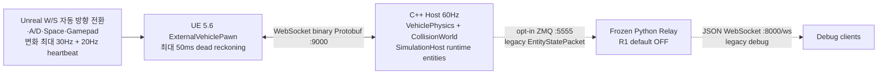
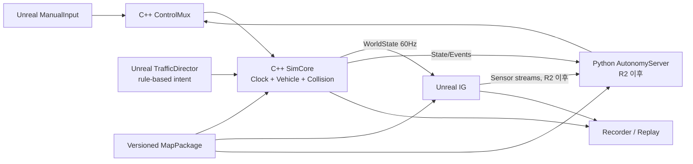
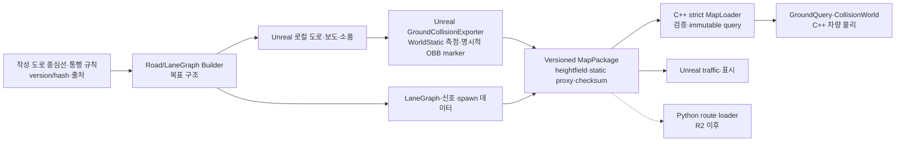
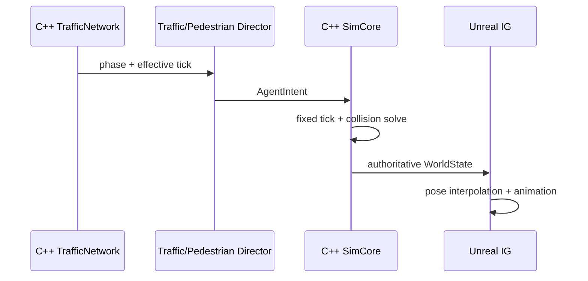

# 시스템 아키텍처

## 1. 문서 정보

| 항목 | 값 |
|---|---|
| 버전 | 3.21 |
| 작성일 | 2026-08-19 |
| 최종 수정 | 2026-09-07 |
| 대상 | R1 수동운전 및 R2/R3 자율주행 확장 기반 |
| 관련 문서 | [일정표](./01_schedule.md), [기능표](./02_feature_matrix.md), [전체 리팩터링 구조](./refactoring.md) |

## 2. 설계 목표

1. C++ SimCore가 차량과 충돌의 최종 물리 상태를 정확하고 일관되게 계산한다.
2. Unreal은 C++ 결과를 고품질로 표현하고 입력·센서·교통 표현을 담당한다.
3. Python은 향후 FSD 판단만 담당하며 수동운전의 필수 데이터 경로에서 제외한다.
4. 지도·차선·충돌 데이터를 한 번 생성하여 C++·Unreal·Python이 함께 사용한다.
5. 수동 입력과 자율주행 명령이 동일한 제어 인터페이스를 사용한다.
6. 작은 가상 도심의 도로·배치·통행 규칙은 데이터 패키지로 격리하여 다른 지역과 트랙에 재사용한다.
7. 로컬 수동운전은 60Hz 상태 전달의 jitter와 표시 지연을 측정하고 제한된 예측으로 보완한다.

2026-08-31 사용자 승인으로 R1 배경은 Wall/Broad 실재 지역 재현에서 **작은 가상 도심
코스**로 바뀌었다. 실제 지도 GIS 취득·Cesium/WGS84 통합·NYSE/Federal Hall 에셋은
R1 요구가 아니다. 로컬 ENU/FLU 계약, Unreal 지면 측정과 C++ 물리 권한, LaneGraph·신호·
NPC 3~4대·보행자 6~8명, SensorRig·기록/재생 및 1080p 60fps·30분 인수 게이트는 유지한다.
범위 변경 근거는 [ADR-013](./decisions/ADR-013-small-virtual-city-course.md)을 따른다.

## 3. 현재 구조와 목표 구조

### 3.1 현재 저장소 기준 구조



현재 구현과 남은 경계는 다음과 같다.

- 9/7에 클라이언트 시작 설정을 `SimCoreClientSettings`로 분리했다. 직렬화된 기본값,
  선택적 `ProjectDir/SimCoreClient.ini`, `-SimCoreServerUrl` 순서로 적용한다.
  `-SimCoreClientConfig`로 별도 INI를 지정하고 map 상대 경로는 그 INI 폴더에 고정한다.
  잘못된 파일·중복/알 수 없는 키·비loopback URL은 첫 소켓 생성 전에 차단하며 HUD에
  이유를 표시한다. 성공한 설정은 Play 수명주기에 고정하고 기존 map/Hello 검증을 유지한다.
- 플레이어 카메라는 V로 추적·운전석·차량 기준 고정 후방을 전환하고 C로 추적에 복귀한다.
  차량 pose나 서버 입력에는 영향을 주지 않는다. 차종별 장착 위치와 플레이어 운전자
  owner-view 숨김을 사용한다. 트럭도 창 개구가 있는 객실의 운전석 시점을 사용한다.
  독립 자유 이동·replay 촬영 전환은 후속이다.
- Windows 배포기는 UE 게임, app-local C++ 서버 DLL·설정, MapPackage와 별도 실행기를
  묶는다. SensorRig의 `Config/sensors.json`은 NonUFS runtime dependency로 포함한다.
  배포 폴더를 이동해도 접속·map 경로가 개발 저장소를 참조하지 않도록 구성하며,
  패키지 제작 성공과 주행·성능 인수는 구분한다. [배포 안내](./windows_package.md).
- 9/5 기준 플레이어는 `1`~`4`로 세단·경차·트럭·오토바이를 선택한다. Unreal은 입력을
  비우고 새 PlaySession으로 연결한 뒤 `SimulationReset.requested_vehicle_class`를 보낸다.
  서버 Hello의 필수 capability `player-vehicle-selection.v1`을 확인해야 reset을 허용한다.
  C++ `player_vehicle_profile`이 질량·구동·제동·조향·서스펜션·충돌 크기를 선택하고
  `VehiclePhysics`의 parameter를 lifecycle 경계에서 교체한다. Unreal은 서버가 확정해 보낸
  Ego `runtime_vehicle_class`를 읽어 외형·바퀴·램프 위치를 바꾼다. 같은 Play 재연결은
  차종과 자세를 보존하며 같은 Play에서 차종만 바꾸는 요청은 거부한다.
- 차종은 C++ physics replay의 `RESET`과 Unreal 주행 CSV v2에도 기록한다. 이전 차종 없는
  `RESET`과 CSV v1은 세단으로 읽는다. 새 Play에서는 SensorRig의 sequence와 센서별 capture
  cadence도 초기화한다. 오토바이는 앞·뒤 중심선 접점과 별도 균형 제어를 사용한다.
  기존 네 wheel wire slot은 앞·뒤 접점마다 둘씩 같은 위치의 분할 하중으로 유지한다.
  실제 횡가속도에서 안쪽 기울기를 구하고 제한된 탑승자 토크로 추종한다. 공중·충돌 이탈·
  65도 이상 전도에서는 균형을 강제하지 않는다. 조향축/자이로까지 갖춘 완전한 이륜 모델은 아니다.
  플레이어와 NPC 모두 차종별 운전자·실내를 표시하며 오토바이는 탑승자·핸들·발판을 사용한다.
  사고 시 오토바이 탑승자는 세계좌표로 분리되어 관성·중력·지면 접촉으로 움직인다.
  이탈 탑승자는 UE 표시이며 독립 서버 충돌 엔티티나 관절별 물리 래그돌은 아니다.
- NPC10대는 네 차종의 크기·질량·관성·가속/제동 profile을 사용한다. C++는 0.25초마다
  신호, 장애물, 인접 차로 간격과 목적지 도달 가능성을 다시 평가한다. 차선 변경 공간이
  부족하면 정지 후 현재 차선 안에서 제한 후진해 공간을 만들고 안전한 인접 차로로
  진행한다. 사고 복귀도 충돌 검사를 거친 저속 전·후진 곡선 주행이다. 이 판단은 저작된
  LaneGraph 안에서 수행하며 자유공간 자율주행이나 NPC별 전체 타이어 동역학은 아니다.
- 9/4~5 표시 후속에는 투명 세단 유리·실내·분리된 운전석 문, 절차적 하차·항의·복귀,
  비상등과 경적, 비충돌 원경 배경, 커브 차선 v3를 포함한다. C++가 충돌·손상·보행 몸통·
  구조물 전도를 확정하고 UE는 국부 정점 변형, 부분 래그돌, 문 힌지와 파편을 표시한다.
  문·팔다리·파편의 표시 계산은 서버 차량 물리에 되먹이지 않는다. 당시 v3는 비충돌 도색만
  교체했지만 9/7 후속 곡선 수정은 아스팔트·연석·보도·NPC 경로를 함께 재생성한다.
  최소 곡률 반경이 도로·보도 폭보다 크도록 제한하고 실제 높이 격자의 연석 지지면도 검사한다.
  최신 map/traffic checksum과 검증 결과는 [9/7 작업일지](./worklogs/2026-09-07.md)에 기록한다.
- C++ `VehiclePhysics`는 네 바퀴의 독립 tire contact와 1D spring/damper 반력으로 tire load,
  차체 heave·pitch·roll을 계산한다. 경사면 tangent 힘과 ENU XY/yaw도 C++가 소유하며,
  `GroundQuery`는 legacy ENU triangle 또는 `SIMGHF1/2` heightfield를 조회한다. v2는 cell
  material ID·terrain friction multiplier를 차량 설정의 surface scale과 결합한다.
  surface scale은 차량 설정 v5에서 도입됐으며 현재 소스의 strict 차량 설정 v7에서도 유지한다.
- chassis shell의 underside·side·roof ground contact가 rollover 관통을 막고, collision impulse에서
  누적 damage/impact zone과 접촉별 dent patch를 만든다. Unreal은 최대16개의 접촉 위치·방향을
  최대28cm 국부 CPU 정점 변형과 `F3` overlay로 표시한다. 면 전체 WPO는 끄고 원본 자산과
  collision shell은 보존한다. 한 사고의 여러 접촉 충격도 합산값으로 반영한다.
- `CollisionWorld`는 8m deterministic broad phase와 정적 OBB-prism, NPC OBB, 보행자 vertical
  capsule의 접촉·projection·상대속도 impulse를 계산한다. 동적 proxy는 질량을 opt-in하면
  Ego와 질량비에 따른 반대 impulse를 받고, 질량 0은 기존 무한질량 호환 경로를 유지한다.
- Proto는 루트 `protocol/vehicle.proto`로 통합됐고 R1의 C++·Unreal이 같은 schema-v2 필드 계약을 사용한다. Python 생성물은 같은 원본에서 만들지만 relay 자체는 동결된 선택 기능이다.
- C++ host는 절대 deadline 60Hz clock, command source/session/sequence/queue-age 검사, 250ms soft SafeStop·1초 hard session retire와 E-stop latch를 적용한다.
- 개발용 background launcher는 stdout/stderr를 `runtime_logs/`로 redirect하고 tick overrun 요약을 최대 1Hz로 제한해, 단일 `io_context` thread가 소비되지 않는 console pipe에 막히지 않게 한다.
- WebSocket 세션은 HTTP 101 accept 완료 전 state frame을 쓰지 않고, initial server Hello 뒤
  첫 client application frame이 유효한 Hello로 승인될 때까지 WorldState broadcast를
  차단한다. 첫 frame 거부는 1008 policy close, 승인 뒤 ordinary payload 거부는 socket을
  유지하며 전송 중 state queue는 latest-wins로 제한한다. server-initiated close가 peer
  handshake나 정체된 write 때문에 완료되지 않으면 250ms deadline 뒤 TCP를 강제 종료한다.
  기본 listener는 `127.0.0.1` 전용이다.
- Unreal client는 입력 변화를 deadzone 처리 후 최신값 우선으로 합쳐 최대 30Hz로 보낸다.
  A/D 키보드 조향은 `DeltaSeconds` 기반 rise/return으로 frame-independent하다. W/S는 fresh
  Ego body state가 정지를 확인한 경우에만 Drive/Reverse를 바꾼다.
- C++와 Unreal은 strict `manifest.cfg`의 실제 collision checksum을 각각 검증하고 연결 직후
  양방향 `Hello`에서 build/source/schema/map checksum과 필수 capability를 교환한다. 양쪽
  Hello가 유효해지기 전에는 ordinary state/reset/control을 적용하지 않으며 E-stop만 안전
  예외다. build/schema/map checksum과 정렬한 capability set으로 negotiated Hello fingerprint를
  만들고, 승인된 connection generation에는 client source/session/highest sequence를 고정한다.
  같은 sequence는 message kind와 sequence를 제외한 semantic payload가 정확히 같은 재전송일
  때만 idempotent하게 허용한다. identity 변경·순서 회귀·altered-payload sequence reuse는
  거부하고, 거부 frame의 높은 sequence는 high-water를 오염시키지 않는다. 그 뒤 Unreal이
  authoritative checksum 일치 후 `SimulationReset`을 보낸다.
- `SimulationHost`는 authoritative runtime entity와 signal clock/reset을 소유한다. 8/31
  `virtual_city_v1` 25lane/차량3head 이력을 보존하며, 현재 `signal_city_v2`는 58lane,
  차량8+보행8 head, controller2, NPC10·보행자8을 발행한다. map/traffic checksum은
  `fnv1a64:86c3103f3e2c7a5b` / `fnv1a64:b19c15afba6936d7`다. 사용자 PIE는 후속이다.
- `traffic_network.json`은 Unreal이 저장 맵의 실제 도로 충돌과 대조해 별도로 내보내는
  versioned sidecar다. v1의 고정 schedule과 v2의 controller별 데이터 기반 phase plan/offset을
  구분하며 각 head의 additive `controller_id`로 소유 controller를 식별한다. C++는
  schema/topology/지면 폭·높이/source map checksum을 검증한
  immutable network만 사용한다. worker 250ms 감시→전체 검증→tick-boundary 교체이며
  새 지면과 불일치하면 신호만 전부 적색으로 전환하고 수동운전/지면 reload는 막지 않는다.
  `WorldState` field 3/4에 head 상태와 network checksum을 넣어 pose/Health와 같은
  sequence·map·play identity로 발행한다. plan/offset 평가는 C++ simulation clock만 수행하고
  Unreal은 `controller_id`를 포함한 결과를 표시할 뿐 phase를 계산하지 않는다.
  [ADR-014](./decisions/ADR-014-server-clock-traffic-signals.md)
  및 [차선·신호 계약](./traffic_network_signals.md)을 따른다.
- UE 경량 diagnostics HUD는 connection/hello/map/control, state rate·sequence,
  local/server age, max gap·forward missing·duplicate/out-of-order old, checksum과 entity를
  표시한다. authoritative
  Health는 8/31 WorldState와 HUD에 연동했다(실제 PIE 확인은 후속). 새 가상 도심의 실제
  `static_colliders.csv`에는 228 OBB가 있고 기존 Landscape는 0개로 보존했다.
  Unreal PIE 벽·동적 entity 충돌은 수동 검증 전이다.
- 기본 CMake 구성은 ZeroMQ를 빌드하거나 5555 포트를 열지 않는다. opt-in observer만 버전 없는 구 `EntityStatePacket`을 발행하며 R1 완료 경로에 포함하지 않는다.

2026-09-02의 동작 보존 리팩터링은 위 책임을 바꾸지 않고 구현 파일의 경계를 좁혔다.
C++는 runtime options의 cfg/CLI, traffic hot reloader, protocol encoder/decoder를 분리했고,
Hello·control·reset 처리는 `simulation_host_session.cpp`와 내부 detail로 분리했다. Unreal은
공통 세단 표시 계약, pure control resolver, client diagnostics, runtime entity/traffic
presentation과 DriveReplay format/runtime을 분리했다. 세 Windows server wrapper는 공통
launcher를 사용한다. 공개 계약과 검증 결과는
[전체 리팩터링 구조](./refactoring.md)에 기록한다.

9/4~5 후속 구현과 저장 맵 반영은 [9/4 작업일지](./worklogs/2026-09-04.md)와
[9/5 작업일지](./worklogs/2026-09-05.md)에 기록했다. 최신 검증은 CTest 34/34와 후속
관련 검사 4/4, UE Automation 84/84 통과다. 자동 검사는 최신 수정본의 주행 감각·표시
자연스러움, 패키징, 1080p 60fps·30분 연속 주행 인수를 대신하지 않는다.

### 3.2 목표 구조



수동운전에서 Python 프로세스는 실행하지 않아도 된다. 자율주행 모드에서는 Python이 `ControlCommand`를 생성하지만 최종 물리 상태는 계속 C++가 결정한다.

## 4. 컴포넌트 책임

### 4.1 C++ SimCore

아래 표는 R1 이후까지 유지할 목표 논리 경계다. 현재 코드는 `SimulationHost`가
`SimulationClock`, `ControlLease`, `VehiclePhysics`를 조정하고, `WsServer`와
opt-in `ZmqPublisher`를 callback으로 주입한다. `CollisionWorld`, strict MapPackage loader와
최소 runtime entity lifecycle은 구현됐지만 별도 `EntityWorld`, 최종 LaneGraph traffic
runtime과 `Recorder`는 후속이다.

| 모듈 | 책임 | 소유 데이터 |
|---|---|---|
| `SimulationClock` | 고정 tick, substep, pause/reset, overrun 계측 | sim time, tick index |
| `ControlMux` | 수동/자율 명령 선택, timeout, E-stop | 현재 control lease와 command |
| `VehicleDynamics` | 자체 강체·조향·구동계·타이어·서스펜션 계산 | 차체·휠·타이어·구동계 상태 |
| `CollisionWorld` | 정적·동적 충돌 검출과 해결 | collision shapes, contact state |
| `EntityWorld` | Ego, NPC 차량, 보행자 proxy 생명주기 | authoritative entity state |
| `MapLoader` | Unreal이 측정한 immutable MapPackage를 검증하고 물리 query provider로 로드 | map checksum, ground snapshot, 검증된 정적 collision proxy |
| `GroundQuery` | triangle 또는 compact heightfield snapshot의 ENU 수직 query·보간 | 검증된 read-only 지면 view |
| `TransportServer` | 명령 수신, 상태·이벤트 발행, handshake | connection/session state |
| `Recorder` | 명령·상태·이벤트와 설정 체크섬 기록·재생 | replay stream |
| `Diagnostics` | tick, latency, collision, queue 로그 | metrics와 structured log |

C++는 렌더링, 영상 센서 생성, 자율주행 의사결정을 담당하지 않는다.

### 4.2 Unreal

현재 구현은 `SimCoreClientComponent`, `SimCoreProtocol`, `ExternalVehiclePawn`,
`SimCoreCoordinateFrames`, `SimCorePresentation`, 경량 diagnostics HUD, `GroundCollisionExporter`,
`ASimCoreStaticCollider`와 runtime entity transient 표시다. 가상 도심에는
`SimCoreVirtualCityLayout` 원본, editor-only `BuildVirtualCity` 저장·Bake commandlet과
map-local `VirtualCityGameMode`/전용 Pawn을 추가했다. 아래 표의 나머지 항목은
향후 분리·구현할 목표 모듈이다.

8/31 표시 개선으로 `SimCoreOrbitCamera`의 mouse orbit/zoom/reset과 수평 유지·
camera probe를 추가했다. 카메라는 server state가 없어도 갱신되며 차량 pose나
control 값을 쓰지 않는다. Editor의 `BuildSedanVisual`은 자체 차체·휠 StaticMesh와
material을 `/Game/Vehicles/Sedan`에 저장하고 Pawn의 mesh component가 참조한다.
메시를 생성하는 코드와 QA 도구는 Editor 모듈에만 있으며 runtime은 저장 에셋을 사용한다.
unit root·기존 wheel pivot·NoCollision과 C++ 자세/속도 연동 표시를 유지한다.
후속 실제 Pawn Tick fixture 시험은 접지 상실 뒤 조향 pivot이 이전 각도에 고정되는
버그를 재현했다. 수정 후에는 지지 위치만 보존하고 최신 서버 조향각을 body-up 기준으로
적용하며 접지 복구 시 contact plane으로 복귀한다. 재현 FAIL→수정→UE Automation
26/26·Editor/Game 빌드 통과를 확인했다. 이 fixture는 socket/서버 주행 없이 표시만
검증하므로 C++ 실제 solver 최고속·선회 시험과 분리한다.
[조작·생성·검증 경계](./vehicle_driving_refinement.md)를 따른다.

| 모듈 | 책임 | 금지되는 책임 |
|---|---|---|
| `SimCoreClient` | handshake, command 전송, WorldState 수신·버퍼링 | 최종 차량 pose 결정 |
| `ManualInputComponent` | 키보드/게임패드 입력 정규화 | 물리 계산 |
| `ExternalVehiclePawn` | pose 보간, wheel·steering 시각화 | Ego에 Chaos 힘을 적용해 C++ 상태 수정 |
| `SimCoreOrbitCamera` | 외부 추적 카메라의 orbit/zoom/reset 상태와 수평 유지 | 차량 pose·ControlCommand 변경, 센서 측정 좌표 대체 |
| `GroundCollisionExporter` | Landscape·WorldStatic의 높이·ImpactNormal·유효 cell과 명시적 OBB marker 측정, MapPackage manifest-last commit | suspension·tire·차체 pose 계산 |
| `GeoTransformAdapter` | 로컬 ENU 원점 metadata와 ENU/FLU↔Unreal 좌표 변환; Cesium/WGS84 통합은 Future | 자체 위·경도 적분 |
| `MapPackageImporter` | LaneGraph와 로컬 에셋 생성·검증 | 독립된 별도 차선 데이터 유지 |
| `TrafficDirector` | NPC 차선·속도·신호 intent 생성 | 충돌 후 최종 pose 해결 |
| `SimCoreTrafficSignalActor` | 서버 신호의 비충돌 외형·상태/초수 표시, stale 전부 적색 | 로컬 위상 계산·NPC intent·차량 물리 |
| `PedestrianDirector` | 단순 경로와 보행 intent, 애니메이션 | 대규모 군중 해석 |
| `SensorRig` | 카메라 등 센서 생성과 timestamp/frame metadata | AI 판단 |
| `ReplayPresenter` | 기록 상태 재생과 촬영 카메라 운용 | 기록된 물리 결과 재계산 |

### 4.3 Python AutonomyServer

R1에서는 필수가 아니며 R2부터 다음을 담당한다.

- 시작점·목적지와 LaneGraph 기반 route planning
- localization과 sensor preprocessing
- behavior planning과 trajectory generation
- steering, throttle, brake 명령 생성
- 자율주행 평가 지표와 실험 관리
- R3의 학습·추론 모델 실행

Python은 차량 동역학과 월드 충돌을 계산하지 않는다. 자율주행 중에도 C++ SimCore가 물리 권한을 유지한다.

## 5. 권한 모델

### 5.1 단일 물리 권한

| 상태 | 권한 소유자 | 다른 컴포넌트의 사용 방식 |
|---|---|---|
| Ego pose/velocity/wheel | C++ | Unreal과 Python은 읽기 전용 |
| NPC 물리 pose | C++ | 현재 C++ LaneGraph 판단·경로 진행 결과를 Unreal이 표시 |
| 보행자 collision pose | C++ | 현재 C++ 횡단 경로·충돌 결과를 Unreal이 animation·부분 래그돌로 표시 |
| 신호 상태 | C++ `TrafficNetwork::signals_at` / `SimulationHost` | 차량과 동일 simulation clock·reset, WorldState 원자 발행; UE는 표시 전용(ADR-014) |
| LaneGraph·통행 제한 | MapPackage | 세 프로세스가 같은 버전 읽기 |
| editor scene 지면 측정 | Unreal | 높이·법선·유효 cell을 MapPackage snapshot으로 고정 |
| runtime 정적 collision snapshot | MapPackage | C++가 검증 후 ground query·collision 계산에 읽기 전용 사용 |
| 센서 영상 | Unreal | Python이 timestamp와 frame ID로 소비 |
| 운전 명령 | 선택된 controller | C++ `ControlMux`만 적용 여부 결정 |

### 5.2 제어 우선순위

```text
EmergencyStop > Active control lease(Manual 또는 Autonomous) > SafeStop
```

- Manual과 Autonomous가 동시에 차량을 제어하지 않는다.
- 모드 전환은 명시적인 요청·승인 handshake를 거친다.
- 유효 command가 250ms 동안 없으면 기본적으로 throttle을 해제하고 안전 제동한다.
- controller는 연결마다 고유 `session_id`를 만들며 sequence는 해당 session 안에서 단조 증가한다.
- active session에서도 client 생성 시각과 server 수신 간격으로 추정한 큐 체류 시간이 100ms를 넘는 명령은 적용하지 않는다.
- timeout 시 기존 session을 폐기하고 WebSocket을 닫는다. Unreal은 0.5초 뒤 새 session ID로 재연결하므로 이전 소켓의 큐 데이터가 새 lease로 넘어오지 않는다.
- reset, spawn, map 변경은 일반 ControlCommand와 분리한다.

## 6. 좌표·단위·시간 규약

### 6.1 좌표계

공통 공개 좌표는 ROS REP-103과 호환되는 right-handed 규약을 사용한다. Unreal과 현재 solver의 좌표는 각 runtime 내부 구현이며 경계 adapter 밖으로 노출하지 않는다.

| frame | 좌표계 | 사용처 |
|---|---|---|
| WGS84 | longitude/latitude/ellipsoidal height | 기존 runtime 출력 호환; 실제 지리 참조·Cesium·GNSS 통합은 Future |
| `map_enu` | right-handed, X=East, Y=North, Z=Up | C++ 위치·속도·충돌, MapPackage |
| `base_link` | right-handed, X=forward, Y=left, Z=up(FLU) | 공통 body 상태, 휠·센서 장착, Python |
| `unreal_actor` | left-handed, X=forward, Y=right, Z=up(FRU) | Unreal 표시 전용 |
| `<sensor>_optical` | right-handed, X=right, Y=down, Z=forward | 향후 카메라 센서 출력 |

| 물리량 | canonical 양의 방향 |
|---|---|
| body yaw rate | 좌회전 |
| road-wheel steering angle·normalized steering command | 좌조향 |
| wheel slip angle·lateral force | wheel-local left |
| navigation heading | North=0°, 시계 방향; body 회전 vector와 별도 scalar |

- R1 `MapOrigin`은 가상 코스의 로컬 기준점과 `map_enu` 축·단위·Unreal 기준 transform을
  versioned metadata로 고정한다. metadata 연동은 후속이며 좌표 왕복 검증은 Must다.
  기존 runtime의 위·경도 설정과 WGS84 출력은 호환을 위해 보존하지만, 가상 코스가 실제
  지리 위치를 재현한다고 해석하지 않는다. Cesium/geodetic 원점 통합은 Future다.
- scalar `yaw_rate`는 true FLU angular velocity의 body-Z 성분이다. 수평 평면 운동에서는
  `heading_rate_clockwise = -yaw_rate_left_positive`지만, compound 자세에서는
  `angular_velocity_body`에서 navigation Euler yaw rate를 복원한 뒤 heading과 비교한다.
- Unreal body polar vector는 `(x, y, z)m → (100x, -100y, 100z)cm`로 변환한다. 자세와 angular velocity는 handedness를 고려한 basis 변환을 사용한다.
- `angular_velocity_body`는 Euler derivative 세 개가 아니라 true right-handed FLU angular
  velocity vector다. 수평 자세에서는 nose-up pitch가 `omega_y < 0`이고 left-up roll이
  `omega_x > 0`이다. compound pitch·roll·yaw에서는 C++가 Euler rate coupling까지 포함해
  FLU vector로 변환하고, Unreal이 현재 pitch·roll과 vector 성분으로 Euler rate를 역복원한 뒤
  제한 외삽한다. FLU positive roll과 Unreal `FRotator.Roll`은 같은 방향이므로 roll을 다시
  반전하지 않는다. 기존 roll 이중 반전은 차체가 지지면 반대로 기울어 보이게 했다.
- C++ `BodyFrameAdapter`가 공개 FLU와 solver 내부 right-positive steering·lateral·yaw의
  부호 경계를 전담한다. `SimCoreCoordinateFrames`는 평면 ENU 위치, FLU 속도,
  schema-v2 yaw·steering의 Unreal 표시 경계를 모은다.
- C++ `GeoTransformAdapter`와 UE `SimCoreCoordinateFrames`는 ENU/FLU↔UE FRU position,
  polar/axial vector와 quaternion basis 변환을 같은 계약으로 구현했다. Windows UE 5.6
  headless `DriveIntegration.Coordinates.GeoTransformContract` Automation 1/1이 성공했다.
  로컬 지도 원점 metadata, SensorRig frame과 실제 코스 PIE 좌표 시각 검증은 남아 있다.
- 위치는 meter, 속도는 m/s, 가속도는 m/s², 질량은 kg, 시간은 second를 사용한다.
- 물리 내부 각도와 각속도는 radian 기반으로 통일하고 기존 표시용 pose 필드만 degree를 사용한다.
- 위·경도는 물리 적분에 사용하지 않고 ENU 상태에서 필요할 때 변환한다.

schema v2의 공개 `linear_velocity_body`, `angular_velocity_body`, scalar `yaw_rate`,
`steering_angle`, `ControlCommand.steering`과 wheel lateral 값은 모두 FLU/Y-left 계약을
사용한다. 항법 heading만 North=0·시계 방향 양수다. 수평 자세에서는 body-Z yaw와 부호가
반대이고, compound 자세에서는 복원한 navigation Euler yaw와 부호가 반대다.
남은 로컬 원점·센서 frame·실제 PIE 검증은 [ADR-011의 COORD-004~008](./decisions/ADR-011-canonical-coordinate-frames.md#현재-구현과-남은-이행-작업)에서 추적하되,
그 중 Cesium/geodetic 통합 요구는 [ADR-013](./decisions/ADR-013-small-virtual-city-course.md)에
따라 Future로 분리한다. ENU/FLU·Unreal·sensor 기준축과 왕복 시험은 R1에서 유지한다.

### 6.2 시간 모델

- 기본 physics tick: 고정 60Hz
- 자체 물리 모델의 수치 안정성에 필요하면 한 tick 안에서 설정 가능한 substep 사용
- 기본 WorldState 발행: 60Hz
- Unreal render tick: physics와 독립
- 모든 명령·상태·센서에 `tick_index` 또는 `simulation_time_ns` 포함
- wall-clock Unix timestamp는 로그 상관관계에만 사용하고 물리 적분에 사용하지 않음
- pause와 replay 시 sim time을 임의로 wall time에 맞추지 않음

## 7. 공통 MapPackage

### 7.1 목적

작성 도로 중심선·통행 규칙을 차선과 시각 도로의 공통 원본으로 사용하고, 실제 충돌 지면은
Unreal에서 측정해 immutable snapshot으로 고정한다. C++가 별도의 지형을 추정하거나
Unreal scene을 다시 cooking하지 않는다. 아래 그림의 도로 생성·LaneGraph 경로는 목표
구조이고, 지면 측정→snapshot 검증·조회 경로는 현재 구현돼 있다.



R1 중심선은 가상 코스에 맞춰 직접 작성하고 방향·폭·lane 수·회전 연결·신호·통행 제한을
명시한다. 여기서 차선 offset과 교차로 연결을 생성한 뒤 Editor override로 보정한다.
GIS/GeoJSON/SHP importer는 R1 선행 조건이 아니다. 자체 작성 원본에도 버전/hash와
변환 이력을 남기며, 외부 에셋은 별도로 라이선스·attribution을 추적한다.

### 7.2 현재 R1 runtime 패키지와 장기 소스 패키지

```text
map_packages/<runtime_package>/
  manifest.cfg
  ground_surface.csv       # legacy triangles 또는 새 형식 sentinel
  ground_heightfield.bin   # 새 Unreal 측정 package에서 선택
  static_colliders.csv
  README.md
```

기존 `wall_broad_v1` bootstrap과 실제 Landscape용 `landscape_local_v1`, 사용자 `NewMap`은
보존한다. 2026-08-31 `/Game/VirtualCity/Maps/L_VirtualCity`와 `virtual_city_v1`을 실제
생성했고 9월 1일 연석·보도 support를 이행해 50cm로 다시 Bake·저장 검증했다. 새 package는
`SIMGHF2` 401×481 lattice, 192,881 samples 중 192,079 valid samples와 191,200
valid·drivable cells, OBB 228개, checksum `fnv1a64:942842ea8d76b7a2`다. 명목 240×200m에서
cube 끝면 ray hit가 누락된 동·서 각 0.5m를 제외한 valid 지면은 E `[-119.5,119.5]`,
N `[-20,180]`m의 239×200m다.

`drive_route.csv`는 약 633.1m 루프의 QA checkpoint 364개이며 `east_m,north_m,up_m,heading_deg`
header를 가진다. collision manifest/checksum과 host collision 입력에 포함하지 않는다.
제품 LaneGraph·NPC AI·통행 규칙·경로계획을 구현한 파일로 해석하지 않는다.

현재 runtime은 strict `manifest.cfg`에 package ID, `map_enu` 좌표계,
`collision_files`와 실제 payload checksum을 기록한다. C++와 Unreal은 선언된 collision
파일의 이름과 raw bytes로 checksum을 다시 계산하며, unknown·duplicate·missing key,
unsafe filename, 파일 누락·변조를 시작 전에 거부한다. 새 package는
`ground_heightfield.bin`을 높이·ImpactNormal·유효 cell source로 사용하고
`ground_surface.csv`는 header-only sentinel이다. binary가 선언되지 않은 기존 package만
`ground_surface.csv` ENU triangle을 사용한다. `static_colliders.csv`는 정적 OBB-prism의
공통 충돌 source다.

아래 `manifest.json` 구조는 LaneGraph·신호·출처와 여러 cooked artifact까지 포함할 장기
MapPackage 목표 포맷이며 현재 runtime parser가 읽는 형식이 아니다.

```text
map_packages/<long_term_package>/
  manifest.json
  georeference.json
  lane_graph.json
  road_semantics.json
  collision_mesh.glb
  signals.json
  pedestrian_paths.json
  spawn_points.json
  overrides.json
  attribution.md
```

장기 `manifest.json`에는 다음을 기록한다.

- package ID와 semantic version
- 작성 도구와 schema version
- 로컬 ENU 원점·축·단위와 Unreal 기준 transform; WGS84 연계 정보는 Future 선택 항목
- 각 파일의 SHA-256
- 자체 작성 원본의 작성 주체·버전/hash·변환 이력, 외부 데이터·에셋의 취득일·라이선스
- Unreal 생성물과 측정 snapshot·LaneGraph가 참조한 source checksum

### 7.3 LaneGraph

LaneGraph는 다음 정보를 가진 방향 그래프다.

- lane node와 directed edge
- center polyline과 폭
- 제한 속도와 진행 방향
- 차량·보행 통행 가능 여부
- predecessor/successor와 좌·우 인접 lane
- 교차로 진입·진출 연결
- 정지선, 횡단보도, 신호 그룹
- 수동 보정 provenance

초기 생성은 직접 작성한 가상 코스 도로 중심선을 기반으로 lane offset을 자동 생성한다.
시각 도로와 어긋난 교차로 연결·정지선·통행 제한을 Editor override로 보정한다. 동일
LaneGraph를 Unreal NPC, 향후 Python A*, C++ 도로 경계 검증에서 사용하도록 설계한다.
배경 범위를 줄여도 LaneGraph 생성·신호 교차로 1개·NPC 3~4대·보행자 6~8명은 R1 Must다.

### 7.4 충돌 일치 절차

1. Unreal `GroundCollisionExporter`에서 `Ground Actor`를 지정한다. Bake preflight는 actor
   전체 colliding-component bounds와 기본 100cm padding을 sampling volume이 포함하는지
   검사하고 부족하면 자동 Fit한다. 수동 Fit 버튼은 결과 box를 미리 볼 때 사용한다.
   기본 100cm 격자에서 WorldStatic hit 높이·ImpactNormal을 측정하고 missing/discontinuous
   cell을 구분해 compact `SIMGHF2` heightfield를 만든다. v2 cell에는 stable material ID와
   terrain friction multiplier가 포함된다. 최대 2,000,000 sample을 넘으면
   해상도를 몰래 낮추지 않고 명시적으로 거부한다. `ASimCoreStaticCollider` marker는 정적
   OBB-prism row로 변환한다.
2. exporter는 header-only legacy sentinel `ground_surface.csv`,
   `ground_heightfield.bin`, `static_colliders.csv`를 모두 staging·교체한 뒤
   `manifest.cfg`를 마지막에 commit하여 부분 package가 유효하게 보이지 않게 한다.
3. C++는 시작 시 manifest와 collision payload의 실제 checksum을 검증한다. binary가 선언된
   package는 O(1) lattice provider를, 기존 package는 adaptive triangle provider를 선택한다.
   heightfield v1은 default material·1.0 multiplier로 해석하고 v2는 cell material/friction을
   strict 검증해 contact에 전달하며,
   static collision에는 8m broad-phase index를 구성한다. 실행 중에는 manifest를 250ms 주기로
   background 감시하고 같은 전체 검증을 통과한 snapshot만 simulation thread에 전달한다.
   시작 로그의 `ground_format`·sample/cell 수와 `exported_ground_bbox_enu_m`·
   `exported_span_m`은 실제 drivable coverage를 표시해 잘못된 Bake를 즉시 드러낸다.
4. host는 새 snapshot을 고정 tick 시작점에서 ground·static collision·checksum 단위로
   원자 교체하고 차량·clock·control lifecycle·runtime entity를 reset한 뒤 이전 WebSocket을
   닫는다. 작성 중이거나 invalid인 후보에는 기존 snapshot을 유지한다.
5. Unreal은 연결마다 같은 manifest와 payload checksum을 다시 검증한다. 재연결에서 checksum이
   바뀌었다면 새 PlaySession ID를 만들고 서버의 첫 일치 `WorldState` 뒤
   `SimulationReset`과 control을 허용한다.
6. checksum이 다르거나 reset lifecycle이 열리지 않으면 host는 일반 control을 거부한다.
7. Ego의 실제 ground·정적·동적 contact solving은 C++만 수행한다.

tracked Landscape runtime package는 실제 v2 전 단계에 Bake한 `SIMGHF1`, `507×508` lattice,
`257,556 samples/256,542 cells`, column·row step 길이 1m인 packed heightfield다. checksum
`fnv1a64:b8b0a6ccd89614de`를 당시 서버 프로세스가 재시작 없이 tick boundary에 적용해 파일
형식과 책임 분리가 실제 package까지 반영됐다. v2 material/friction 경로는 automated fixture로
end-to-end 검증했지만 실제 Landscape Physical Material/tag 재Bake는 아직이다. exported
static collider는 이 기존 Landscape package에서 0개로 보존된다. 별도 가상 도심에는
실제 v2 재질과 OBB 228개를 Bake해 저장 정렬과 C++ dense route/물리 완주 선행 시험을
검증했다. 어느 자동 결과도 실제 PIE의 경사·차체 자세·벽 비관통·재연결 인수를 대신하지 않는다.

### 7.5 런타임 MapPackage 교체 수명주기

```text
Unreal Bake
  └─ payload staging/replace
      └─ manifest.cfg last commit
          └─ background validate (ground + static + checksum)
              ├─ invalid/in-progress → reject, keep current snapshot
              └─ valid latest → queue
                  └─ next 60Hz tick boundary
                      ├─ atomic snapshot swap
                      ├─ vehicle/clock/lease/entities reset
                      ├─ old socket/session fence
                      └─ Unreal reconnect → local revalidate
                          └─ changed checksum → new PlaySession + Reset
```

manifest-last는 파일 저장의 원자성을 보장하는 commit marker이고, simulation tick boundary는
런타임 물리 관측의 원자성을 보장한다. 둘을 분리해야 한 tick에서 새 ground와 이전 collision이
섞이거나, 새 checksum인데 이전 차량 pose가 계속되는 상태를 만들지 않는다. 후보를 읽는 동안
추가 Bake가 완료되면 latest verified candidate가 우선한다. payload가 동일해 checksum이
변하지 않은 Bake에는 reset이나 reconnect를 유발하지 않는다.

향후 Cesium 같은 스트리밍 배경을 추가하더라도 타일 collision을 authoritative 주행 충돌로
사용하지 않는다. R1은 로컬 Unreal scene 측정과 검증된 snapshot만 사용한다.

## 8. 가상 도심 환경의 범위와 경계

### 8.1 R1 제작 범위

- 반복 주행 가능한 작은 양방향 도로 루프와 신호 교차로 1개
- 보도·횡단보도·완만한 경사·정차 공간과 명확한 코스 경계
- 제한된 모듈형 건물·소품·도로 재질·조명으로 구성한 로컬 배경
- 첫 blockout은 명목 240×200m, 현재 50cm Bake의 valid 지면 239×200m이며 조작감·성능에 따라 조정 가능
- 실제 도시·랜드마크 재현, 실제 GIS 취득, Cesium 설치·통합은 R1 범위 밖

### 8.2 Unreal authoring과 C++ 물리의 경계

현재 생성 원본은 meter 기반 `SimCoreVirtualCityLayout.h/.cpp`다. editor-only
`BuildVirtualCity`가 도형 594개와 저장형 색상 재질 10개를 만든다. `VirtualCityGround`
한 actor에는 기본 지면·도로 59개, 보도 116개와 연석 top 215개, 총 390개 component가
있다. 건물·외곽 벽은 별도 시각 geometry이고, 연석은 휠 Ground support와 semantic
`Curb` marker를 함께 가진다. 전체 static marker는 228개다. 주행면의
`SimCore.Surface.Asphalt`/기본 지면의 rough
tag를 production exporter가 측정해 v2 재질로 전달한다. 임시 runtime MID만 사용하는
구성이 아니며 외형은 아직 Engine Cube 기반 prototype art다.

C++는 current→predicted swept body footprint가 닿는 Curb along 구간을 `R` 이하 간격으로
검사한다. 각 위치에서 near(+1R)·far(+3R) pair가 모두 유효하고, `abs(near delta)`가
`[0.02m,0.75R]`, far delta가 같은 부호, far 높이차와 collider 높이 오차가 `0.30R` 이하,
collider 높이가 `0.75R` 이하인지 확인한 뒤에만 planar body collision의
해당 Curb를 제외한다. 50cm heightfield의 authored marker 중심을 가로지르는 full-body
footprint 215곳 중 도로/보도 연석 중심 214곳이 후보이며,
`Curb_BayEnd` 중심은 뒤의 Barrier 경계 때문에 의도적으로 제외된다. 이는 marker 중심
검사 결과이며 전체 연석 길이 보장은 아니다. 옛 1m Bake+absolute marker-top 후보 계약은
164/215였고 현재는 50cm+signed delta다. 옛 bytes를 최종 계약으로 재감사하지 않아
개선분을 해상도에만 귀속하지 않는다. one-off 전체 along-length QA는 210/215 collider 전 길이와
북쪽 T-opening 네 끝단·BayEnd의 의도적 gap을 확인했다. 휠 ray·서스펜션·차체
자세 계산은 GroundQuery를 계속 사용하고 pose를 직접 올리지 않는다.

생성 commandlet은 기존 대상 맵을 덮어쓰지 않는다. `-SyncGeneratedGround`는 생성 원본과
정확히 일치하는 연석·보도 actor만 Ground component로 이행하는 제한된 migration이다.
`-BakeOnly`는 현재 저장 맵을
그대로 열어 production export만 수행하고, `-ValidateOnly`는 저장 geometry transform,
marker ID·pose·extent·semantic·활성 상태와 route asphalt·높이·경사를 원본과 비교한다.
후자는 사용자 배치 변경 이후 원본과 다르면 실패할 수 있다. 실행·수정 절차는
[가상 도심 빠른 시작](./virtual_city_quickstart.md)을 따른다.

저장 재로드 검증과 C++ dense route/입력만을 주는 실제 물리 완주 선행 시험,
UE Automation 11/11 및 Editor/Game 빌드는 통과했다. 최종 통합 QA 재실행은 작업일지에서
관리하고 아래 실제 PIE·시각·성능 경계를 별도로 유지한다.

- Unreal은 도로·보도·건물·소품을 작성하고 WorldStatic 지면과 OBB marker를 측정한다.
- 시각 주행면과 측정된 heightfield·정적 proxy는 같은 코스와 원점을 사용한다.
- C++는 검증된 immutable snapshot을 조회해 타이어·서스펜션·차체·접촉을 계산한다.
- 배경 메시 추가만으로 C++ 충돌이 자동 생성되지 않는다. 주행 관련 장애물은 명시적
  marker와 재Bake·checksum 검증이 필요하다.
- 최종 코스는 실제 PIE 비관통·경사 접지·재Bake/reconnect·표시 일치 및 패키지 성능을
  통과해야 하며 자동 fixture 성공으로 대체하지 않는다.

### 8.3 보존과 Future

기존 `NewMap`과 package는 비교·회귀 자료로 보존했고 별도 코스를 제작했다. Cesium은 현재
필수 의존성이 아니며 이번 결정은 플러그인을 제거했다는 의미가 아니다. 실제 지리 원점·
Cesium 중원경·GIS importer는 필요해지는 릴리스에서 별도 결정한다. Google Photorealistic
3D Tiles 의존도 R1에서는 제외한다. 제작 순서와 자산 출처 정책은
[배경 제작안](./04_environment_plan.md)을 따른다.

## 9. 차량 물리 구조

### 9.1 자체 물리 경계

```cpp
class IVehicleDynamics {
public:
    virtual ~IVehicleDynamics() = default;
    virtual void initialize(const VehicleConfig&, const VehicleSpawn&) = 0;
    virtual void apply_control(const ControlCommand&) = 0;
    virtual void step(double fixed_dt, const CollisionWorld&) = 0;
    virtual VehicleState snapshot() const = 0;
};
```

실제 인터페이스는 구현 중 조정할 수 있지만, SimCore의 transport·recording·entity 코드는 구체적인 차량 수식과 내부 상태 타입을 직접 노출하지 않는다. 이후 비교 검증이나 요구 변경으로 외부 SDK를 시험하더라도 이 경계 밖의 코드를 바꾸지 않는 것이 목적이다.

### 9.2 구현 결정과 현재 단계

D1에 외부 차량 SDK를 런타임으로 채택하지 않고 현재 C++ 서버에 차량 물리를 직접 구현하기로 결정했다. Chrono::Vehicle 10.0.0의 차량 1대·4대, 정적 벽 충돌, 반복성 결과는 비교 기준으로 보존하며 제품 의존성에는 포함하지 않는다. 상세 근거는 [ADR-006](./decisions/ADR-006-custom-vehicle-physics.md)에 기록한다.

현재 2단계 모델과 MapPackage 지면 접촉 기반은 다음을 계산한다.

- 질량과 구동력·제동력으로 종방향 가속도 계산
- 공기저항과 구름저항
- Drive, Neutral, Reverse와 단일 기어비 RPM 근사
- 8/31 후속 승인한 조향 변경은 `clamp(input, -1, 1) × max_steering_angle`을 속도 무관
  중앙 목표각으로 정하고 유한 rack rate로 접근한 뒤 Ackermann 기하로 앞바퀴에 배분한다.
  최대 중앙각 35°, 증가 `1.80rad/s`, 복귀 `2.20rad/s`는 유지한다. 속도별 cap과
  `comfortable_lateral_accel_mps2`는 제거하며 선택형 속도 조향 보조를 추가하지 않는다.
  v6 단계의 C++/Unreal 자동 검증은 이전 이력이며, 아래 v7·hard-stop 지지력 보완은
  최종 CTest 16/16·UE 26/26을 통과했다. 극한 과도응답과 사용자 PIE 인수는 남아 있다.
  목표각은 실제 곡률/횡가속도/yaw를 강제하지 않으며,
  실제 ENU 궤적은 기존 타이어 힘·normal load·slip·충돌 적분에서 결정한다.
- `GroundQuery`를 통한 4개 바퀴의 하향 hit point·normal·no-hit 상태
- `FlatGroundQuery`, legacy `ground_surface.csv` ENU triangle provider 또는 Unreal 측정
  `ground_heightfield.bin` lattice provider의 가장 가까운 vertical hit·법선 조회
- 바퀴별 1D spring/damper stroke·normal reaction. 네 독립 반력이 각 tire load와 차체
  z/heave, mount arm을 통한 pitch·roll moment를 결정한다.
- wheel inertia와 longitudinal slip 기반 종력, slip angle 기반 횡력, friction circle 제한.
  v7은 앞/뒤 per-tire cornering stiffness를 고정 60,000/50,000N/rad로 분리한다.
  spring 외 hard-stop 반력을 tire load/마찰 예산에 반영한 수정은 관련 직접 회귀와
  기존 시험을 통과했다. 하중 비례 강성 후보는 지형 회귀 실패로 되돌렸으며 채택하지 않는다.
  저속 복합 입력에서는 사용 가능한 마찰 한도에서 횡력을 먼저 보존하고 남은 범위에
  종력을 배분해 출발·저속 선회 중 옆미끄럼을 억제한다.
- 구동력은 유한 rise/fall rate로 적용하고 slip 8~12% traction control을 거친다. 구동축
  한쪽이라도 접지를 잃으면 해당 차축 토크를 차단하며, 공중 휠은 수동 감쇠로 정지한다.
- 가감속·선회에 따른 종·횡 tire force, 후륜 구동과 4륜 제동. 각 massless wheel hub의
  planar 속도를 world로 만든 뒤 wheel별 contact-normal local tangent forward/right에
  투영해 slip을 계산한다. tire force도 같은 평면에 둔 뒤 common solver basis로 투영한다.
  같은 world force로 `tau_i=(contact_patch_i-CG)×F_i`를 구해 generalized roll/pitch 축에
  투영한다. rolling resistance도 world lever로 계산하며 중력·공력·driveline drag는 tire
  contact moment에서 제외한다.
- yaw·pitch·roll 관성과 네 suspension 반력 기반 차체 자세. roll generalized axis는 현재
  body-forward, pitch axis는 horizontal-right다. suspension pitch moment는
  `sum(x_i*S_i*cos(roll))`, pitch 유효 관성은
  `I_pitch*cos²(roll)+I_yaw*sin²(roll)`을 사용한다. Euler `E`, `E-dot`, gyroscopic bias와
  planar yaw 가속도 결합을 포함해 compound 자세에서도 body-axis/small-angle 식을 섞지
  않는다. generic sedan의 보조
  `attitude_spring_n_m_rad`와 `attitude_damping_n_m_s_rad`는 legacy 형식 호환 key로만
  남고 validation이 모두 0을 요구한다. solver moment에서는 완전히 제거했으며 지지 평면은
  reset과 진단에만 사용한다. 과거 support-target 인공 K/C와 세계각 pitch ±6°·roll ±8°
  clamp는 제거했다.
- suspension compression hard-stop은 세계 Z만 올리거나 ordinary attitude를 clamp하지
  않는다. position solve는 일반화 좌표 `q={z,roll,pitch}`에서 반복당 translation 0.15m,
  rotation 2° trust region으로 최대 32회 풀고 남은 침투 잔차만 최소 pure-Z lift로
  해소한다. pitch Jacobian은 현재 Euler 정의의 실제 horizontal-right axis를 사용한다.
  velocity solve는 최종 clearance가 activation slop 안인 hard-stop corner만 활성화하고,
  corner별 누적 nonnegative impulse를 투영하는 unilateral LCP를 최대 32회,
  forward/reverse 교대 sweep으로 풀어 대칭 충격의 wheel-order bias를 없앤다. 자세 보정으로
  mount가 다른 Landscape triangle로 이동할 수 있으므로 correction→ground requery→enforce를
  같은 tick에 최대 4회 반복한다.
- ground coverage는 suspension contact와 구분한 authored-surface footprint gate다. 단일
  missing corner와 대각선으로 마주 보는 두 wheel ray만 남은 상태는 실제 partial support로
  계속 계산한다. 반면 front/rear axle 또는 left/right side 중 하나의 두 coverage ray가
  모두 사라지면 ground-bound reduced model이 남은 spring만으로 map 끝에서 tip하지 않도록
  step 시작의 이전 지원 pose로 fail-closed하고 속도를 0으로 만든다. 별도 vehicle-centre
  coverage miss와 네 ray 모두 miss도 기존처럼 같은 안전 정지를 적용한다. 첫 wheel 하나가
  Bake 밖으로 나갔다는 이유만으로 rollback하지는 않는다.
- 경사면 normal에서 만든 fixed ENU tangent basis의 longitudinal/lateral 중력·타이어 힘과 실제 XY 이동의 surface Z projection
- `CollisionWorld`의 8m deterministic broad phase, 정적 OBB-prism SAT, NPC kinematic OBB와 보행자 vertical capsule 접촉
- 이동 거리 0.10m·회전 1° 이하 microstep, projection과 normal/restitution/friction impulse, 최대 64 step fail-closed
- Local ENU east/north/up 6축 pose와 WGS84 출력
- 입력 clamp, 비정상 `dt` 방어, 정지·가속·제동·후진·회전 회귀 시험

현재 자동 시험은 차량 설정·MapPackage loader fail-closed, adaptive triangle query와
brute-force 동등성, 평지·급경사·전체/부분 no-hit, spring/damper, tangent force,
오르막·횡경사 자세, 앞이 높은 지면의 positive pitch, 왼쪽이 높은 지면의 positive roll,
기존 6°/8° 경계를 넘는 연속 자세, deep one-side hard-stop의 bounded attitude와 symmetric
four-wheel 재접촉의 pitch/roll 무편향, 단일 missing corner·대각선 2-wheel partial support와
완전 axle/side·centre·0-ray terminal footprint gate, 정적 OBB와 NPC·보행자 proxy의
projection·상대속도·결정성을 검증한다. tracked `landscape_local_v1`에서 full-throttle로
600 tick 주행하는 회귀는 보완 전 최대 pitch `151.7°`, 최소 z `-0.182m`의 nose-down 실패를
재현했고 terminal footprint gate 적용 후 통과했다. live editor-baked package 회귀는 이후
범위가 확대돼도 깨지지 않도록 고정 `north<30m` 종료 가정 대신 finite pose·centre coverage·
비관통·attitude stability를 검사하고, terminal stop은 deterministic finite-boundary 회귀가
담당한다. 과거 cap 기반 조향 회귀의 약 5m/s 반경 4.0~6.5m, 약 10m/s 반경 15~25m와
bicycle model 대비 yaw response 75~115%는 이전 모델의 검증 이력으로만 보존한다.
최신 고정 목표각 구조의 합격 조건으로 재사용하지 않는다. 당시 Ackermann·마찰 한도,
v1 default friction과 v2 material/multiplier 선택·당시 차량 설정 v5 surface scale 결합도
검증했다. 2026-08-28 당시 C++ Release build와
CTest는 14/14, 전체 suite 20회는 280/280(48.35s), 신규 heightfield/reload 반복은 각 50/50,
선행 WebSocket 회귀는 100/100 통과했다. UE 5.6 Editor/Game build, GeoTransform headless
Automation 1/1과 실제 WebSocket smoke의 pre-Hello state 차단, invalid Hello 1008,
same-sequence altered-payload 2회 거부, valid recovery state sequence 5148도 통과했다.
차체의 east/north/up과
roll/pitch/yaw 및 충돌 후 pose는 C++가 결정하고 Unreal은 결과를 표시하며 Chaos로 Ego
pose를 다시 해결하지 않는다. 같은 날 Unreal exporter에 full-bounds Bake preflight·자동 Fit·
ENU bbox 결과를 추가했고 UE 5.6 Editor build가 성공했다. 실제 PIE 주행 smoke는 재검증
전이다.

새 조향 검증은 동일 입력·초기 rack 상태·tick 경과에서 속도와 무관한 목표각과 slew,
중립 복귀·좌우 Ackermann, 정상/저마찰 지면의 바퀴별 friction budget을 확인한다.
실제 궤적은 ENU 위치 증분/진행 방향 변화로 측정하고 종방향 계기판 속도
`longitudinal_kph`와 ENU CG 선속도 `path_kph`, slip·yaw 응답을 구분 기록한다.
유효 도로 입력 회귀의 CG 반경은 기하학적 CG 참고의 0.85~1.5배 범위인지 확인하되
90km/h full-lock 한계 시험에는 적용하지 않는다. 고속 full-lock의 slip·understeer·감속을 허용하며 무미끄럼이나 저속과 같은
반경을 강요하지 않는다. 물리 결과를 목표 경로에 맞춰 덮어쓰지 않는다. **이전 v6 직접 시험**은
진입 속도 `0/3/10/25/-5m/s`의 동일 입력 이력에서 중앙/개별 wheel 각도의 매 tick 차이
1e-6rad 미만과 full rack 35° 도달 350ms 이내를 확인했다. 정속 입력 0.15의
30/40/50km/h 중앙각은 모두 5.25°였으며 실제 ENU 궤적 반경은 각각 약
30.477/31.292/33.947m였다. 고속 full-lock은 slip·감속을 보였으며 특정 실차 검증이
아니다. 당시 강화된 반경 기준을 포함한 C++ `ALL_BUILD`·CTest **16/16(5.73초, skip 0)**,
Unreal Editor/Game Development 빌드·Automation **25/25**(신규 Steering 2개)와 격리
Health smoke가 통과했다. 기존 TrafficSignals isolated-world cleanup 경고 3개는 남고
신규 조향 시험은 경고가 없으며 전체 시험 실패는 0개다. 사용자 PIE 감각 인수·NPC·
패키징·성능·특정 실차 검증을 완료 처리하지 않는다.

현재 소스의 strict 차량 설정 형식은 `format_version=7`이다. 앞/뒤
`front_tire_corner_stiffness_n_rad`·`rear_tire_corner_stiffness_n_rad`는 각 축 합계가 아닌
타이어 1개당 N/rad다. 선정값은 앞 60,000/뒤 50,000이며 하중에 비례해 바꾸지 않는다.
v6는 구 `tire_corner_stiffness_n_rad`를 두 새 항목에 각각 그대로
복사하고 구 항목을 삭제한 뒤 version7로 올려야 한다. v5는 여기에
`comfortable_lateral_accel_mps2` 삭제도 필요하다. 구 버전은 migration 안내 오류,
v7의 legacy key는 unknown 오류로 거부하며 자동 변환·무시하지 않는다. 선택형 속도
조향 보조는 없고 최대각·rack rate/return과 타이어 힘 파라미터를 분리한다.

최신 정속 50km/h·입력 0.15 진단에서 spring 지지력 합 13,422.963N과 FR hard-stop
impulse 21.4502003N·s×60Hz를 더하면 1,500kg 중량인 약 14,709.975N을 지지하지만,
hard-stop 기여가 타이어 마찰 계산에서 빠진 문제를 확인했다. 당시 FR 횡력 이용률은
약 0.52로 비포화이고 FL은 약 0.95의 횡력 한계에 도달했으므로 이 누락 수정만으로
50km/h 반경의 큰 개선을 보장하지 않는다. 이 반력을 tire normal-load/힘 예산에
반영한 수정은 soft spring·`dt` 변경·reset·no-contact·50km/h `ΣFz` 직접 회귀를 통과했다.
추가 하중 비례 강성 후보는 기존 `landscape_local_v1`의 10초 full-throttle·zero-steer
회귀에서 최대 roll 65.681°로 기존 45° 한도를 넘어 실패해 되돌렸다. 최신 v7은 앞/뒤
고정 60k/50k를 사용하고, `μFz`를 임의로 늘리거나 `ΣFz`를 `mg`에 정규화하지 않는다.
50km/h·입력 0.15 반경은 약 32.48m로 이전 33.947m에서 완만하게 개선됐지만,
180km/h full-lock의 큰 반경·과도 yaw 진동과 reduced-order 한계는 남는다. 이전 v6
회귀로 새 수정의 합격을 대신하지 않는다. 최신 physics/config/probe 직접 실행에 이어
C++ `ALL_BUILD`·**CTest 16/16(4.92초, 실패 0·skip 0)**, UE **Editor/Game 빌드·26/26**,
격리 Health smoke·서버 적용이 통과했다. 90km/h·입력 0.04는 중앙각 1.4°,
종방향 계기판 속도 90.0007km/h·CG 궤적 속도 90.0264km/h를 유지하며 ENU 반경이
145.377m에서 114.520m로 변했다. 신규 0.015 small-signal의 30/90km/h 반경은
295.610/303.179m였으며 독립 understeer 계수 0.000125rad/(m/s²)를 검증했다.
이는 UE deadzone 0.02 미만의 solver 진단이지 실제 사용자 입력 시험이 아니다.
**180km/h full-lock 과도 yaw 진동·사용자 PIE 인수는 미완료**이며 자동 계약 통과와 구분한다.
미채택 실험의 공식 모델 참고와 상세 사용/검증 경계는
[조향 문서](./vehicle_driving_refinement.md)를 따른다.

현재 4-corner 모델은 wheel 회전 관성, 독립 spring/damper와 sprung-body heave·pitch·roll을
결합하지만 hub vertical unsprung mass는 대수적으로 푸는 reduced-order 구조다. roll/pitch는
planar yaw trajectory를 조건으로 finite-angle 계산하며 planar yaw inertia로의 역결합은
없다. heave도 ground-normal-following 근사다. drivable `|pitch|<=60°` 범위에서는 Euler
singularity를 피하지만 완전한 전복·공중 6DoF나 특정 실차 계측 모델을 뜻하지 않는다.

Unreal에서 제작한 개발용 Landscape·정적 경사면은 `GroundCollisionExporter`가 지정된
영역의 실제 `WorldStatic` 충돌을 수직 raycast로 측정해 높이·ImpactNormal·유효 cell과
surface material/friction을 MapPackage `ground_heightfield.bin`의 `SIMGHF2`로 bake한다.
서버는 기존 `SIMGHF1`도 호환한다. manifest v1 호환용
`ground_surface.csv`는 header-only sentinel이며 새 C++ host는 이를 물리 입력으로 사용하지
않는다. `ASimCoreStaticCollider` marker는 ID 순으로
`static_colliders.csv`의 Wall/Curb/Barrier OBB와 재질로 export된다. 월드 cm 좌표는
`east=Y/100`, `north=X/100`, `up=Z/100`으로 변환한다. 세 payload를 staging·교체한 뒤
실제 payload checksum을 담은 `manifest.cfg`를 마지막에 commit한다. C++ 서버는 시작 시
binary 선언 여부에 따라 heightfield 또는 legacy triangle provider를 로드하고, 실행 중에는
완전 검증한 새 snapshot을 tick boundary에서 교체해 바퀴별 ground query와
`CollisionWorld` 접촉을 수행한다. 따라서
render pose의 충돌 hit를 네트워크로 되먹이는 순환 지연 없이 단일 권한과 replay
결정성을 유지한다. 상세 책임 경계와 실패 정책은
[ADR-012](./decisions/ADR-012-unreal-ground-measurement-boundary.md)에 기록한다. 기존
Landscape는 0 markers, 새 가상 도심은 실제 228 OBB이며 벽·커브 PIE 확인은 자동 검증과
별개로 수동 게이트다.

### 9.3 정확도의 정의

R1에서 “정확한 C++ 물리”는 다음을 의미한다.

- 시간, 좌표, 단위, 충돌 결과가 Unreal과 일관됨
- 차량 모델에 차체·휠·타이어·서스펜션·구동·제동이 존재함
- 설정된 파라미터에 대해 직진·제동·회전·경사·접촉 시험을 반복 통과함
- replay로 회귀 여부를 측정할 수 있음

특정 실차와 수치적으로 일치한다는 의미는 아니다. 실차 정확도를 선언하려면 대상 차종, 질량 분포, 타이어, 서스펜션, 동력계와 기준 주행 계측 데이터가 추가로 필요하다.

## 10. 통신 아키텍처

### 10.1 R1 transport 결정

R1 수동운전의 runtime control/state 통신은 `WebSocket binary + Protobuf`로 확정한다. C++ host의 현행 JSON 입력 파서는 제거됐으며, UDP는 초기값이 아니라 측정 결과가 나쁠 때 재검토하는 대안이다. Python relay와 그 JSON WebSocket은 동결된 과거 observer/debug 도구이며 기본 빌드와 R1 검증에서 제외한다.

현재 R1 구현은 하나의 WebSocket 연결에서 `Hello`, `ControlCommand`, `SimulationReset`,
`WorldState`를 교환한다. 아래 신뢰성/실시간 채널 분리는 센서·생명주기 메시지가 추가될 때의
논리 목표이며, 별도 transport로 아직 구현된 것은 아니다.

- 신뢰성 채널에서 handshake·reset·설정·생명주기 메시지를 교환
- 실시간 채널에서 Unreal→C++ command와 C++→Unreal state를 교환
- runtime control/state 메시지는 Protobuf `Envelope`를 사용
- JSON은 runtime driving protocol에 사용하지 않음
- Python relay와 ZMQ dependency·5555 bind는 기본 빌드에서 비활성화
- transport와 serialization은 각각 인터페이스 뒤에 두어 측정 결과에 따라 교체 가능
- 센서 영상은 같은 socket에 싣지 않음

### 10.2 메시지 계층

R1 기본 runtime에서 처리하는 payload는 `Hello`, `ControlCommand`, `WorldState`,
`SimulationReset`이다. `Health`는 8/31부터 `WorldState.health`로 함께 발행하며,
`AgentIntent`, `SignalState`, 범용 `LifecycleCommand`, `SensorMetadata`는 목표
메시지다. 현재 reset은 범용 생명주기 명령이 아니라 additive schema-v2
`SimulationReset`으로 명시한다.

C++는 연결 직후 server `Envelope{Hello}`를 보내고 UE도 client `Hello`를 보낸다. 양쪽은
source/build identity, exact schema version, 실제 MapPackage checksum, 빈 값·중복이 없는
capability 집합을 strict 검증한다. 서버가 요구하는 `world-state.v2`, `control.v2`,
`simulation-reset.v1`, `map-package-checksum.v1`을 모두 확인하기 전에는 ordinary
reset/control을 거부하고, transport도 client Hello 승인 전 state broadcast를 내보내지
않으며 UE는 server Hello 전 state를 적용하지 않는다. server는 capability 순서를 정규화해
build/schema/map checksum/sorted capabilities의 negotiated fingerprint를 만들고, accepted
generation별 source/session/highest sequence와 마지막 message kind·semantic fingerprint를
보관한다. 같은 sequence의 재전송은 kind와 sequence를 제외한 semantic payload가 정확히
같을 때만 허용하며, 다른 payload 재사용은 socket 상태를 바꾸지 않고 거부한다. printable
ASCII identity만 로그 경계로 허용한다. E-stop만 초기화 전 안전 예외다. handshake 뒤 C++는
tick마다 schema v2 `Envelope{WorldState}`를 직렬화한다.

`SIMCORE_ENABLE_ZMQ_OBSERVER=OFF`가 기본값이다. 명시적으로
`release-zmq-observer` preset을 선택한 경우에만 C++가 별도의 버전 없는
`EntityStatePacket`을 ZMQ에 발행하고 동결된 Python relay가 이를 읽는다. 이 경로는
schema v2 Envelope와 동일한 계약이 아니며 R1 기능·성능·호환성 게이트에 사용하지
않는다. R2 Python AutonomyServer를 시작할 때 control/state/sensor transport와
version handshake를 별도로 결정한다.

```text
Envelope
  schema_version
  sequence
  simulation_time_ns
  source_id
  map_package_checksum
  session_id
  play_session_id
  payload (oneof)
    hello
    control_command
    world_state
    simulation_reset
```

schema-v2 `EntityState`의 기존 1~21번 필드 의미는 유지한다. runtime entity 지원은
22=`entity_kind`, 23=`linear_velocity_enu`, 24~26=`collision_half_length/width/height`,
27=`collision_radius`를 additive로 추가했다. 구 v2 consumer는 이 필드를 건너뛸 수 있고,
새 Unreal parser는 Ego와 runtime entity를 함께 읽되 ID·개수·수치·shape를 fail-closed
검증한다.

| 메시지 | 방향 | 핵심 필드 |
|---|---|---|
| `Hello/Handshake` | 양방향 | source/build, schema, map checksum, capabilities; ordinary payload 이전 fail-closed gate |
| `ControlCommand` | Controller→C++ | mode, throttle, brake, steering, handbrake, gear |
| `AgentIntent` | Unreal→C++ | entity, target lane, target speed, stop/continue |
| `WorldState` | C++→소비자 | Ego와 runtime entity의 ID 순 pose, velocity, collision metadata; Ego wheel/contact |
| `SignalState` | Unreal→C++/Python | signal group, phase, effective tick |
| `SimulationReset` | Unreal→C++ | play session ID, client time, requested vehicle class; 새 PIE·차종 선택의 configured spawn·clock·lease 초기화 |
| `LifecycleCommand` (목표) | Unreal→C++ | spawn, despawn, map load 등 향후 범용 생명주기 명령 |
| `Health` | C++→Unreal (`WorldState` 내부) | authoritative safety status, tick overrun count, 마지막 승인 command age, command 존재 여부, reason; queue depth는 아직 없음 |
| `SensorMetadata` | Unreal→Python/Recorder | sensor, frame, pose, sim time, payload reference |

### 10.3 상태 표시

- C++는 매 physics tick에 immutable snapshot을 생성한다.
- 현재 Unreal 구현은 snapshot 수신 시각과 body-frame 선·각속도로 render frame의 pose를 예측한다.
- multi-entity snapshot의 NPC는 권한 차종에 맞는 저장 메시·바퀴, 보행자는 Manny/Quinn으로
  표시한다. frame에서 사라진 ID, kind 변경, disconnect와 EndPlay 때 정리한다. 서버 OBB·
  보행 충돌체는 F3로 별도 확인하며 UE 표시 actor가 서버 충돌을 다시 해결하지 않는다.
- Ego 표시 휠의 spin은 authoritative body longitudinal speed를 타이어 반지름으로 나눈
  시각 각속도로 계산한다. 후진에서는 회전 부호를 반대로 하고 정지에서는 0으로 고정한다.
  물리 `WheelState.angular_speed`와 slip은 타이어 힘 진단용 권한 상태로 남기되, 출발 순간의
  slip spike를 그대로 mesh 회전에 노출하지 않는다.
- 외삽은 `MaxExtrapolationSeconds=0.05`로 제한하며, 50ms를 넘으면 마지막 제한 pose를 유지한다.
- 기존 `VInterpTo/RInterpTo` 추종 보간은 설정값상 약 80~100ms의 추가 추종 지연을 만들 수 있어 제거했다.
- 경량 diagnostics HUD는 connection, hello, map, control, state rate, sequence, local/server
  age, max gap, forward sequence missing, duplicate/out-of-order old, 짧은 checksum과 controlled
  entity를 기본 4Hz로 표시한다.
  8/31부터 같은 snapshot의 authoritative Health(status·reason·command age·overrun)를
  함께 표시한다. Health 누락/unknown·100ms stale·연결/handshake 실패는 Active로
  표시하지 않으며 fresh control 송신은 계속 허용해 soft SafeStop 복구를 막지 않는다.
  wire/compatibility 결정은
  [ADR-005](./decisions/ADR-005-realtime-transport-protocol.md)에 기록한다.
- 코드 기반 운전 계기판은 diagnostics HUD와 별개의 `AHUD` presentation이다. 기본 GameMode가
  자동 설치하며 fresh·connected snapshot의 속도·RPM·기어·연료만 표시한다. stale·reconnect·
  offline에서는 이전 값을 지운다. `SIDE BRAKE`는 `EntityState`에 확인 필드가 없으므로
  `PendingControl`의 로컬 command intent만 표시하며 authoritative 적용 상태로 해석하지 않는다.
- 배기가스 component와 procedural audio synth도 같은 snapshot을 읽는 **단방향 소비자**다.
  RPM·종가속도는 sprite 배출량, RPM·차속·휠 접지·published slip은 엔진/타이어음을 구동한다.
  unavailable/stale state에서 emission은 0으로 감쇠하고 audio는 silence로 전환한다.
  이 경로는 `ControlCommand`, `VehiclePhysics`, collision, map package 또는 wire schema에
  피드백하지 않는다.
- Unreal collision response가 Ego transform을 변경하지 않는다.
- 시각 오차의 C++ pose↔보간 기준 pose 비교 표시는 후속 디버그 overlay에서 측정한다.

### 10.4 로컬 저지연 경로와 측정

60Hz 물리와 네트워크 I/O는 같은 단일 `io_context`에서 순서대로 처리한다. 로컬 수동운전 경로는 다음 규칙을 사용한다.

- 동일 render tick의 axis callback은 하나의 최신 command로 합치고, deadzone·변화 epsilon을 적용한 뒤 최대 30Hz로 보낸다.
- 수동 방향 resolver는 S를 `전진 중 service brake → 정지 확인 후 Reverse throttle`, W를
  `후진 중 service brake → 정지 확인 후 Drive throttle`로 변환한다. W+S 동시 입력은
  throttle을 0으로 두고 service brake를 적용한다.
- 기어 전환 판단에는 허용된 state age 안의 authoritative signed body speed만 사용한다.
  아직 상태가 없거나 stale이면 현재 기어를 유지하고 반대 방향 페달을 제동으로만 처리한다.
- 입력 유지 중에는 20Hz heartbeat로 250ms timeout lease를 갱신한다. 물리와 WorldState는 60Hz를 유지한다.
- 각 연결은 고유 `session_id`와 독립 sequence를 사용한다. 서버는 100ms를 초과해 송신 큐에 머문 것으로 추정되는 command를 폐기하여 SafeStop을 해제하지 못하게 한다.
- Unreal은 `BeginPlay`마다 새 `play_session_id`를 만들고 WebSocket 연결 직후 client
  `Hello`를 보낸다. server `Hello`의 schema/map checksum/capability gate가 통과한 뒤에만
  `SimulationReset`을 첫 `ControlCommand`보다 먼저 전송한다. 새 ID는 차량 pose와
  runtime NPC·보행자, simulation clock을 configured spawn으로 되돌리고 control lease를
  SafeStop에서 다시 시작한다.
- 같은 PIE의 재연결은 새 connection `session_id`와 기존 `play_session_id`를 사용한다.
  서버는 reset을 중복 적용하지 않고 이전 socket을 영구 폐기한 뒤 새 socket으로 lease를
  넘긴다. 이전 PIE·socket에서 늦게 도착한 command는 새 주행에 진입할 수 없다.
- WebSocket accept마다 C++가 단조 증가 `connection_generation`을 부여한다. lifecycle
  owner보다 낮은 generation의 reset/control은 상태 변경 전에 거부하고, reset을 승인한
  generation·session에서 온 control만 lease에 진입시킨다. 새 socket의 retired session
  재사용도 validate-then-commit 단계에서 현재 owner를 건드리지 않고 거부한다. 안전
  우선순위가 더 높은 유효 E-stop은 lifecycle owner와 무관하게 process latch에 진입한다.
- C++는 `WorldState` Envelope의 `play_session_id`에 현재 권한 PIE를 echo한다. Unreal은
  로컬 ID와 불일치하거나 비어 있는 state를 표시 전에 폐기해 새 PIE의 pre-reset 초기
  frame이 이전 차량 위치를 잠깐 노출하지 않게 한다.
- E-stop은 process-lifetime latch다. `SimulationReset` 요청으로 해제하지 않으며 서버
  프로세스를 다시 시작해야 한다.
- 250ms command 공백에서는 즉시 throttle을 해제하고 full brake·handbrake SafeStop을 적용하되 session과 socket은 유지한다. 100ms queue-age를 통과한 같은 session의 fresh command가 오면 즉시 다시 arm한다.
- command 공백이 1초를 넘을 때만 해당 session을 영구 폐기하고 1008로 연결을 닫으며, Unreal은 기본 0.5초 후 새 session으로 자동 재연결한다.
- 위 250ms command SafeStop과 별개로, WebSocket server-initiated close에는 250ms transport
  grace deadline이 있다. peer close reply가 없거나 진행 중 write가 정체돼 graceful close가
  끝나지 않으면 deadline에서 TCP shutdown을 강제해 generation 정리를 보장한다.
- Windows UE 5.6 client는 libWebSockets event-loop service를 사용한다. polling fallback은 240Hz이며, producer가 consumer보다 빨라지는 무제한 command FIFO를 허용하지 않는다.
- Editor PIE에서는 background CPU throttling을 꺼 frame hitch가 command timeout을 반복시키지 않게 한다.
- Windows host 실행 중 1ms timer resolution을 요청하고 종료 시 반드시 반환한다.
- TCP `no_delay`를 사용하며, state write가 밀리면 진행 중 패킷과 최신 대기 패킷만 유지한다.
- WebSocket accept가 완료되기 전 binary payload를 쓰지 않아 HTTP 101 handshake 순서를 보장한다.

2026-08-19 Windows loopback Release 측정은 Python probe로 240개 state를 수신해 비교했다. 이는 렌더 프레임까지 포함한 최종 제품 지연이 아니라 host transport scheduler의 기준값이다.

| 지표 | 개선 전 | 개선 후 |
|---|---:|---:|
| state 간격 p95 | 30.05ms | 17.08ms |
| state 간격 최대 | 49.82ms | 17.20ms |
| 25ms 초과 interval | 26/239 | 0/239 |
| command 전송→첫 speed 변화 | 약 35.62ms | 약 27.32ms |

현재 수치에서는 WebSocket을 UDP로 교체할 근거가 없다. packaged Unreal의 render 시점 state age, 장시간 overrun, LAN과 다중 엔티티 조건은 별도로 다시 측정한다. 상세 결정은 [ADR-010](./decisions/ADR-010-low-latency-control-presentation.md)에 기록한다.

실제 PIE에서 시간이 지날수록 입력 지연이 증가한 원인은 UE 5.6 내부 command FIFO의 60Hz 생산/약 30Hz 소비 불균형이었다. 서버 도착 이후 지연만으로는 발견할 수 없었으며, event-loop service와 20Hz heartbeat 적용 후 장시간 반복 조작에서 해소됐다. 진단 과정은 [해결 사례](./troubleshooting/ue56-websocket-growing-input-delay.md)를 따른다.

2026-08-27의 별도 1008 사례는 PIE tick 중단이 아니라 서버의 state rate가 60Hz에서
24~40Hz로 함께 떨어진 뒤 발생했다. 단일 I/O thread에서 매 overrun을 `std::cerr`에
동기 출력하고, 자동화가 더 이상 console pipe를 소비하지 않으면 heartbeat read까지
막힐 수 있었다. background file logging, 1Hz overrun 요약과 위 2단계 lease를 적용했다.
재현 증거와 운영 절차는 [control lease timeout 해결 사례](./troubleshooting/ue56-control-lease-timeout-log-backpressure.md)에 기록한다.

## 11. Traffic과 보행자

규칙 기반 AI와 물리를 분리한다. 아래 Director/AgentIntent는 후속 통합 목표다.
현재 신호 시간은 [ADR-014](./decisions/ADR-014-server-clock-traffic-signals.md)에 따라
C++ `TrafficNetwork`가 simulation clock에서 계산한다. `virtual_city_v1`의 단일 교차로
고정 schedule은 호환 이력으로 남고, 현재 `signal_city_v2`는 방향 차선 46개·차량/보행
head 각8개·독립 controller 2개와 sidecar의 데이터 기반 phase plan/offset을 사용한다. 각 head의
additive `controller_id`까지 차량·Health와 같은
`WorldState`에 담는다. Unreal은 받아서 표시하며 자체 phase timer를 돌리지 않는다.



- TrafficDirector는 LaneGraph, 신호, 선행 차량을 보고 target lane과 target speed를 정한다.
- 현재 `signal_city_v2`에서 NPC10대·보행자8명의 deterministic ID·spawn·runtime state를
  소유한다. 같은 proxy를 collision과 `WorldState`에 사용하고 새 PIE reset에서 복원한다.
- C++는 NPC 차량을 R1용 제한된 route follower+유한질량 OBB로 진행시키고 충돌 상태를
  확정한다. Ego 충돌의 equal-and-opposite impulse로 NPC·보행자 위치와 속도가 변하며,
  충돌 중 경로 진행을 동결한다. 잔여 운동 정착 후 2~5초 대기·저속 복귀하며 강한 충격은
  자동 운행 중단 상태를 유지한다. 다음 follower tick에 원위치로 끌어당기지 않는다.
- PedestrianDirector는 경로와 대기/횡단 intent를 정한다.
- C++는 서 있는 보행자의 capsule과 충돌 뒤 몸통 중심·회전 투영 OBB를 tick에 맞춰 진행한다.
- NPC는 `npc_autonomous`에서 목적지 선택·successor 경로 탐색·동일 목적지 우회와 저작된
  같은 방향 차선 변경을 수행하고 차량 신호를 따른다. cfg route는 초기 배치에 사용하며
  legacy fixed 모드는 유지한다. 보행자는 지정 crosswalk/보행 신호를 유지하고,
  Ego FSD·복잡한 군중 회피·교통 수요 모델은 포함하지 않는다.
- impulse 기반 damage와 전/후/좌/우/roof/underbody Unreal 실제 정점 변형은 구현했지만,
  collision shape 변형·파편·부품 분리·fracture는 포함하지 않는다.

9/3 구조물 후속: `StructureDamageRuntime`은 Wall 접촉의 부분 피해와 traffic 기둥의
충격량·중력 힌지 전도를 계산한다. 기둥은 runtime collision proxy로 추가하며 같은 tick의
전도 자세를 wire와 물리에 사용한다. 파손된 신호 head만 소등하고 정상 head의 주기는 유지한다.
같은 신호 그룹에 정상 head가 남아 있으면 NPC는 그 신호를 따르며, 모두 고장 났으면 정지한다.
SafeStop의 전체 적색 처리는 별도다. 건물 shell은 유지하고 UE는 외벽 균열·짧은 비충돌 파편만 표시한다.
같은 Play 재연결은 유지, 새 Play/map·traffic reload는 복원한다. 차량 파편이나 건물 전체
붕괴를 구현한 것은 아니다. [구조물 피해 계약](./structure_damage.md)을 따른다.

### 11.1 NPC runtime 구현(2026-08-31, 2026-09-02~04 후속)

`simulation_host_npc.cpp`가 검증된 lane route·signal snapshot·불변 GroundQuery를
`NpcLaneFollower`에 공급한다. 제어기는 경로 거리·속도·정지 이유를 계산하고, 호스트는
전방 OBB 표본으로 Ego/static/runtime 장애물을 검사한다. 이 NPC는 Ego의 네 타이어·
서스펜션 동역학을 실행하지 않는 route follower다. 다만 collision solve에서는 NPC 차종별 질량,
보행자 80kg의 유한질량 proxy로 참여해 Ego와 반대 방향의 normal/tangent impulse를 받고,
속도·yaw 한도와 시간 기반 `ImpactRecoveryState`에 따라 authoritative pose를 갱신한다.
충돌 solver의 normal impulse/mass를 250ms 창으로 합산하고, 정착→대기→복귀 동안
follower 거리·차선 변경 진행을 동결한다. 복귀는 최대 0.35m/s·8도/s로 가속을 제한하고
NPC의 이동 구간에 지면/OBB 검사를 적용한다. 심한 충격이나 누적 손상 100%에서는
`Disabled`를 유지한다. 이는 데모용 사고 반응 정책이며 실제 파손 역학의 예측 모델이 아니다.
새 Play/reset은 이 상태를 초기화한다. 9/3 후속 `ImpactTumbleState`는 충돌 angular impulse와
상자 지지점 관성·중력·착지 감쇠를 이용한 NPC pitch/roll·전도를 추가한다. 회전된 상자의
지지 높이와 보수적 yaw-aligned 외곽을 collision snapshot에 반영하고 기존 wire 자세로
표시한다. 지면 구속 모델이므로 공중 비행·정밀 6자유도 접촉, NPC끼리의 완전한 차량
동역학은 아직 없다. 보행자는 UE Manny/Quinn 스켈레탈 메시·idle/walk를 사용한다.
9/3 사용자 피드백 후 실제 횡단 heading·runtime impact event/phase를 전송하고, UE의
기존 PhysicsAsset 관절을 연결했다. 후속 사용자 피드백으로 매 snapshot 전체 골격 이동과
2.5m offset 제한을 제거했다. 서버 `PedestrianImpactState`의 몸통 중심·상향 속도·낙하·전도와
낮은 충돌 OBB를 전송하고, UE 골반만 kinematic으로 맞추며 팔다리를 simulate한다. 서 있는
캡슐을 남기지 않으며 `F3`에서 서버 충돌체와 중심을 직접 표시한다. 동일 사건 재발사 방지와
서버 복귀 허가 후 자세 복원은 유지한다. 서버 관절별 동역학은 아니며 UE 관절 힘은 서버에
되먹이지 않는다. EntityState additive34/35는 downed/airborne,36은 NPC 좌·우 깜빡이 의도다.

tick 시작 pose→accepted end pose의 속도를 collision proxy에 설정해 Ego 충돌을 계산한 뒤
정확히 같은 end pose를 WorldState로 발행한다. 별도 `advance_runtime_entities()`에서
lane NPC를 중복 적분하지 않는다. NPC ID1001/proxy `lane-npc-1001`과 wire slot은 생성/
map reload 양쪽에서 예약한다. 새 Play/lease/map·traffic reload와 ground lifetime 경계는
[NPC 계약](./npc_lane_following.md)을 따른다.

Unreal은 수신 NPC 차종에 맞는 자체 차체/휠을 표시하고 tick별 bounded extrapolation을 적용한다.
외형 actor는 NoCollision이며 local stale/reset/disconnect에서 정리한다. 서버의 신호
상태·진행이나 물리를 Unreal AI가 독립적으로 재계산하지 않는다.

### 11.2 NPC 내비게이션 확장(2026-09-03)

`NpcRoutePlanner`는 재방문 가능한 목적지를 entity ID/trip counter로 선택하고 저작된
directed successor의 거리 기준 최단 경로를 계산한다. `simulation_host_npc.cpp`는 전방
최대 80m의 정적/정차 장애물을 조회해 같은 목적지로 우회하며 신호 대기열을 제외한다.
`NpcLaneChangePlan`은 optional `TrafficLane::lane_changes`의 같은 방향 station 구간에서
quintic 경로를 만든다. host가 앞뒤 간격·접근 속도·전체 swept 장애물 검사를 담당하고,
`NpcLaneFollower`의 reroute/target adoption은 진행 상태와 신호 허가를 보존한다.
검증 실패는 tick 진행 rollback과 마지막 pose 동결로 처리한다. Unreal 지도 geometry·ground,
공개 wire와 Ego 물리 수식을 바꾸지 않았다. [상세 계약·시험](./npc_navigation.md)을 따른다.

## 12. 센서 확장 구조

모든 센서는 차량 body frame에 상대적인 `SensorMount`를 가진다.

```text
SensorMount
  sensor_id
  sensor_type
  parent_frame_id
  translation_m
  rotation_quaternion
  update_rate_hz
  latency_ms
  enabled
  parameters
```

- RGB/Depth/Segmentation은 Unreal `SceneCaptureComponent2D` 계열로 구현한다.
- GNSS/IMU는 C++ ground-truth 상태에서 noise/bias 모델을 적용한다.
- LiDAR/Radar는 구현 방식과 성능 예산을 R2에서 별도 결정한다.
- 모든 센서는 캡처 시점의 sim time과 world/body/sensor transform을 기록한다.
- GPU readback과 인코딩은 game thread를 차단하지 않는 비동기 파이프라인으로 설계한다.
- 센서 payload와 control/state 메시지 transport를 분리한다.

R1은 SensorRig, mount config, timestamp/frame metadata와 선택적인 저주기 RGB smoke test까지만 수행한다.

현재 구현은 `base_link` FLU 기준 front camera10Hz·roof LiDAR20Hz config와 authoritative
`SimulationTimeNs` metadata cadence다. 실제 image/point cloud payload는 캡처하지 않는다.
map checksum 또는 PlaySession이 바뀌면 metadata sequence와 센서별 capture cadence를
초기화하므로 차종 변경 뒤 이전 주행의 센서 시간이 이어지지 않는다.

## 13. 기록·재생·촬영

### 13.1 기록 대상

- build ID, schema version
- MapPackage와 collision source checksum
- vehicle config checksum
- tick 설정과 random seed
- 모든 적용된 ControlCommand와 AgentIntent
- authoritative WorldState와 collision event
- 신호 상태 변화
- 연결·timeout·reset 이벤트

### 13.2 재생 모드

| 모드 | 용도 |
|---|---|
| Input replay | 같은 입력을 C++에서 다시 계산하여 결정성과 회귀 검증 |
| State replay | 기록된 상태를 Unreal에서 그대로 재생하여 영상 촬영 |

영상은 실시간 플레이 캡처보다 State replay를 우선 사용한다. 동일한 주행에 카메라와 품질 설정을 바꿔 Movie Render Queue로 촬영할 수 있고, 녹화 부하가 물리 결과에 영향을 주지 않는다.

현재 Unreal `R`은 authoritative snapshot CSV를
`Saved/DriveReplays/last_drive.csv`에 저장하고 `F6`는 collision-free visual ghost로 재생한다.
CSV v2는 권한 차종을 함께 저장해 재생 외형에 적용하며 CSV v1은 세단으로 읽는다.
이 화면 재생과 별도로 C++ `PhysicsReplayRecorder`가 실제 fixed tick의 `VehicleInput`,
physics update 직전 dynamic collision proxy와 결과 상태를 기록한다. `RESET`은 offline
physics에 기록된 차종 profile을 적용해 reset하고, reconnect/SafeStop/hard timeout/EStop은
lifecycle marker로 보존한다. 차종이 없는 이전 `RESET`은 세단으로 해석한다.
안전 전이의 물리 효과는 각 tick의 정확한 적용 입력으로 재현하며 원래 lease FSM이나 traffic
AI를 offline에서 다시 실행했다고 주장하지 않는다.

`--verify-physics-replay`는 같은 실행 파일 bytes·vehicle checksum·map collision checksum·
origin/spawn/Hz를 요구하며 기록된 외부 충돌 입력으로 Ego 물리를 재계산한다. 위치 1cm와
yaw 0.1도 및 body/wheel/damage 상태를 frame별로 검사한다. format/version/count/footer와
유한값을 엄격히 검증하고, map/traffic reload 또는 불완전 기록을 정상 재생으로 승인하지
않는다. R/F6 UI와 서버 recorder는 독립적이며 실제 사용자 기록·재생 인수는 별도다.
[실행 절차와 제한](./core_validation.md)을 따른다.

## 14. 실패 처리

| 실패 | C++ 동작 | Unreal 표시 |
|---|---|---|
| command timeout | throttle 해제, 안전 제동 | 같은 WorldState의 authoritative SafeStop·reason·command age; stale이면 Unknown |
| map checksum 불일치 | simulation start 거부 | 양쪽 checksum과 해결 방법 표시 |
| state packet gap | 계속 시뮬레이션, gap 계측 | 제한된 보간 후 freeze·경고 |
| Unreal 연결 종료 | 설정에 따라 안전 정지 또는 headless 지속 | 재연결 후 full snapshot 요청 |
| tick overrun | 누적 wall time 보정으로 dt를 키우지 않고 overrun 기록 | 서버 로그와 WorldState Health/HUD 누적 count |
| invalid numeric state | 해당 tick 적용 중단, snapshot 보존, 치명 로그 | 시뮬레이션 중지 안내 |

## 15. 시험 구조

### 15.1 C++ 단위·회귀 시험

- 좌표·quaternion 왕복
- command clamp와 timeout
- fixed tick 독립성
- 정지·가속·제동·회전·경사
- 정적 mesh 및 동적 OBB/capsule 충돌
- 동일 input replay
- Proto backward compatibility와 invalid packet
- MapPackage checksum과 schema validation

### 15.2 Unreal 자동·통합 시험

- MapPackage import 결과 수와 bounds
- ENU↔Unreal transform 왕복
- handshake 성공·실패
- state buffer의 보간·gap·reconnect
- Ego physics 권한 위반 탐지
- TrafficDirector 신호 준수
- SensorMount transform과 timestamp

2026-08-28 현재 C++ Windows Release 전체 build와 CTest 14/14·전체 suite 20회
280/280(48.35s),
UE 5.6 Editor/Game build, headless `DriveIntegration.Coordinates.GeoTransformContract`
Automation 1/1과 실제 WebSocket smoke의 invalid Hello 1008·pre-Hello state 차단·동일
sequence altered payload 2회 거부·valid recovery state sequence 5148이 통과했다. 실제
Landscape PIE와 `static_colliders>0` marker 충돌은 자동 시험 결과와 별개의 수동 gate다.

2026-09-02 최종 자동 통합은 실제 `signal_city_course` 5개 검증군, C++ Release 전체 build와
CTest **20/20**, UE Editor/Game Development build와 전체 Automation **47/47**, Windows
launcher self-test 3 profiles, Python generated Proto **1/1**과 smoke helper **10/10**을
통과했다. Signal City WebSocket도 엄격한 순항속도·경로 경계를 유지한 채 **2,280 states**와
SafeStop/reset을 다시 통과했다.
당시 테스트 인계용 background 실행에서 port9000 listener와 시작 로그를 확인했다. 이는
일시 실행 증거이며 현재 서버 상태를 보장하지 않는다. 실제 PIE 조작감·HUD 가독성·60fps·
30분 안정성은 미완료다.

### 15.3 성능 시험

- 목표 Windows PC의 패키지 빌드에서 수행
- 동일한 replay, 카메라, 해상도, 그래픽 설정 사용
- Game thread, Render thread, GPU, frame p50/p95, streaming hitch 기록
- command age, state arrival interval·age, sequence gap, 입력→첫 상태 변화의 p50/p95/max 기록
- loopback과 LAN을 구분하고 timer resolution·서버 build·Unreal FPS를 결과에 함께 기록
- NPC 수, 보행자 수, 센서 활성 상태를 결과에 함께 기록
- 모듈형 건물·소품 밀도와 조명 품질별 비용을 측정하고, 가상 코스 전체에서 동일 성능 기준 적용

9/3의 `FSimCorePerformanceCapture`는 위 전체 프로파일링 계획 중 opt-in 엔진 frame-end
간격과 승인된 WorldState의 game-thread 간격만 계측한다. 측정 중에는 메모리에 보관하고
종료할 때 CSV/설정 JSON을 저장한다. renderer/GPU 단독 시간과 인과관계가 있는 입력 지연은
계측하지 않는다. `analyze_performance.py`는 malformed/truncated/nonfinite data를 거부하고
PIE/NullRHI·해상도/제한 설정 변경·짧은 기록을 정식 패키지 측정과 구분한다. 안정성·수동
주행 인수는 자동 승인하지 않는다. 전체 자동 검증은 `scripts/check_core.py`로 수행한다.

## 16. 배포 구성

```text
release/
  SimCore.exe
  DriveIG/
  config/
    runtime_server.cfg
    vehicle_sedan.cfg
    sensors.json
  maps/
    virtual_city_v1/       # 실제 blockout package 존재; 최종 배포 인수는 후속
    signal_city_v2/        # 비직사각 도심망·2 controller 후속 package; 사용자 PIE 인수는 후속
  proto/
    schema_version.txt
  logs/
  replays/
  THIRD_PARTY_NOTICES.md
  RUNBOOK.md
```

C++ runtime 설정은 `runtime_server.cfg`와 CLI가 담당한다. 적용 우선순위는 built-in defaults
&lt; cfg &lt; CLI다. cfg에 적은 상대 vehicle/map 경로는 cfg 파일 위치를 기준으로 해석한다.
WebSocket port, physics Hz, origin latitude/longitude/altitude, spawn heading,
command timeout·maximum queue age·hard timeout, source ID, demo entities와 vehicle/map 경로를
외부화한다. unknown/duplicate key, missing value, non-finite/range 오류와 timeout 상호 관계
오류는 시작 전에 fail-closed하고 `--help`로 지원 키와 우선순위를 안내한다. Unreal packaged
client의 외부 server address 배포 구성은 별도 후속이다.

목표 배포 실행 순서는 다음과 같다.

1. SimCore가 config와 MapPackage를 검증하고 대기한다.
2. Unreal 패키지가 연결해 schema·map handshake를 수행한다.
3. 사용자 선택으로 Manual control lease를 획득한다.
4. C++가 tick을 시작하고 WorldState를 발행한다.
5. Unreal이 IG, traffic intent, sensor, recording을 시작한다.
6. 종료 시 replay와 성능·오류 로그를 flush한다.

현재 프로토타입은 strict runtime cfg와 MapPackage를 검증한 뒤 `WsServer`와 물리 tick을
시작하고, 연결 시 server `Hello`를 전송한다. Unreal은 로컬 `manifest.cfg`와 payload를 먼저
검증해 client `Hello`를 보내며, 양쪽 schema/build/source/capability/map checksum gate가
통과한 뒤 `SimulationReset`을 보낸다. host는 reset 전 일반 control을 거부하고 reset을
승인한 connection generation·session에만 lease 진입을 허용한다. 따라서 Hello, map identity와
SimulationReset lifecycle gate는 구현됐으며, 사용자 선택형 Manual/Autonomous `ControlMux`가
후속이다.

## 17. 아키텍처 결정 기록

| ADR | 상태 | 결정 | 이유 |
|---|---|---|---|
| ADR-001 | R1 범위 대체·이력 보존 | 과거 Cesium+로컬 에셋 하이브리드 | 배경·지리 통합 요구는 2026-08-31 ADR-013으로 대체; 고정 주행면·충돌 원칙 유지 |
| ADR-002 | 확정 | C++가 단일 물리 권한 | C++/Unreal 충돌 보정 경쟁 제거와 headless 확장 |
| ADR-003 | 확정 | Python을 수동운전 필수 경로에서 제거 | 지연·장애 지점 감소, Python을 FSD 역할로 한정 |
| ADR-004 | 확정 | MapPackage를 지도 single source of truth로 사용 | 차선·충돌·경로 데이터 불일치 방지 |
| ADR-005 | 확정 | R1은 WebSocket binary + Protobuf | JSON 혼용을 제거하고, UDP는 측정 결과로 재검토 |
| ADR-006 | 확정 | 현재 C++ 서버에 자체 차량 물리 구현 | 차량 수식·상태·오차를 직접 설명하고 수정하는 학습·포트폴리오 목표 |
| ADR-007 | 확정 | R1은 수동운전, 학습은 연기 | 8월 품질과 기반 구조에 집중 |
| ADR-008 | R1 범위 대체·이력 보존 | 과거 Wall/Broad 핵심부 보행 중심·주변 도로 주행 | 실제 지역 조건은 ADR-013으로 대체; 보행 구역·차량 경로 분리 원칙 유지 |
| ADR-009 | 확정 | 센서 payload를 제어 채널과 분리 | 이미지 readback이 physics/control 지연을 만들지 않도록 함 |
| ADR-010 | 확정 | Windows 60Hz timer 안정화 + 입력 latest-wins/coalescing + 최대 50ms dead reckoning | loopback jitter와 송신 FIFO·추종 보간 지연을 줄이면서 C++ 물리 권한 유지 |
| ADR-011 | 확정·이행 중 | 공통 공개 좌표는 ROS 호환 FLU, Unreal FRU와 solver 내부 좌표는 adapter에서 변환 | Python·센서·향후 ROS 확장에 하나의 right-handed 계약 제공 |
| ADR-012 | 확정·이행 중 | Unreal이 지면을 측정해 versioned heightfield를 만들고 C++가 query·차량 물리만 계산 | World collision 측정과 권한 물리를 분리하고 결정적 hot reload·replay 유지 |
| ADR-013 | 확정·blockout 구현 | 작은 가상 도심 코스로 R1 배경 전환 | 실제 지역·GIS·Cesium 작업은 제외하고 Unreal 코스 완성도에 집중; 실제 별도 맵/충돌 package 생성, 교통·센서·기록/재생·수동 인수 게이트 유지 |
| ADR-014 | 확정·v2 확장 구현 | 차량 신호 시간 권한은 C++ simulation clock, Unreal은 표시 전용 | v1 고정 schedule 호환을 보존하면서 v2의 controller별 데이터 기반 plan/offset과 additive `controller_id`를 결정적으로 발행 |

## 18. 결정 대기 사항

| 항목 | 현재안 | 기한 |
|---|---|---|
| Unreal/Cesium 버전 | Unreal Engine 5.6 계열 유지; Cesium 통합·버전 선택은 Future | Cesium R1 제외 확정 2026-08-31 |
| 자체 물리 Windows 게이트 | MSVC Release 빌드와 동일 입력 회귀 시험 | D5 전 |
| UDP 전환 기준 | WebSocket binary + Protobuf 측정값이 ADR-005 기준을 넘으면 재검토 | D3 전 |
| 기준 차량 | 확보한 차량 에셋과 제원이 일치하는 일반 승용차 | D3 |
| 코스 경계·배치 | 방향 승인 후 명목 240×200m/현재 50cm valid 239×200m, 약 633.1m 시험 루프 구현 | 실제 PIE 조작감·성능 확인 후 상세 배치 조정 |
| 배경 방식 | 별도 VirtualCity 기본 도형·자체 색상 재질·낮 조명 blockout 구현 | 최종 외형·외부 에셋 검토·프로파일링은 후속 |
| 라이선스 에셋 | 기존 구매·보유 에셋 목록 확인 필요 | D8 전 |

## 19. 참고 자료

Cesium·NYC·Google 자료는 이전 지리 기반 배경안의 이력 및 Future 검토용으로 보존하며
R1 구현 의존성이나 필수 작업을 의미하지 않는다.

- [Cesium for Unreal clipping](https://cesium.com/learn/unreal/unreal-clipping/)
- [Cesium for Unreal FAQ: 데이터 형식·다운로드·오프라인](https://cesium.com/learn/unreal/unreal-faq/)
- [NYC Digital City Map](https://www.nyc.gov/content/planning/pages/resources/datasets/digital-city-map)
- [NVIDIA PhysX Vehicle 문서](https://nvidia-omniverse.github.io/PhysX/physx/5.1.0/docs/Vehicles.html)
- [Project Chrono Vehicle 문서](https://api.projectchrono.org/manual_vehicle.html)
- [Unreal Engine Set Actor Transform](https://dev.epicgames.com/documentation/unreal-engine/BlueprintAPI/Transformation/SetActorTransform)
- [Google Map Tiles API 정책](https://developers.google.com/maps/documentation/tile/policies)
- [Microsoft timeBeginPeriod 문서](https://learn.microsoft.com/windows/win32/api/timeapi/nf-timeapi-timebeginperiod)
- [ROS REP-103 좌표·단위 규약](https://reps.openrobotics.org/rep-0103/)
- [Unreal Engine 좌표계와 공간](https://dev.epicgames.com/documentation/en-us/unreal-engine/coordinate-system-and-spaces-in-unreal-engine)

## 20. 변경 이력

| 버전 | 날짜 | 변경 내용 |
|---|---|---|
| 3.21 | 2026-09-07 | 카메라 상태·차종별 시점과 운전자 가림 처리, strict loopback INI/CLI·경로 기준·실패 시 연결 차단, 동적 에셋 Cook·SensorRig JSON·서버와 지도의 Windows 배포 경계 추가 |
| 3.20 | 2026-09-07 | 9/4~5 구현을 현재 요약에 동기화: 플레이어 차종 reset·Hello capability·서버 profile·권한 상태·CSV v2/physics replay·SensorRig 초기화, 네 차종 NPC와 근접 후진 회피, 운전자·충돌 표시 경계 및 커브 v3. CTest34/34·후속4/4·UE84/84와 남은 수동/배포 인수를 구분 |
| 3.19 | 2026-09-03 | 실제 정점 기반 dent, 서버 보행 몸통/UE 부분 래그돌, microstep 내 runtime pair 충돌, wire downed/airborne/indicator, 58lane·NPC10·보행 전용 WALK와 보호 현시를 반영. 시각 인수·완전한 6자유도/전신 모델과 구분 |
| 3.18 | 2026-09-03 | NPC RoutePlanner·quintic LaneChangePlan·상태 보존 reroute/adoption과 host 안전 가드, optional lane_changes 및 현재 Signal City 46lane/16head를 반영. legacy fixed 경로·맵/ground·wire·Ego 물리 유지; 검증 결과는 별도 작업일지로 관리 |
| 3.17 | 2026-09-03 | 서버 적용 입력·외부 충돌 입력 기반 Ego replay와 identity/strict footer, opt-in UE frame/state 캡처·분석 경계, 재접속 absolute MapPackage path 및 Core runner를 반영. CTest21/21·UE48/48·Python30/30·실제 replay480ticks 오차0 통과; 물리 수식·공개 wire·맵/에셋 유지 |
| 3.16 | 2026-09-02 | `SimulationHost`의 Hello·control·reset session/detail과 Unreal runtime entity/traffic presentation 분리를 추가. 유한질량 OBB 입력 각속도 상한으로 partial-tick 전파를 차단하고 C++ build·CTest20/20, UE Editor/Game·Automation47/47, launcher 3 profiles, Python Proto1/1·helper10/10·Signal City 2,280-state 최종 통합 결과를 기록 |
| 3.15 | 2026-09-02 | 동작 보존 전체 리팩터링의 runtime options cfg/CLI, traffic hot reloader, protocol encoder/decoder, Unreal sedan/control/diagnostics/replay format-runtime, 공통 Windows launcher 경계를 기록하고 별도 문서에 연결. 최종 통합 수치는 후속 검증 전 추정하지 않음 |
| 3.14 | 2026-09-02 | 키보드 미세 조향 제곱 응답, rear mechanical side brake의 종방향 우선 마찰 배분, Ego↔NPC/보행자 유한질량 반작용과 reaction hold, 6구역 국부 WPO dent를 반영. CTest20/20·UE46/46·Editor/Game 빌드 통과; PIE 조작감·ragdoll·collision-shape 변형은 수동/후속 유지 |
| 3.13 | 2026-09-02 | frame-independent 조향·F3 overlay·full-body rollover contact·damage/deformation, Signal City 42lane/16head/2controller/NPC4/보행자8, SensorRig metadata와 F5 CSV/F6 ghost, CTest20/20·UE45/45·2,280-state smoke를 반영. 결정적 input replay·PIE/성능/안정성은 미완료 유지 |
| 3.12 | 2026-09-02 | `virtual_city_v1` 단일 교차로 이력을 보존하면서 `signal_city_v2`의 방향 차선 42개·차량 head 8개·독립 controller 2개, 데이터 기반 phase plan/offset과 additive `controller_id`, Unreal 표시 전용 경계를 현재 상태에 반영. 다중 NPC/보행자와 사용자 PIE 인수는 미완료로 유지 |
| 3.11 | 2026-09-02 | 저장 보도 support를 16→24cm로 연석 top과 정렬하고, 50cm raster near 허용치를 far plateau·collider 높이로 제한 검증하는 계약과 새 checksum·전체 회귀 결과를 기록 |
| 3.10 | 2026-09-01 | 코드 기반 계기판·배기가스·procedural 차량음을 Unreal presentation-only 단방향 소비자로 추가. fresh authoritative 표시, stale fail-closed, 로컬 주차 브레이크 intent 경계와 물리·제어·schema 비개입을 명시 |
| 3.9 | 2026-09-01 | 가상 도심 50cm SIMGHF2와 새 checksum, current→predicted swept-body along≤R signed near/far delta 계약, center full-footprint 214/215·전체 along-length 210/215+의도적 opening/BayEnd gap, 30/50m/s gate stress를 반영. 사용자 PIE 인수는 대기 |
| 3.8 | 2026-09-01 | 가상 도심 Ground를 59+보도116+연석215=390개로 이행하고 semantic Curb 이중 저작·조건부 planar collision 제외·suspension 기반 등판 경계를 기록. 새 collision/traffic checksum, 실제 package 연석 계측, CTest18/18·UE29/29·두 ValidateOnly와 PIE 수동 인수 대기를 구분 |
| 3.7 | 2026-08-31 | C++ NpcLaneFollower 1대와 tick-start 충돌 proxy/accepted-end 발행·reset/reload/ground lifetime, UE 세단/휠·stale 정리 책임 명시. C++18/18·UE28/28·120초 NPC smoke 통과, kinematic 모델과 미완료 다중 traffic 경계 유지 |
| 3.6 | 2026-08-31 | v7 고정 강성 60k/50k·migration·hard-stop 반력·접지 상실 표시 수정의 CTest 16/16(4.92초)·UE 26/26·Editor/Game·Health smoke·서버 적용과 실제 solver 계측을 기록. 하중 비례 후보는 지형 회귀 실패로 미채택이며 v6·25/25는 이전 이력. 최고속 full-lock 과도 yaw·PIE는 미완료 |
| 3.5 | 2026-08-31 | 속도 무관 input×max-angle·유한 rack·Ackermann 조향, speed cap/legacy knob 제거·strict cfg v6 migration과 최종 CTest 16/16·UE 25/25·Editor/Game 빌드·Health smoke 통과를 기록. 실제 궤적은 기존 타이어 힘·부하에서 결정하며 이전 cap 회귀는 이력으로 보존; 사용자 PIE·전체 R1 인수는 대기 |
| 3.3 | 2026-08-31 | 조향 generic profile 보완, 물리와 분리된 orbit 카메라와 자체 저장형 세단 메시/재질을 반영. 카메라 입력은 pose/control 불변, 시각 메시 NoCollision·unit root·wheel pivot 유지, Editor 생성/검증과 runtime 참조를 분리 |
| 3.2 | 2026-08-31 | SimCoreVirtualCityLayout→editor commandlet→별도 저장 맵→production SIMGHF2/228 marker Bake와 검증 경계를 기록. 실제 valid 238×200m, QA 전용 route와 prototype art, map-local GameMode를 반영하며 LaneGraph·traffic·수동·성능 인수는 완료 처리하지 않음 |
| 3.1 | 2026-08-31 | 사용자 승인으로 R1 배경을 작은 가상 도심으로 전환. 로컬 원점·작성 중심선 LaneGraph·UE 지면 측정/C++ 검증·물리 경계를 반영하고 잘못 남은 C++ collision cooking 목표도를 정정. 실제 GIS/Cesium 통합은 Future, 기존 맵·패키지는 보존하며 ADR-001/008의 지역 관련 요구는 ADR-013으로 대체 |
| 3.0 | 2026-08-31 | Health를 WorldState 내부 atomic snapshot으로 추가하고 선택 capability·없는 command age·HUD freshness·전역 EStop 진단을 명시. 별도 Health frame/queue 간섭을 방지하고 pose/play fence 유지 |
| 2.9 | 2026-08-28 | negotiated Hello fingerprint(build/schema/map checksum/sorted capabilities), accepted generation의 source/session/highest-sequence binding, semantic exact retransmission만 허용하는 동일 sequence 규칙과 250ms forced-close deadline을 반영. 최종 CTest 14/14·20회 280/280(48.35s), pre-Hello 차단·invalid 1008·altered-payload 2회 거부·recovery seq 5148 smoke 통과 |
| 2.8 | 2026-08-28 | client Hello 승인 전 WorldState 차단·첫 frame 1008 close, generation별 source/session/sequence binding과 non-poisoning high-water, log-safe identity, localhost-only listener 및 HUD missing/old 분리를 반영. 전체 CTest 20회 280/280와 실제 negative/positive WebSocket smoke 통과 |
| 2.7 | 2026-08-28 | `SIMGHF2` surface material/friction과 v1 호환·vehicle cfg v5, C++/UE GeoTransform/quaternion+Automation 1/1, 양방향 Hello capability/schema/map checksum gate, 경량 diagnostics HUD, strict runtime cfg&lt;CLI를 현재 구조로 반영. 최종 C++ 14/14·UE Editor/Game build를 기록하되 실제 v2 Landscape/PIE, authoritative SafeStop/Health, static marker gate는 후속 유지 |
| 2.6 | 2026-08-28 | 실제 100cm Bake(257,556 samples/256,542 cells, checksum `b8b0…`)와 실행 중 서버의 same-process tick-boundary 적용을 runtime MapPackage 현황에 반영하고 남은 PIE·static marker gate를 구분 |
| 2.5 | 2026-08-28 | Unreal의 100cm 높이·ImpactNormal·valid-cell 측정과 C++ `GroundQuery` 물리 계산 책임을 `SIMGHF1`로 분리하고 legacy v1 sentinel 호환, 2M sample fail-closed, C++ 13/13·신규 100/100·UE Editor/Game build 및 실제 새 Bake 수동 gate를 반영 |
| 2.4 | 2026-08-28 | 실제 19,208-triangle full-bounds package, manifest 250ms 감시·전체 payload 검증·latest-wins·tick-boundary atomic swap, 차량/clock/lifecycle reset과 UE 새 PlaySession 자동 재연결 수명주기, generic sedan 조향 rate/cap·선회 envelope 및 최종 C++/UE/반복 smoke를 반영 |
| 2.3 | 2026-08-28 | Ground Actor full-bounds Bake preflight·자동 Fit, 20k 예산 spacing 자동 상향, exporter/host ENU bbox/span 관측과 live package 회귀의 확대 bake 불변 조건을 충돌 authoring·검증 경계에 반영 |
| 2.2 | 2026-08-28 | 유한 MapPackage 끝의 terminal footprint policy를 단일 missing corner·대각선 two-wheel 허용, 완전 axle/side·centre·0-ray fail-close로 정교화하고 tracked Landscape 600-tick nose-down 회귀를 반영 |
| 2.1 | 2026-08-27 | wheel별 tangent slip projection, finite-angle generalized roll/pitch와 gyro/yaw coupling, active-corner LCP, triangle requery outer solve, partial-ray·centre coverage 경계와 FLU body-Z yaw 계약을 반영 |
| 2.0 | 2026-08-27 | wheel별 contact-normal tangent force, compound attitude true RH-FLU angular velocity, hard-stop 0.15m/2° trust-region position solve·잔차 pure-Z fallback·32회 교대-sweep accumulated-impulse LCP와 deep one-side/symmetric-four 회귀를 반영 |
| 1.9 | 2026-08-27 | 네 독립 spring/damper 반력 기반 tire load·heave·pitch/roll, `q={z,roll,pitch}` unilateral hard-stop, 자세 hard clamp·support-plane 인공 K/C 제거, RH FLU pitch omega와 UE roll 부호 수정, Ground Actor 전체 범위 fit 절차를 반영 |
| 1.8 | 2026-08-27 | W/S brake-to-stop 전진·후진 resolver와 fresh-state gear interlock, 차속 기반 표시 휠, 차량 설정 v4의 파워트레인 slew·부분 접지 토크 차단·저속 friction budget 횡력 우선 traction control을 반영 |
| 1.7 | 2026-08-27 | 250ms soft SafeStop/1초 hard reconnect lease, background 파일 로그·overrun 1Hz 제한, 차량 설정 v3의 저속 횡그립·속도별 조향·출력/drag sedan 응답과 회귀를 반영 |
| 1.6 | 2026-08-27 | 경사 tangent VehiclePhysics, adaptive ground grid·8m broad phase, 정적 OBB/NPC OBB/보행자 capsule CollisionWorld, strict manifest checksum·SimulationReset gate, exporter의 ground/static CSV·manifest-last commit, runtime entity multi-WorldState·Unreal transient 표시와 schema-v2 additive 22~27 필드를 실제 상태로 동기화 |
| 1.5 | 2026-08-26 | 새 PIE의 SimulationReset, 같은 PIE reconnect dedupe·connection handover, 서버 connection generation 기반 stale reset/control fencing, play ID state gate와 E-stop latch 보존 계약 반영 |
| 1.4 | 2026-08-26 | Unreal WorldStatic collision을 editor에서 ENU triangle MapPackage로 bake하고 C++가 재시작 시 로드하는 단일 권한 authoring bridge와 UE 5.6 빌드 결과 반영 |
| 1.3 | 2026-08-25 | 외부 차량 설정 loader·checksum, MapPackage triangle ground provider, 차체 heave·노면 pitch/roll·경사 중력과 관련 Windows 회귀 시험 반영 |
| 1.2 | 2026-08-21 | Python/ZMQ observer를 default-OFF legacy 경로로 동결하고 GroundQuery·FlatGroundQuery·1D suspension 기반과 미완료 6DoF 경계를 반영 |
| 1.1 | 2026-08-21 | FLU 좌회전·좌조향 양수 schema v2, C++ `BodyFrameAdapter`와 Unreal scalar 경계, Windows Unreal 검증 대기 상태 반영 |
| 1.0 | 2026-08-19 | C++ `SimulationHost`와 WebSocket 수명주기, Unreal 연결 generation·game-thread 적용 및 좌표·표시 helper, Python package entrypoint·lifespan·오류 격리 리팩터링과 재검증 상태 반영 |
| 0.9 | 2026-08-19 | ADR-011의 ROS 호환 FLU canonical frame, Unreal 경계 변환, legacy yaw/steering 부호와 adapter·시험 이행 작업 반영 |
| 0.8 | 2026-08-19 | control session·queue-age SafeStop, body Y-left publish 계약, 횡하중 이동 수정, 입력 coalescing과 entity ID 선택 반영 |
| 0.7 | 2026-08-19 | UE 5.6 WebSocket command FIFO의 60Hz 생산/30Hz 소비 불균형과 event-loop·20Hz heartbeat 해결 반영 |
| 0.6 | 2026-08-19 | 현재 UE/C++ 수직 절단과 4륜 상태를 반영하고 handshake 순서, Windows 60Hz jitter, 입력 즉시 전송, 최대 50ms dead reckoning 및 측정값 기록 |
| 0.5 | 2026-08-14 | C++ host의 binary Protobuf ControlCommand 수신과 WorldState broadcast 구현 상태 반영 |
| 0.4 | 2026-08-14 | R1 통신을 WebSocket binary + Protobuf로 확정하고 JSON runtime protocol 제거 방향 반영 |
| 0.3 | 2026-08-14 | ADR-006을 자체 C++ 물리엔진 결정으로 변경하고 D1 기본 모델·공통 Proto 상태 반영 |
| 0.2 | 2026-08-14 | Chrono::Vehicle 스파이크와 통합안을 기록; 0.3에서 런타임 채택 철회 |
| 0.1 | 2026-08-14 | C++ 단일 물리 권한, 공통 MapPackage, 직접 통신, 센서 확장 구조 최초 작성 |
