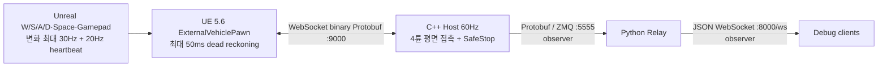
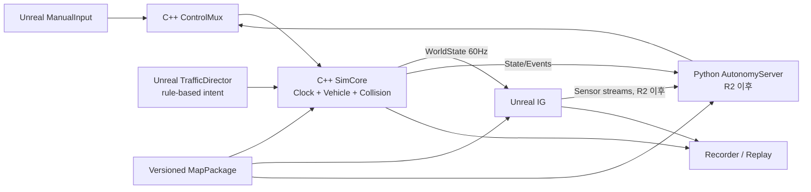
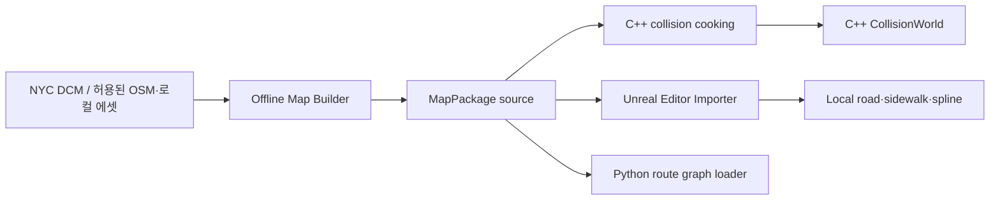
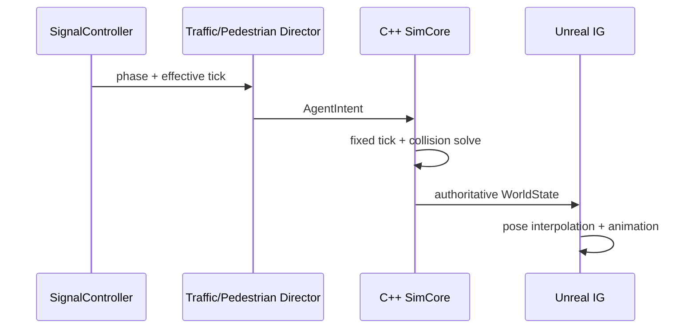

# 시스템 아키텍처

## 1. 문서 정보

| 항목 | 값 |
|---|---|
| 버전 | 1.0 |
| 작성일 | 2026-08-19 |
| 대상 | R1 수동운전 및 R2/R3 자율주행 확장 기반 |
| 관련 문서 | [일정표](./01_schedule.md), [기능표](./02_feature_matrix.md) |

## 2. 설계 목표

1. C++ SimCore가 차량과 충돌의 최종 물리 상태를 정확하고 일관되게 계산한다.
2. Unreal은 C++ 결과를 고품질로 표현하고 입력·센서·교통 표현을 담당한다.
3. Python은 향후 FSD 판단만 담당하며 수동운전의 필수 데이터 경로에서 제외한다.
4. 지도·차선·충돌 데이터를 한 번 생성하여 C++·Unreal·Python이 함께 사용한다.
5. 수동 입력과 자율주행 명령이 동일한 제어 인터페이스를 사용한다.
6. Wall/Broad에 종속된 코드는 데이터 패키지로 격리하여 다른 지역과 트랙에 재사용한다.
7. 로컬 수동운전은 60Hz 상태 전달의 jitter와 표시 지연을 측정하고 제한된 예측으로 보완한다.

## 3. 현재 구조와 목표 구조

### 3.1 현재 저장소 기준 구조



현재 구조의 한계는 다음과 같다.

- C++ 물리는 4륜의 longitudinal slip·slip angle·friction circle과 차체 yaw/roll/pitch 응답을 계산하지만 접촉면은 아직 z=0 평면이다.
- Proto는 루트 `protocol/vehicle.proto`로 통합됐고 C++·Python 생성물과 Unreal 경량 wire adapter가 같은 필드 계약을 사용한다.
- C++ host는 절대 deadline 60Hz clock, command source/session/sequence/queue-age 검사, 250ms SafeStop과 E-stop latch를 적용한다.
- WebSocket 세션은 HTTP 101 accept 완료 전 state frame을 쓰지 않으며, 전송 중 state queue는 latest-wins로 제한한다.
- Unreal client는 입력 변화를 deadzone 처리 후 최신값 우선으로 합쳐 최대 30Hz로 보내고 WorldState의 pose·body velocity·4개 wheel state를 표시한다.
- map checksum은 필드만 있고 현재 기본값은 `unset`이다.
- 자동 재연결은 구현됐지만 Hello/schema/map capability handshake, packet gap HUD,
  MapPackage 지형·충돌, 실제 suspension stroke는 아직 없다.

### 3.2 목표 구조



수동운전에서 Python 프로세스는 실행하지 않아도 된다. 자율주행 모드에서는 Python이 `ControlCommand`를 생성하지만 최종 물리 상태는 계속 C++가 결정한다.

## 4. 컴포넌트 책임

### 4.1 C++ SimCore

아래 표는 R1 이후까지 유지할 목표 논리 경계다. 현재 코드는 `SimulationHost`가
`SimulationClock`, `ControlLease`, `VehiclePhysics`를 조정하고, `WsServer`와
`ZmqPublisher`는 callback으로 주입하는 단계까지 분리됐다. `CollisionWorld`,
`EntityWorld`, `MapLoader`, `Recorder`는 아직 구현 전이다.

| 모듈 | 책임 | 소유 데이터 |
|---|---|---|
| `SimulationClock` | 고정 tick, substep, pause/reset, overrun 계측 | sim time, tick index |
| `ControlMux` | 수동/자율 명령 선택, timeout, E-stop | 현재 control lease와 command |
| `VehicleDynamics` | 자체 강체·조향·구동계·타이어·서스펜션 계산 | 차체·휠·타이어·구동계 상태 |
| `CollisionWorld` | 정적·동적 충돌 검출과 해결 | collision shapes, contact state |
| `EntityWorld` | Ego, NPC 차량, 보행자 proxy 생명주기 | authoritative entity state |
| `MapLoader` | MapPackage 검증과 물리용 데이터 로드 | map checksum, cooked collision |
| `TransportServer` | 명령 수신, 상태·이벤트 발행, handshake | connection/session state |
| `Recorder` | 명령·상태·이벤트와 설정 체크섬 기록·재생 | replay stream |
| `Diagnostics` | tick, latency, collision, queue 로그 | metrics와 structured log |

C++는 렌더링, 영상 센서 생성, 자율주행 의사결정을 담당하지 않는다.

### 4.2 Unreal

현재 구현은 `SimCoreClientComponent`, `SimCoreProtocol`, `ExternalVehiclePawn`,
`SimCoreCoordinateFrames`, `SimCorePresentation`이다. 아래 표의 나머지 항목은
향후 분리·구현할 목표 모듈이다.

| 모듈 | 책임 | 금지되는 책임 |
|---|---|---|
| `SimCoreClient` | handshake, command 전송, WorldState 수신·버퍼링 | 최종 차량 pose 결정 |
| `ManualInputComponent` | 키보드/게임패드 입력 정규화 | 물리 계산 |
| `ExternalVehiclePawn` | pose 보간, wheel·steering 시각화 | Ego에 Chaos 힘을 적용해 C++ 상태 수정 |
| `GeoTransformAdapter` | ENU↔Cesium/Unreal 좌표 변환 | 자체 위·경도 적분 |
| `MapPackageImporter` | LaneGraph와 로컬 에셋 생성·검증 | 독립된 별도 차선 데이터 유지 |
| `TrafficDirector` | NPC 차선·속도·신호 intent 생성 | 충돌 후 최종 pose 해결 |
| `SignalController` | 차량·보행 신호 상태 | C++ 차량 물리 |
| `PedestrianDirector` | 단순 경로와 보행 intent, 애니메이션 | 대규모 군중 해석 |
| `SensorRig` | 카메라 등 센서 생성과 timestamp/frame metadata | AI 판단 |
| `ReplayPresenter` | 기록 상태 재생과 촬영 카메라 운용 | 기록된 물리 결과 재계산 |

### 4.3 Python AutonomyServer

R1에서는 필수가 아니며 R2부터 다음을 담당한다.

- 시작점·목적지와 LaneGraph 기반 route planning
- localization과 sensor preprocessing
- behavior planning과 trajectory generation
- steering, throttle, brake 명령 생성
- 자율주행 평가 지표와 실험 관리
- R3의 학습·추론 모델 실행

Python은 차량 동역학과 월드 충돌을 계산하지 않는다. 자율주행 중에도 C++ SimCore가 물리 권한을 유지한다.

## 5. 권한 모델

### 5.1 단일 물리 권한

| 상태 | 권한 소유자 | 다른 컴포넌트의 사용 방식 |
|---|---|---|
| Ego pose/velocity/wheel | C++ | Unreal과 Python은 읽기 전용 |
| NPC 물리 pose | C++ | Unreal AI가 intent를 보내고 결과를 표시 |
| 보행자 collision pose | C++ | Unreal이 경로 intent·animation을 제공하고 결과를 표시 |
| 신호 상태 | Unreal `SignalController` | tick이 붙은 상태를 C++와 Python에 공유 |
| LaneGraph·통행 제한 | MapPackage | 세 프로세스가 같은 버전 읽기 |
| 정적 collision source | MapPackage | C++가 authoritative collision로 cooking |
| 센서 영상 | Unreal | Python이 timestamp와 frame ID로 소비 |
| 운전 명령 | 선택된 controller | C++ `ControlMux`만 적용 여부 결정 |

### 5.2 제어 우선순위

```text
EmergencyStop > Active control lease(Manual 또는 Autonomous) > SafeStop
```

- Manual과 Autonomous가 동시에 차량을 제어하지 않는다.
- 모드 전환은 명시적인 요청·승인 handshake를 거친다.
- 유효 command가 250ms 동안 없으면 기본적으로 throttle을 해제하고 안전 제동한다.
- controller는 연결마다 고유 `session_id`를 만들며 sequence는 해당 session 안에서 단조 증가한다.
- active session에서도 client 생성 시각과 server 수신 간격으로 추정한 큐 체류 시간이 100ms를 넘는 명령은 적용하지 않는다.
- timeout 시 기존 session을 폐기하고 WebSocket을 닫는다. Unreal은 0.5초 뒤 새 session ID로 재연결하므로 이전 소켓의 큐 데이터가 새 lease로 넘어오지 않는다.
- reset, spawn, map 변경은 일반 ControlCommand와 분리한다.

## 6. 좌표·단위·시간 규약

### 6.1 좌표계

공통 공개 좌표는 ROS REP-103과 호환되는 right-handed 규약을 사용한다. Unreal과 현재 solver의 좌표는 각 runtime 내부 구현이며 경계 adapter 밖으로 노출하지 않는다.

| frame | 좌표계 | 사용처 |
|---|---|---|
| WGS84 | longitude/latitude/ellipsoidal height | Cesium 위치, GNSS 출력, 지도 import |
| `map_enu` | right-handed, X=East, Y=North, Z=Up | C++ 위치·속도·충돌, MapPackage |
| `base_link` | right-handed, X=forward, Y=left, Z=up(FLU) | 공통 body 상태, 휠·센서 장착, Python |
| `unreal_actor` | left-handed, X=forward, Y=right, Z=up(FRU) | Unreal 표시 전용 |
| `<sensor>_optical` | right-handed, X=right, Y=down, Z=forward | 향후 카메라 센서 출력 |

| 물리량 | canonical 양의 방향 |
|---|---|
| body yaw rate | 좌회전 |
| road-wheel steering angle·normalized steering command | 좌조향 |
| wheel slip angle·lateral force | wheel-local left |
| navigation heading | North=0°, 시계 방향; body 회전 vector와 별도 scalar |

- `MapOrigin`은 WGS84 원점과 `map_enu` frame을 정의한다.
- 항법 heading과 body yaw rate의 관계는 `heading_rate_clockwise = -body_yaw_rate_left_positive`다.
- Unreal body polar vector는 `(x, y, z)m → (100x, -100y, 100z)cm`로 변환한다. 자세와 angular velocity는 handedness를 고려한 basis 변환을 사용한다.
- 현재 `SimCoreCoordinateFrames`가 평면 ENU 위치, FLU 속도와 schema-v1 자세의
  Unreal 표시 변환을 모은다. 완전한 `GeoTransformAdapter`/`BodyFrameAdapter`,
  Cesium·quaternion 변환과 왕복 시험은 ADR-011 후속 작업이다.
- 위치는 meter, 속도는 m/s, 가속도는 m/s², 질량은 kg, 시간은 second를 사용한다.
- 물리 내부 각도와 각속도는 radian 기반으로 통일하고 기존 표시용 pose 필드만 degree를 사용한다.
- 위·경도는 물리 적분에 사용하지 않고 ENU 상태에서 필요할 때 변환한다.

현재 공개 `linear_velocity_body`, `angular_velocity_body`와 wheel lateral 값은 FLU/Y-left로 1차 전환됐다. 다만 scalar `yaw_rate`, `steering_angle`, `ControlCommand.steering`은 아직 우회전 양수인 legacy 계약이고, 변환도 전용 adapter로 완전히 모이지 않았다. 이 항목을 완료로 오인하지 않도록 [ADR-011의 COORD-002~008](./decisions/ADR-011-canonical-coordinate-frames.md#현재-구현과-남은-이행-작업)을 R1 선행 작업으로 추적한다.

### 6.2 시간 모델

- 기본 physics tick: 고정 60Hz
- 자체 물리 모델의 수치 안정성에 필요하면 한 tick 안에서 설정 가능한 substep 사용
- 기본 WorldState 발행: 60Hz
- Unreal render tick: physics와 독립
- 모든 명령·상태·센서에 `tick_index` 또는 `simulation_time_ns` 포함
- wall-clock Unix timestamp는 로그 상관관계에만 사용하고 물리 적분에 사용하지 않음
- pause와 replay 시 sim time을 임의로 wall time에 맞추지 않음

## 7. 공통 MapPackage

### 7.1 목적

Cesium의 시각 타일, Unreal spline, C++ 충돌맵을 각각 손으로 관리하면 반드시 어긋난다. 하나의 지도 원본을 전처리하여 모든 런타임 산출물을 생성한다.



NYC Digital City Map의 street centerline은 도로명과 폭을 가진 공식 지도 기반 데이터로 사용할 수 있다. 실제 lane 수, 방향, 회전 연결, 신호, 통행 제한은 별도 속성과 수동 override가 필요하다. Cesium for Unreal은 GeoJSON/SHP를 직접 lane spline으로 변환하지 않으므로 offline builder와 Unreal importer를 둔다.

### 7.2 소스 패키지 예시

```text
map_packages/wall_broad_v1/
  manifest.json
  georeference.json
  lane_graph.json
  road_semantics.json
  collision_mesh.glb
  signals.json
  pedestrian_paths.json
  spawn_points.json
  overrides.json
  attribution.md
```

`manifest.json`에는 다음을 기록한다.

- package ID와 semantic version
- 작성 도구와 schema version
- WGS84 원점과 축 규약
- 각 파일의 SHA-256
- 원본 데이터의 이름·버전·취득일·라이선스
- Unreal용 및 C++용 cooked artifact가 참조한 source checksum

### 7.3 LaneGraph

LaneGraph는 다음 정보를 가진 방향 그래프다.

- lane node와 directed edge
- center polyline과 폭
- 제한 속도와 진행 방향
- 차량·보행 통행 가능 여부
- predecessor/successor와 좌·우 인접 lane
- 교차로 진입·진출 연결
- 정지선, 횡단보도, 신호 그룹
- 수동 보정 provenance

초기 생성은 도로 중심선을 기반으로 하되 lane offset을 자동 생성한다. 개발자는 모든 spline을 직접 깔지 않고 Wall/Broad 핵심 교차로와 통행 제한만 보정한다. 동일 LaneGraph를 Unreal NPC, Python A*, C++ 도로 경계 검증에 사용한다.

### 7.4 충돌 일치 절차

1. 로컬 주행면과 충돌 source mesh를 Map Builder가 생성한다.
2. C++는 source checksum을 확인하고 자체 충돌 월드용 표현과 cache를 생성한다.
3. Unreal은 같은 source를 디버그 표현 및 query geometry로 import한다.
4. 실행 handshake에서 `map_package_checksum`과 `collision_source_checksum`을 비교한다.
5. 다르면 물리 시뮬레이션을 시작하지 않는다.
6. Ego의 실제 contact solving은 C++만 수행한다.

Cesium 스트리밍 타일의 collision은 타일 LOD와 로딩 상태가 변할 수 있으므로 authoritative 주행 충돌로 사용하지 않는다.

## 8. Cesium과 로컬 환경의 경계

### 8.1 Cesium이 담당하는 부분

- Georeference와 WGS84 변환
- 지도 원점 배치
- 목표 장비 성능을 통과할 경우 제한된 중·원경 배경
- 지리 데이터 정렬을 위한 Editor 기준

### 8.2 로컬 Unreal 환경이 담당하는 부분

- 차량이 실제로 닿는 도로 표면
- 보도, 커브, 정지선, 횡단보도
- 핵심 촬영 구간의 재질과 소품
- 고정 충돌 source와 시각적으로 맞는 주행면
- 주요 랜드마크의 촬영 품질

Cartographic Polygon의 invert/exclude 기능으로 목표 구역 바깥의 완전한 타일을 제외할 수 있지만, 경계에 걸친 타일은 로딩될 수 있고 시각 클리핑이 물리 충돌을 자동으로 자르지는 않는다. 따라서 이는 배경 최적화 수단이지 물리 데이터 생성 수단이 아니다.

Google Photorealistic 3D Tiles는 현재 목표 PC에서 측정된 성능 문제와 데이터 추출·저장 제약 때문에 R1에서 제외한다. 사용자 소유 데이터나 합법적으로 내려받을 수 있는 지리 데이터를 crop하여 로컬 에셋 또는 자체 3D Tiles로 만드는 방식은 허용한다.

## 9. 차량 물리 구조

### 9.1 자체 물리 경계

```cpp
class IVehicleDynamics {
public:
    virtual ~IVehicleDynamics() = default;
    virtual void initialize(const VehicleConfig&, const VehicleSpawn&) = 0;
    virtual void apply_control(const ControlCommand&) = 0;
    virtual void step(double fixed_dt, const CollisionWorld&) = 0;
    virtual VehicleState snapshot() const = 0;
};
```

실제 인터페이스는 구현 중 조정할 수 있지만, SimCore의 transport·recording·entity 코드는 구체적인 차량 수식과 내부 상태 타입을 직접 노출하지 않는다. 이후 비교 검증이나 요구 변경으로 외부 SDK를 시험하더라도 이 경계 밖의 코드를 바꾸지 않는 것이 목적이다.

### 9.2 구현 결정과 현재 단계

D1에 외부 차량 SDK를 런타임으로 채택하지 않고 현재 C++ 서버에 차량 물리를 직접 구현하기로 결정했다. Chrono::Vehicle 10.0.0의 차량 1대·4대, 정적 벽 충돌, 반복성 결과는 비교 기준으로 보존하며 제품 의존성에는 포함하지 않는다. 상세 근거는 [ADR-006](./decisions/ADR-006-custom-vehicle-physics.md)에 기록한다.

현재 2단계 모델은 다음을 계산한다.

- 질량과 구동력·제동력으로 종방향 가속도 계산
- 공기저항과 구름저항
- Drive, Neutral, Reverse와 단일 기어비 RPM 근사
- 4개 바퀴의 평면 접촉점, normal load, steering, angular speed
- wheel inertia와 longitudinal slip 기반 종력, slip angle 기반 횡력, friction circle 제한
- 가감속·선회에 따른 종·횡 normal-load transfer, 후륜 구동과 4륜 제동
- yaw 관성 및 suspension-equivalent spring/damper 기반 roll/pitch 응답
- Local ENU east/north 위치와 WGS84 출력
- 입력 clamp, 비정상 `dt` 방어, 정지·가속·제동·후진·회전 회귀 시험

다음 단계에서 MapPackage 지형 raycast, 실제 suspension stroke, 경사·노면 마찰과 충돌을 같은 인터페이스 안에 추가한다. 현재 바퀴 접촉은 z=0 평면을 전제로 한다. Unreal은 자체 물리 결과를 표시하며 Chaos로 Ego pose를 다시 해결하지 않는다.

### 9.3 정확도의 정의

R1에서 “정확한 C++ 물리”는 다음을 의미한다.

- 시간, 좌표, 단위, 충돌 결과가 Unreal과 일관됨
- 차량 모델에 차체·휠·타이어·서스펜션·구동·제동이 존재함
- 설정된 파라미터에 대해 직진·제동·회전·경사·접촉 시험을 반복 통과함
- replay로 회귀 여부를 측정할 수 있음

특정 실차와 수치적으로 일치한다는 의미는 아니다. 실차 정확도를 선언하려면 대상 차종, 질량 분포, 타이어, 서스펜션, 동력계와 기준 주행 계측 데이터가 추가로 필요하다.

## 10. 통신 아키텍처

### 10.1 R1 transport 결정

R1 수동운전의 runtime control/state 통신은 `WebSocket binary + Protobuf`로 확정한다. C++ host의 현행 JSON 입력 파서는 제거됐으며, UDP는 초기값이 아니라 측정 결과가 나쁠 때 재검토하는 대안이다. Python relay의 JSON WebSocket은 수동운전 runtime protocol이 아니라 observer/debug 경로로만 취급한다.

현재 R1 구현은 하나의 WebSocket 연결에서 `ControlCommand`와 `WorldState`를
교환한다. 아래 신뢰성/실시간 채널 분리는 센서·생명주기 메시지가 추가될 때의
논리 목표이며, 별도 transport로 아직 구현된 것은 아니다.

- 신뢰성 채널에서 handshake·reset·설정·생명주기 메시지를 교환
- 실시간 채널에서 Unreal→C++ command와 C++→Unreal state를 교환
- runtime control/state 메시지는 Protobuf `Envelope`를 사용
- JSON은 runtime driving protocol에 사용하지 않음
- Python relay는 수동운전 경로에서 제거
- transport와 serialization은 각각 인터페이스 뒤에 두어 측정 결과에 따라 교체 가능
- 센서 영상은 같은 socket에 싣지 않음

### 10.2 메시지 계층

현재 runtime에서 처리하는 payload는 `ControlCommand`와 `WorldState`다.
`Hello`와 `Health`는 Proto 정의만 존재하며, `AgentIntent`, `SignalState`,
`LifecycleCommand`, `SensorMetadata`는 목표 메시지다.

```text
Envelope
  schema_version
  sequence
  simulation_time_ns
  source_id
  map_package_checksum
  session_id
  payload
```

| 메시지 | 방향 | 핵심 필드 |
|---|---|---|
| `Hello/Handshake` | 양방향 | build, schema, map checksum, capabilities |
| `ControlCommand` | Controller→C++ | mode, throttle, brake, steering, handbrake, gear |
| `AgentIntent` | Unreal→C++ | entity, target lane, target speed, stop/continue |
| `WorldState` | C++→소비자 | entity pose, velocity, acceleration, wheel, contact |
| `SignalState` | Unreal→C++/Python | signal group, phase, effective tick |
| `LifecycleCommand` | Unreal→C++ | spawn, despawn, reset, map load |
| `Health` | 양방향 | tick overrun, packet age, queue depth, errors |
| `SensorMetadata` | Unreal→Python/Recorder | sensor, frame, pose, sim time, payload reference |

### 10.3 상태 표시

- C++는 매 physics tick에 immutable snapshot을 생성한다.
- 현재 Unreal 구현은 snapshot 수신 시각과 body-frame 선·각속도로 render frame의 pose를 예측한다.
- 외삽은 `MaxExtrapolationSeconds=0.05`로 제한하며, 50ms를 넘으면 마지막 제한 pose를 유지한다.
- 기존 `VInterpTo/RInterpTo` 추종 보간은 설정값상 약 80~100ms의 추가 추종 지연을 만들 수 있어 제거했다.
- D11에서 packet gap 경고, reconnect 후 full snapshot, 필요 시 짧은 interpolation buffer를 추가한다.
- Unreal collision response가 Ego transform을 변경하지 않는다.
- 시각 오차는 C++ pose와 보간 기준 pose를 함께 HUD에 표시하여 측정한다.

### 10.4 로컬 저지연 경로와 측정

60Hz 물리와 네트워크 I/O는 같은 단일 `io_context`에서 순서대로 처리한다. 로컬 수동운전 경로는 다음 규칙을 사용한다.

- 동일 render tick의 axis callback은 하나의 최신 command로 합치고, deadzone·변화 epsilon을 적용한 뒤 최대 30Hz로 보낸다.
- 입력 유지 중에는 20Hz heartbeat로 250ms timeout lease를 갱신한다. 물리와 WorldState는 60Hz를 유지한다.
- 각 연결은 고유 `session_id`와 독립 sequence를 사용한다. 서버는 100ms를 초과해 송신 큐에 머문 것으로 추정되는 command를 폐기하여 SafeStop을 해제하지 못하게 한다.
- 250ms timeout이 발생하면 서버는 해당 session을 영구 폐기하고 연결을 닫으며, Unreal은 기본 0.5초 후 새 session으로 자동 재연결한다.
- Windows UE 5.6 client는 libWebSockets event-loop service를 사용한다. polling fallback은 240Hz이며, producer가 consumer보다 빨라지는 무제한 command FIFO를 허용하지 않는다.
- Editor PIE에서는 background CPU throttling을 꺼 frame hitch가 command timeout을 반복시키지 않게 한다.
- Windows host 실행 중 1ms timer resolution을 요청하고 종료 시 반드시 반환한다.
- TCP `no_delay`를 사용하며, state write가 밀리면 진행 중 패킷과 최신 대기 패킷만 유지한다.
- WebSocket accept가 완료되기 전 binary payload를 쓰지 않아 HTTP 101 handshake 순서를 보장한다.

2026-08-19 Windows loopback Release 측정은 Python probe로 240개 state를 수신해 비교했다. 이는 렌더 프레임까지 포함한 최종 제품 지연이 아니라 host transport scheduler의 기준값이다.

| 지표 | 개선 전 | 개선 후 |
|---|---:|---:|
| state 간격 p95 | 30.05ms | 17.08ms |
| state 간격 최대 | 49.82ms | 17.20ms |
| 25ms 초과 interval | 26/239 | 0/239 |
| command 전송→첫 speed 변화 | 약 35.62ms | 약 27.32ms |

현재 수치에서는 WebSocket을 UDP로 교체할 근거가 없다. packaged Unreal의 render 시점 state age, 장시간 overrun, LAN과 다중 엔티티 조건은 별도로 다시 측정한다. 상세 결정은 [ADR-010](./decisions/ADR-010-low-latency-control-presentation.md)에 기록한다.

실제 PIE에서 시간이 지날수록 입력 지연이 증가한 원인은 UE 5.6 내부 command FIFO의 60Hz 생산/약 30Hz 소비 불균형이었다. 서버 도착 이후 지연만으로는 발견할 수 없었으며, event-loop service와 20Hz heartbeat 적용 후 장시간 반복 조작에서 해소됐다. 진단 과정은 [해결 사례](./troubleshooting/ue56-websocket-growing-input-delay.md)를 따른다.

## 11. Traffic과 보행자

규칙 기반 AI와 물리를 분리한다.



- TrafficDirector는 LaneGraph, 신호, 선행 차량을 보고 target lane과 target speed를 정한다.
- C++는 NPC 차량을 동역학 또는 R1용 제한된 kinematic body로 진행시키고 충돌 상태를 확정한다.
- PedestrianDirector는 경로와 대기/횡단 intent를 정한다.
- C++는 보행자의 capsule pose를 tick에 맞춰 진행시켜 Ego 충돌과 화면 위치가 같은 상태를 참조하게 한다.
- 복잡한 군중 회피, 충돌 파손, 교통 수요 모델은 R1에 포함하지 않는다.

## 12. 센서 확장 구조

모든 센서는 차량 body frame에 상대적인 `SensorMount`를 가진다.

```text
SensorMount
  sensor_id
  sensor_type
  parent_frame_id
  translation_m
  rotation_quaternion
  update_rate_hz
  latency_ms
  enabled
  parameters
```

- RGB/Depth/Segmentation은 Unreal `SceneCaptureComponent2D` 계열로 구현한다.
- GNSS/IMU는 C++ ground-truth 상태에서 noise/bias 모델을 적용한다.
- LiDAR/Radar는 구현 방식과 성능 예산을 R2에서 별도 결정한다.
- 모든 센서는 캡처 시점의 sim time과 world/body/sensor transform을 기록한다.
- GPU readback과 인코딩은 game thread를 차단하지 않는 비동기 파이프라인으로 설계한다.
- 센서 payload와 control/state 메시지 transport를 분리한다.

R1은 SensorRig, mount config, timestamp/frame metadata와 선택적인 저주기 RGB smoke test까지만 수행한다.

## 13. 기록·재생·촬영

### 13.1 기록 대상

- build ID, schema version
- MapPackage와 collision source checksum
- vehicle config checksum
- tick 설정과 random seed
- 모든 적용된 ControlCommand와 AgentIntent
- authoritative WorldState와 collision event
- 신호 상태 변화
- 연결·timeout·reset 이벤트

### 13.2 재생 모드

| 모드 | 용도 |
|---|---|
| Input replay | 같은 입력을 C++에서 다시 계산하여 결정성과 회귀 검증 |
| State replay | 기록된 상태를 Unreal에서 그대로 재생하여 영상 촬영 |

영상은 실시간 플레이 캡처보다 State replay를 우선 사용한다. 동일한 주행에 카메라와 품질 설정을 바꿔 Movie Render Queue로 촬영할 수 있고, 녹화 부하가 물리 결과에 영향을 주지 않는다.

## 14. 실패 처리

| 실패 | C++ 동작 | Unreal 표시 |
|---|---|---|
| command timeout | throttle 해제, 안전 제동 | timeout 경고와 command age |
| map checksum 불일치 | simulation start 거부 | 양쪽 checksum과 해결 방법 표시 |
| state packet gap | 계속 시뮬레이션, gap 계측 | 제한된 보간 후 freeze·경고 |
| Unreal 연결 종료 | 설정에 따라 안전 정지 또는 headless 지속 | 재연결 후 full snapshot 요청 |
| tick overrun | 누적 wall time 보정으로 dt를 키우지 않고 overrun 기록 | 성능 HUD 표시 |
| invalid numeric state | 해당 tick 적용 중단, snapshot 보존, 치명 로그 | 시뮬레이션 중지 안내 |

## 15. 시험 구조

### 15.1 C++ 단위·회귀 시험

- 좌표·quaternion 왕복
- command clamp와 timeout
- fixed tick 독립성
- 정지·가속·제동·회전·경사
- 정적 mesh 및 동적 OBB/capsule 충돌
- 동일 input replay
- Proto backward compatibility와 invalid packet
- MapPackage checksum과 schema validation

### 15.2 Unreal 자동·통합 시험

- MapPackage import 결과 수와 bounds
- ENU↔Unreal transform 왕복
- handshake 성공·실패
- state buffer의 보간·gap·reconnect
- Ego physics 권한 위반 탐지
- TrafficDirector 신호 준수
- SensorMount transform과 timestamp

### 15.3 성능 시험

- 목표 Windows PC의 패키지 빌드에서 수행
- 동일한 replay, 카메라, 해상도, 그래픽 설정 사용
- Game thread, Render thread, GPU, frame p50/p95, streaming hitch 기록
- command age, state arrival interval·age, sequence gap, 입력→첫 상태 변화의 p50/p95/max 기록
- loopback과 LAN을 구분하고 timer resolution·서버 build·Unreal FPS를 결과에 함께 기록
- NPC 수, 보행자 수, 센서 활성 상태를 결과에 함께 기록
- Cesium 배경 on/off를 별도 측정해 R1 포함 여부 결정

## 16. 배포 구성

```text
release/
  SimCore.exe
  DriveIG/
  config/
    runtime.json
    vehicle.json
    sensors.json
  maps/
    wall_broad/
  proto/
    schema_version.txt
  logs/
  replays/
  THIRD_PARTY_NOTICES.md
  RUNBOOK.md
```

목표 배포 실행 순서는 다음과 같다.

1. SimCore가 config와 MapPackage를 검증하고 대기한다.
2. Unreal 패키지가 연결해 schema·map handshake를 수행한다.
3. 사용자 선택으로 Manual control lease를 획득한다.
4. C++가 tick을 시작하고 WorldState를 발행한다.
5. Unreal이 IG, traffic intent, sensor, recording을 시작한다.
6. 종료 시 replay와 성능·오류 로그를 flush한다.

현재 프로토타입은 `WsServer`를 시작한 직후 물리 tick을 시작하며, 연결 시
초기 `WorldState`를 전송한다. 위 순서의 map/schema handshake와 명시적 lease
획득 게이트는 아직 구현 전이다.

## 17. 아키텍처 결정 기록

| ADR | 상태 | 결정 | 이유 |
|---|---|---|---|
| ADR-001 | 확정 | Cesium+로컬 에셋 하이브리드 | 실제 좌표를 유지하면서 주행면 품질·성능·고정 충돌 확보 |
| ADR-002 | 확정 | C++가 단일 물리 권한 | C++/Unreal 충돌 보정 경쟁 제거와 headless 확장 |
| ADR-003 | 확정 | Python을 수동운전 필수 경로에서 제거 | 지연·장애 지점 감소, Python을 FSD 역할로 한정 |
| ADR-004 | 확정 | MapPackage를 지도 single source of truth로 사용 | 차선·충돌·경로 데이터 불일치 방지 |
| ADR-005 | 확정 | R1은 WebSocket binary + Protobuf | JSON 혼용을 제거하고, UDP는 측정 결과로 재검토 |
| ADR-006 | 확정 | 현재 C++ 서버에 자체 차량 물리 구현 | 차량 수식·상태·오차를 직접 설명하고 수정하는 학습·포트폴리오 목표 |
| ADR-007 | 확정 | R1은 수동운전, 학습은 연기 | 8월 품질과 기반 구조에 집중 |
| ADR-008 | 확정 | 핵심부 보행 중심, 주변 도로 주행 | Wall/Broad의 실제 공간 특성과 사용자 요구 반영 |
| ADR-009 | 확정 | 센서 payload를 제어 채널과 분리 | 이미지 readback이 physics/control 지연을 만들지 않도록 함 |
| ADR-010 | 확정 | Windows 60Hz timer 안정화 + 입력 latest-wins/coalescing + 최대 50ms dead reckoning | loopback jitter와 송신 FIFO·추종 보간 지연을 줄이면서 C++ 물리 권한 유지 |
| ADR-011 | 확정·이행 중 | 공통 공개 좌표는 ROS 호환 FLU, Unreal FRU와 solver 내부 좌표는 adapter에서 변환 | Python·센서·향후 ROS 확장에 하나의 right-handed 계약 제공 |

## 18. 결정 대기 사항

| 항목 | 현재안 | 기한 |
|---|---|---|
| Unreal/Cesium 버전 | Unreal Engine 5.6.1 확정, Cesium 호환 버전은 설치 시 고정 | D1 |
| 자체 물리 Windows 게이트 | MSVC Release 빌드와 동일 입력 회귀 시험 | D5 전 |
| UDP 전환 기준 | WebSocket binary + Protobuf 측정값이 ADR-005 기준을 넘으면 재검토 | D3 전 |
| 기준 차량 | 확보한 차량 에셋과 제원이 일치하는 일반 승용차 | D3 |
| 지도 경계 | NYSE·Federal Hall과 주변 차량 루프를 포함하는 4~6블록 | D8 전 |
| 배경 방식 | 로컬 핵심부 + 성능 통과 시 제한된 Cesium 중·원경 | D16 프로파일링 후 최종 |
| 라이선스 에셋 | 기존 구매·보유 에셋 목록 확인 필요 | D8 전 |

## 19. 참고 자료

- [Cesium for Unreal clipping](https://cesium.com/learn/unreal/unreal-clipping/)
- [Cesium for Unreal FAQ: 데이터 형식·다운로드·오프라인](https://cesium.com/learn/unreal/unreal-faq/)
- [NYC Digital City Map](https://www.nyc.gov/content/planning/pages/resources/datasets/digital-city-map)
- [NVIDIA PhysX Vehicle 문서](https://nvidia-omniverse.github.io/PhysX/physx/5.1.0/docs/Vehicles.html)
- [Project Chrono Vehicle 문서](https://api.projectchrono.org/manual_vehicle.html)
- [Unreal Engine Set Actor Transform](https://dev.epicgames.com/documentation/unreal-engine/BlueprintAPI/Transformation/SetActorTransform)
- [Google Map Tiles API 정책](https://developers.google.com/maps/documentation/tile/policies)
- [Microsoft timeBeginPeriod 문서](https://learn.microsoft.com/windows/win32/api/timeapi/nf-timeapi-timebeginperiod)
- [ROS REP-103 좌표·단위 규약](https://reps.openrobotics.org/rep-0103/)
- [Unreal Engine 좌표계와 공간](https://dev.epicgames.com/documentation/en-us/unreal-engine/coordinate-system-and-spaces-in-unreal-engine)

## 20. 변경 이력

| 버전 | 날짜 | 변경 내용 |
|---|---|---|
| 1.0 | 2026-08-19 | C++ `SimulationHost`와 WebSocket 수명주기, Unreal 연결 generation·game-thread 적용 및 좌표·표시 helper, Python package entrypoint·lifespan·오류 격리 리팩터링과 재검증 상태 반영 |
| 0.9 | 2026-08-19 | ADR-011의 ROS 호환 FLU canonical frame, Unreal 경계 변환, legacy yaw/steering 부호와 adapter·시험 이행 작업 반영 |
| 0.8 | 2026-08-19 | control session·queue-age SafeStop, body Y-left publish 계약, 횡하중 이동 수정, 입력 coalescing과 entity ID 선택 반영 |
| 0.7 | 2026-08-19 | UE 5.6 WebSocket command FIFO의 60Hz 생산/30Hz 소비 불균형과 event-loop·20Hz heartbeat 해결 반영 |
| 0.6 | 2026-08-19 | 현재 UE/C++ 수직 절단과 4륜 상태를 반영하고 handshake 순서, Windows 60Hz jitter, 입력 즉시 전송, 최대 50ms dead reckoning 및 측정값 기록 |
| 0.5 | 2026-08-14 | C++ host의 binary Protobuf ControlCommand 수신과 WorldState broadcast 구현 상태 반영 |
| 0.4 | 2026-08-14 | R1 통신을 WebSocket binary + Protobuf로 확정하고 JSON runtime protocol 제거 방향 반영 |
| 0.3 | 2026-08-14 | ADR-006을 자체 C++ 물리엔진 결정으로 변경하고 D1 기본 모델·공통 Proto 상태 반영 |
| 0.2 | 2026-08-14 | Chrono::Vehicle 스파이크와 통합안을 기록; 0.3에서 런타임 채택 철회 |
| 0.1 | 2026-08-14 | C++ 단일 물리 권한, 공통 MapPackage, 직접 통신, 센서 확장 구조 최초 작성 |
